Lincp21 Figure 3
========================================================


```r
library(cummeRbund)
```

```
## Loading required package: BiocGenerics
## Loading required package: parallel
## 
## Attaching package: 'BiocGenerics'
## 
## The following objects are masked from 'package:parallel':
## 
##     clusterApply, clusterApplyLB, clusterCall, clusterEvalQ,
##     clusterExport, clusterMap, parApply, parCapply, parLapply,
##     parLapplyLB, parRapply, parSapply, parSapplyLB
## 
## The following object is masked from 'package:stats':
## 
##     xtabs
## 
## The following objects are masked from 'package:base':
## 
##     anyDuplicated, append, as.data.frame, as.vector, cbind,
##     colnames, duplicated, eval, evalq, Filter, Find, get,
##     intersect, is.unsorted, lapply, Map, mapply, match, mget,
##     order, paste, pmax, pmax.int, pmin, pmin.int, Position, rank,
##     rbind, Reduce, rep.int, rownames, sapply, setdiff, sort,
##     table, tapply, union, unique, unlist
## 
## Loading required package: RSQLite
## Loading required package: DBI
## Loading required package: ggplot2
## Loading required package: reshape2
## Loading required package: fastcluster
## 
## Attaching package: 'fastcluster'
## 
## The following object is masked from 'package:stats':
## 
##     hclust
## 
## Loading required package: rtracklayer
## Loading required package: GenomicRanges
## Loading required package: IRanges
## Loading required package: XVector
## Loading required package: Gviz
## Loading required package: grid
## 
## Attaching package: 'cummeRbund'
## 
## The following object is masked from 'package:GenomicRanges':
## 
##     promoters
## 
## The following object is masked from 'package:IRanges':
## 
##     promoters
## 
## The following object is masked from 'package:BiocGenerics':
## 
##     conditions
```

```r
library(gplots)
```

```
## KernSmooth 2.23 loaded
## Copyright M. P. Wand 1997-2009
## 
## Attaching package: 'gplots'
## 
## The following object is masked from 'package:rtracklayer':
## 
##     space
## 
## The following object is masked from 'package:IRanges':
## 
##     space
## 
## The following object is masked from 'package:stats':
## 
##     lowess
```

```r
all<-"/n/rinn_data1/users/agroff/seq/OtherMice/Diana/lincP21/diff/BROAD_ALL_2_ALL_TISSUES"
alpha<-0.05 
genome<-"mm10"

cuff<-readCufflinks(dir=all,gtfFile="/n/rinn_data1/seq/lgoff/Projects/BrainMap/data/annotation/mm10_gencode_vM2_with_lncRNAs_and_LacZ.gtf",genome=genome)
```


```r
getRelevantSigTable<-function(cuff,alpha){
  m<-getSigTable(cuff,alpha)
  comparisons<-c("wt_brain_adultvsko_brain_adult","wt_brain_embryovsko_brain_embryo","wt_heartvsko_heart","wt_kidneyvsko_kidney","wt_legvsko_leg","wt_livervsko_liver","wt_lungvsko_lung","wt_MEFsvsko_MEFs")
  m<-m[,comparisons]
  m<-as.data.frame(m)
  m$sum<-rowSums(m,na.rm=TRUE)
  m
}
m<-getRelevantSigTable(cuff,alpha)
```

```
## Using testResult as value column: use value.var to override.
```

```r
DEuniverse<-m[which(m$sum>0),]
deGenes<-rownames(DEuniverse)
write.table(deGenes,file="universe_of_DE_genes.tab",sep="\t")


alwaysSig<-m[which(m$sum==8),]
alwaysSigGenes<-getGenes(cuff,row.names(alwaysSig))
alwaysSig<-annotation(alwaysSigGenes)
```


```r
genes<-getGenes(cuff,deGenes)

pdf("universe_DEgenes_fpkms.pdf")
csHeatmap(genes,clustering="both")
```

```
## Using tracking_id, sample_name as id variables
## No id variables; using all as measure variables
```

```r
dev.off()
```

```
## pdf 
##   2
```

```r
modifiedHeatmap<-function(cuff,geneSetIDs){
  fpkms<-fpkmMatrix(genes(cuff))
  fpkms<-fpkms[which(row.names(fpkms)%in% geneSetIDs),]
  cols<-c("leg","liver","heart","adult_brain","embryo_brain","kidney","lung","MEFs")
  foldchangeTable<-log2(fpkms[,9:16]/fpkms[,1:8]) #log2foldchange KO/WT
  colnames(foldchangeTable)<-cols
  # negative = down in KO 
  # WT leg gene = 4018; KO leg gene = 3914
  # log2(KO/WT)=-0.0377378549
  c<-foldchangeTable
  c<-do.call(data.frame,lapply(c,function(x) replace(x,x=="-Inf",min(is.finite(x))))) #replace -Inf w NA; replace NA w column mins
  c<-do.call(data.frame,lapply(c,function(x) replace(x,x=="Inf",max(is.finite(x))))) #replace Inf w NA; replace NA with column max 
  m<-c
	
  heatRange=2
  
  m_vals <- unlist(as.list(m))[is.finite(unlist(as.list(m)))]
  m_max <- max(m_vals)
	m_min <- max(m_vals)
	range_lim <- max(c(abs(m_max), abs(m_min)))
	range_lim <- min(c(heatRange, range_lim))
	m_max <- range_lim
	m_min <- -range_lim
	m[m <  m_min] <- m_min
	m[m >  m_max] <- m_max
	m[is.na(m)] <- 0
  
	method=dist
	#m=m[hclust(method(m))$order, ] # cluster by row 
  #m=m[,hclust(method(t(m)))$order] # cluster by column
  m=m[hclust(method(m))$order ,hclust(method(t(m)))$order]#cluster by both
	
	rows=dim(m)[1]
	cols=dim(m)[2]

    melt.m=cbind(rowInd=rep(1:rows, times=cols), colInd=rep(1:cols, each=rows), melt(m))

	g=ggplot(data=melt.m)
	

		g2=g+geom_rect(aes(xmin=colInd-1,xmax=colInd,ymin=rowInd-1,ymax=rowInd, fill=value))
	

		g2=g2+scale_x_continuous(breaks=(1:cols)-0.5, labels=colnames(m))

		g2=g2+scale_y_continuous(breaks=(1:rows)-0.5, labels=rownames(m))	
	
    g2 <- g2 + theme(axis.ticks = element_blank()) 

	  g2=g2+theme(panel.grid.minor=element_line(colour=NA), panel.grid.major=element_line(colour=NA),panel.background=element_rect(fill=NA, colour=NA))
	
	##adjust x-axis labels
	g2=g2+theme(axis.text.x=element_text(angle=-90, hjust=0))

  
  heatscale=c(low='steelblue',mid='white',high='tomato')
  heatMidpoint=0
  legendTitle <- bquote(paste(log[2], frac("FPKM","WT",sep="")))


	if (length(heatscale) == 2){
	    g2 <- g2 + scale_fill_gradient(low=heatscale[1], high=heatscale[2], name=legendTitle)
	} else if (length(heatscale) == 3) {
	    if (is.null(heatMidpoint))
	    {
	        heatMidpoint = (max(m) + min(m)) / 2.0
	        #write(heatMidpoint, stderr())
	    }

	    g2 <- g2 + scale_fill_gradient2(low=heatscale[1], mid=heatscale[2], high=heatscale[3], midpoint=heatMidpoint, name=legendTitle)
	}
  g2
}

pdf("universeOfGenes_alltissues_KO-WT.pdf")
modifiedHeatmap(cuff,deGenes)
```

```
## No id variables; using all as measure variables
```

```r
dev.off()
```

```
## pdf 
##   2
```


```r
getLogFoldChangeTable<-function(cuff){
  fpkms<-fpkmMatrix(genes(cuff))
  cols<-c("leg","liver","heart","adult_brain","embryo_brain","kidney","lung","MEFs")
  foldchangeTable<-log2(fpkms[,9:16]/fpkms[,1:8]) #log2foldchange KO/WT
  colnames(foldchangeTable)<-cols
  # negative = down in KO 
  # WT leg gene = 4018; KO leg gene = 3914
  # log2(KO/WT)=-0.0377378549
  c<-foldchangeTable
  c<-do.call(data.frame,lapply(c,function(x) replace(x,x=="-Inf",min(is.finite(x))))) #replace -Inf w NA; replace NA w column mins
  c<-do.call(data.frame,lapply(c,function(x) replace(x,x=="Inf",max(is.finite(x))))) #replace Inf w NA; replace NA with column max 
  row.names(c)<-row.names(foldchangeTable)
  c
}
  c<-getLogFoldChangeTable(cuff)
  m<-c
  
  
  #which genes always change in the same direction (not sig) ? 
  up<-c
  up[up>0]<-1
  up[up<0]<-NA
  sum<-rowSums(up)
  up<-up[which(sum==8),]
  
  down<-c
  down[down<0]<-(-1)
  down[down>0]<-NA
  sum<-rowSums(down)
  down<-down[which(sum==-8),]
  
  
  downgenes<-getGenes(cuff,row.names(down))
  upgenes<-getGenes(cuff,row.names(up))
  upAnnot<-annotation(upgenes) #13/24 on chr17 ! 
  downAnnot<-annotation(downgenes) #18/31 on chr17 !

  consistantGenes<-c(row.names(down),row.names(up))
  modifiedHeatmap(cuff,consistantGenes)
```

```
## No id variables; using all as measure variables
```

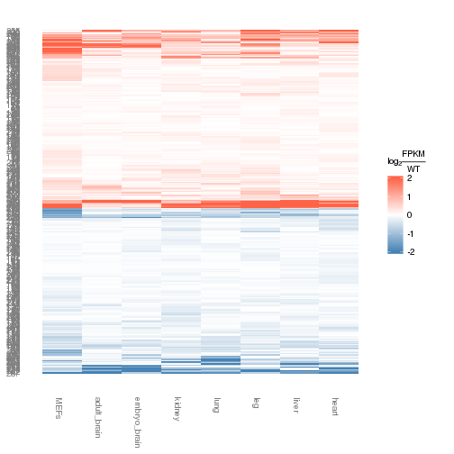 


```r
consistantly_up_genenames<-upAnnot$gene_short_name
consistantly_down_genenames<-downAnnot$gene_short_name

makegmtdat<-function(x,name,desc){
  x<-toupper(x)
  tmp<-c(name,desc,x)
  tmpdat<-as.data.frame(t(tmp))
  write.table(tmpdat,file=paste(name,"gmt",sep="."),quote=FALSE, sep="\t",row.names=FALSE,col.names=FALSE)
  tmpdat
}

updat<-makegmtdat(consistantly_up_genenames,"constantly_upreg_genes","across lincp21 mouse in vivo tissues, these genes always are upregulated in the KO")
downdat<-makegmtdat(consistantly_down_genenames,"constistantly_downreg_genes","across lincp21 mouse in vivo tissues, these genes are always downreg in the KO")
```


```r
pdf("dendrograms.pdf")
csDendro(genes(cuff))
```

```
## 'dendrogram' with 2 branches and 16 members total, at height 0.376748
```

```r
#'dendrogram' with 2 branches and 16 members total, at height 0.376748 
csDendro(genes(cuff),replicates=T)
```

```
## 'dendrogram' with 2 branches and 71 members total, at height 0.3893674
```

```r
csDendro(genes)
```

```
## Using tracking_id, sample_name as id variables
```

```
## 'dendrogram' with 2 branches and 16 members total, at height 0.5002893
```

```r
csDendro(genes,replicates=T)
```

```
## Using tracking_id, rep_name as id variables
```

```
## 'dendrogram' with 2 branches and 71 members total, at height 0.5138029
```

```r
dev.off()
```

```
## pdf 
##   2
```


```r
sig<-getSig(cuff)
sM<-getSigTable(cuff)
```

```
## Using testResult as value column: use value.var to override.
```

```r
sM<-as.data.frame(sM)
#comparisons<-c("wt_livervsko_liver","wt_legvsko_leg","wt_heartvsko_heart","wt_brain_adultvsko_brain_adult","wt_brain_embryovsko_brain_embryo")
comparisons<-c("wt_brain_adultvsko_brain_adult","wt_brain_embryovsko_brain_embryo","wt_heartvsko_heart","wt_kidneyvsko_kidney","wt_legvsko_leg","wt_livervsko_liver","wt_lungvsko_lung","wt_MEFsvsko_MEFs")
sM<-sM[,comparisons]
sum<-rowSums(sM)
common<-sM[which(sum==8),]
commonIDs<-row.names(common)

commonGenes<-getGenes(cuff,commonIDs)
commonAnnot<-annotation(commonGenes)
alwaysSigGenes<-commonAnnot$gene_short_name
```


```r
library(BSgenome.Mmusculus.UCSC.mm10)
```

```
## Loading required package: BSgenome
## Loading required package: Biostrings
```

```r
library(seqbias)
library(stringr)
library(plyr)
```

```
## 
## Attaching package: 'plyr'
## 
## The following object is masked from 'package:cummeRbund':
## 
##     count
## 
## The following object is masked from 'package:XVector':
## 
##     compact
## 
## The following objects are masked from 'package:IRanges':
## 
##     desc, rename
```

```r
myLengths<-seqlengths(Mmusculus)[!grepl("_random",names(seqlengths(Mmusculus)))]
mm10.granges<-GRanges(seqnames = names(myLengths), ranges = IRanges(start = 1, end = myLengths),seqlengths=myLengths)

getTable<-function(ids){
  genes<-getGenes(cuff,ids)
  fullTable<-annotation(genes)
  write("First Split",stderr())
  firstSplit<-str_split_fixed(fullTable$locus,":",2)
  write("Second Split",stderr())
  secondSplit<-str_split_fixed(firstSplit[,2],"-",2)
  fullTable$chromosome<-firstSplit[,1]
  fullTable$start<-as.numeric(secondSplit[,1])
  fullTable$end<-as.numeric(secondSplit[,2])
  fullTable<-fullTable[fullTable$chromosome %in% names(seqlengths(mm10.granges)),]
  fullTable$chromosome<-factor(fullTable$chromosome, levels=names(seqlengths(mm10.granges)))
  fullTable
}

dat<-getTable(consistantGenes)
m$gene_id<-row.names(m)
fullTable<-merge(dat,m,by.x="gene_id",by.y="gene_id")
fullTable$length<-NULL
fullTable$coverage<-NULL
fullTable$nearest_ref_id<-NULL
fullTable$class_code<-NULL

# melt only the logfoldchange values 
#cast molten datafram, aggregate
variables<-c("gene_id","gene_short_name","locus","chromosome","start","end")
dat.melt<-melt(fullTable,id=variables)
chr17.dat.melt<-dat.melt[which(dat.melt$chromosome=="chr17"),]

#average
mean.cast<-dcast(chr17.dat.melt,gene_short_name~chromosome,fun.aggregate=mean)
colnames(mean.cast)<-c("name","mean")

#SE
se <- function(x) sqrt(var(x)/length(x))
se.cast<-dcast(chr17.dat.melt,gene_short_name~chromosome,fun.aggregate=se)
colnames(se.cast)<-c("name","se")


mean_se<-merge(se.cast,mean.cast,by.x="name",by.y="name")

dat<-merge(fullTable,mean_se,by.x="gene_short_name",by.y="name")
lincp21<-getGene(cuff,"Trp53cor1")
lincp21Annot<-annotation(lincp21)
lincp21_start<-29057473
centered_dat<-dat
centered_dat$start<-centered_dat$start-lincp21_start
limits<-aes(ymin=centered_dat$mean-centered_dat$se,ymax=centered_dat$mean+centered_dat$se)
ggplot(centered_dat,aes(start,mean))+geom_point()+geom_errorbar(limits,width=0.2)
```

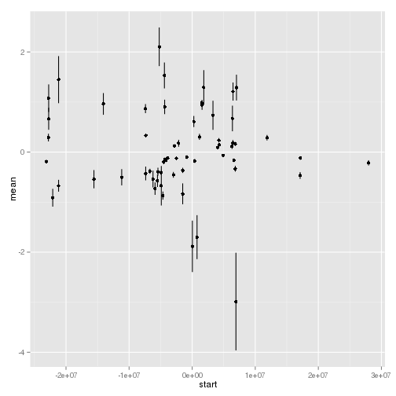 

```r
#always same direction


#always significant 
```


```r
library(BSgenome.Mmusculus.UCSC.mm10)
library(seqbias)
library(stringr)
library(plyr)

strain_name<-"Trp53cor1"
myLengths<-seqlengths(Mmusculus)[!grepl("_random",names(seqlengths(Mmusculus)))]
mm10.granges<-GRanges(seqnames = names(myLengths), ranges = IRanges(start = 1, end = myLengths),seqlengths=myLengths)

#Constants
windowSize<-4000000
myRandom<-random.intervals(mm10.granges,n=nIter,ms=windowSize)
```

```
## Error in cbind(1:n, ms): object 'nIter' not found
```

```r
getTable<-function(object){
  fullTable<-annotation(genes(object))
  write("First Split",stderr())
  firstSplit<-str_split_fixed(fullTable$locus,":",2)
  write("Second Split",stderr())
  secondSplit<-str_split_fixed(firstSplit[,2],"-",2)
  fullTable$chromosome<-firstSplit[,1]
  fullTable$start<-as.numeric(secondSplit[,1])
  fullTable$end<-as.numeric(secondSplit[,2])
  fullTable<-fullTable[fullTable$chromosome %in% names(seqlengths(mm10.granges)),]
  fullTable$chromosome<-factor(fullTable$chromosome, levels=names(seqlengths(mm10.granges)))
  fullTable
}

#locus annotation
fullTable<-getTable(cuff)

#summary mean/se logfoldchange... 
fc<-getLogFoldChangeTable(cuff)
fc$gene_id<-row.names(fc)
fullTable<-merge(fullTable,fc,by.x="gene_id",by.y="gene_id")

#reduce table 
columnstokeep<-c("gene_id","gene_short_name","chromosome","start","end","leg","liver","heart","adult_brain","embryo_brain","kidney","lung","MEFs")
fullTable<-fullTable[,columnstokeep]
fullTable<-ddply(fullTable,.(gene_id),head,n=1)

myGene<-fullTable[which(fullTable$gene_short_name==strain_name),]
chromosome<-myGene$chromosome
locuslength=abs(myGene$start-myGene$end)
start<-myGene$start-(windowSize/2-locuslength/2)
end<-myGene$end+(windowSize/2-locuslength/2)


genesInRegion<-fullTable[which(fullTable$chromosome==chromosome & fullTable$start>=start & fullTable$end<=end),]

genesInRegion$start<-genesInRegion$start-myGene$start

#which of these genes were EVER considered significant? 
sigTable<-getRelevantSigTable(cuff,alpha=0.05)
```

```
## Using testResult as value column: use value.var to override.
```

```r
sigTable<-as.data.frame(sigTable)
sigTable$id<-row.names(sigTable)
#sigTable<-sigTable[which(sigTable$sum>0),]
sigTable$sig<-sigTable$sum
sigTable$sig[sigTable$sig>0]<-"yes"
sigTable$sig[sigTable$sig==0]<-"no"
sigTable<-sigTable[,c("id","sig")]
#sigGenesInRegion<-sigTable[which(sigTable$id %in% genesInRegion$gene_id),]
data<-merge(sigTable,genesInRegion,by.x="id",by.y="gene_id",all.y=T)


variables<-c("id","gene_short_name","chromosome","start","end","sig")
data.melt<-melt(data,id=variables)
data.melt$value[is.na(data.melt$value)]<-0

#average log2 foldchange... 
means<-aggregate(data.melt,by=list(data.melt$gene_short_name),mean)
```

```
## Warning in mean.default(X[[1L]], ...): argument is not numeric or logical:
## returning NA
```

```
## Warning in mean.default(X[[2L]], ...): argument is not numeric or logical:
## returning NA
```

```
## Warning in mean.default(X[[3L]], ...): argument is not numeric or logical:
## returning NA
```

```
## Warning in mean.default(X[[4L]], ...): argument is not numeric or logical:
## returning NA
```

```
## Warning in mean.default(X[[5L]], ...): argument is not numeric or logical:
## returning NA
```

```
## Warning in mean.default(X[[6L]], ...): argument is not numeric or logical:
## returning NA
```

```
## Warning in mean.default(X[[7L]], ...): argument is not numeric or logical:
## returning NA
```

```
## Warning in mean.default(X[[8L]], ...): argument is not numeric or logical:
## returning NA
```

```
## Warning in mean.default(X[[9L]], ...): argument is not numeric or logical:
## returning NA
```

```
## Warning in mean.default(X[[10L]], ...): argument is not numeric or
## logical: returning NA
```

```
## Warning in mean.default(X[[11L]], ...): argument is not numeric or
## logical: returning NA
```

```
## Warning in mean.default(X[[12L]], ...): argument is not numeric or
## logical: returning NA
```

```
## Warning in mean.default(X[[13L]], ...): argument is not numeric or
## logical: returning NA
```

```
## Warning in mean.default(X[[14L]], ...): argument is not numeric or
## logical: returning NA
```

```
## Warning in mean.default(X[[15L]], ...): argument is not numeric or
## logical: returning NA
```

```
## Warning in mean.default(X[[16L]], ...): argument is not numeric or
## logical: returning NA
```

```
## Warning in mean.default(X[[17L]], ...): argument is not numeric or
## logical: returning NA
```

```
## Warning in mean.default(X[[18L]], ...): argument is not numeric or
## logical: returning NA
```

```
## Warning in mean.default(X[[19L]], ...): argument is not numeric or
## logical: returning NA
```

```
## Warning in mean.default(X[[20L]], ...): argument is not numeric or
## logical: returning NA
```

```
## Warning in mean.default(X[[21L]], ...): argument is not numeric or
## logical: returning NA
```

```
## Warning in mean.default(X[[22L]], ...): argument is not numeric or
## logical: returning NA
```

```
## Warning in mean.default(X[[23L]], ...): argument is not numeric or
## logical: returning NA
```

```
## Warning in mean.default(X[[24L]], ...): argument is not numeric or
## logical: returning NA
```

```
## Warning in mean.default(X[[25L]], ...): argument is not numeric or
## logical: returning NA
```

```
## Warning in mean.default(X[[26L]], ...): argument is not numeric or
## logical: returning NA
```

```
## Warning in mean.default(X[[27L]], ...): argument is not numeric or
## logical: returning NA
```

```
## Warning in mean.default(X[[28L]], ...): argument is not numeric or
## logical: returning NA
```

```
## Warning in mean.default(X[[29L]], ...): argument is not numeric or
## logical: returning NA
```

```
## Warning in mean.default(X[[30L]], ...): argument is not numeric or
## logical: returning NA
```

```
## Warning in mean.default(X[[31L]], ...): argument is not numeric or
## logical: returning NA
```

```
## Warning in mean.default(X[[32L]], ...): argument is not numeric or
## logical: returning NA
```

```
## Warning in mean.default(X[[33L]], ...): argument is not numeric or
## logical: returning NA
```

```
## Warning in mean.default(X[[34L]], ...): argument is not numeric or
## logical: returning NA
```

```
## Warning in mean.default(X[[35L]], ...): argument is not numeric or
## logical: returning NA
```

```
## Warning in mean.default(X[[36L]], ...): argument is not numeric or
## logical: returning NA
```

```
## Warning in mean.default(X[[37L]], ...): argument is not numeric or
## logical: returning NA
```

```
## Warning in mean.default(X[[38L]], ...): argument is not numeric or
## logical: returning NA
```

```
## Warning in mean.default(X[[39L]], ...): argument is not numeric or
## logical: returning NA
```

```
## Warning in mean.default(X[[40L]], ...): argument is not numeric or
## logical: returning NA
```

```
## Warning in mean.default(X[[41L]], ...): argument is not numeric or
## logical: returning NA
```

```
## Warning in mean.default(X[[42L]], ...): argument is not numeric or
## logical: returning NA
```

```
## Warning in mean.default(X[[43L]], ...): argument is not numeric or
## logical: returning NA
```

```
## Warning in mean.default(X[[44L]], ...): argument is not numeric or
## logical: returning NA
```

```
## Warning in mean.default(X[[45L]], ...): argument is not numeric or
## logical: returning NA
```

```
## Warning in mean.default(X[[46L]], ...): argument is not numeric or
## logical: returning NA
```

```
## Warning in mean.default(X[[47L]], ...): argument is not numeric or
## logical: returning NA
```

```
## Warning in mean.default(X[[48L]], ...): argument is not numeric or
## logical: returning NA
```

```
## Warning in mean.default(X[[49L]], ...): argument is not numeric or
## logical: returning NA
```

```
## Warning in mean.default(X[[50L]], ...): argument is not numeric or
## logical: returning NA
```

```
## Warning in mean.default(X[[51L]], ...): argument is not numeric or
## logical: returning NA
```

```
## Warning in mean.default(X[[52L]], ...): argument is not numeric or
## logical: returning NA
```

```
## Warning in mean.default(X[[53L]], ...): argument is not numeric or
## logical: returning NA
```

```
## Warning in mean.default(X[[54L]], ...): argument is not numeric or
## logical: returning NA
```

```
## Warning in mean.default(X[[55L]], ...): argument is not numeric or
## logical: returning NA
```

```
## Warning in mean.default(X[[56L]], ...): argument is not numeric or
## logical: returning NA
```

```
## Warning in mean.default(X[[57L]], ...): argument is not numeric or
## logical: returning NA
```

```
## Warning in mean.default(X[[58L]], ...): argument is not numeric or
## logical: returning NA
```

```
## Warning in mean.default(X[[59L]], ...): argument is not numeric or
## logical: returning NA
```

```
## Warning in mean.default(X[[60L]], ...): argument is not numeric or
## logical: returning NA
```

```
## Warning in mean.default(X[[61L]], ...): argument is not numeric or
## logical: returning NA
```

```
## Warning in mean.default(X[[62L]], ...): argument is not numeric or
## logical: returning NA
```

```
## Warning in mean.default(X[[63L]], ...): argument is not numeric or
## logical: returning NA
```

```
## Warning in mean.default(X[[64L]], ...): argument is not numeric or
## logical: returning NA
```

```
## Warning in mean.default(X[[65L]], ...): argument is not numeric or
## logical: returning NA
```

```
## Warning in mean.default(X[[66L]], ...): argument is not numeric or
## logical: returning NA
```

```
## Warning in mean.default(X[[67L]], ...): argument is not numeric or
## logical: returning NA
```

```
## Warning in mean.default(X[[68L]], ...): argument is not numeric or
## logical: returning NA
```

```
## Warning in mean.default(X[[69L]], ...): argument is not numeric or
## logical: returning NA
```

```
## Warning in mean.default(X[[70L]], ...): argument is not numeric or
## logical: returning NA
```

```
## Warning in mean.default(X[[71L]], ...): argument is not numeric or
## logical: returning NA
```

```
## Warning in mean.default(X[[72L]], ...): argument is not numeric or
## logical: returning NA
```

```
## Warning in mean.default(X[[73L]], ...): argument is not numeric or
## logical: returning NA
```

```
## Warning in mean.default(X[[74L]], ...): argument is not numeric or
## logical: returning NA
```

```
## Warning in mean.default(X[[75L]], ...): argument is not numeric or
## logical: returning NA
```

```
## Warning in mean.default(X[[76L]], ...): argument is not numeric or
## logical: returning NA
```

```
## Warning in mean.default(X[[77L]], ...): argument is not numeric or
## logical: returning NA
```

```
## Warning in mean.default(X[[78L]], ...): argument is not numeric or
## logical: returning NA
```

```
## Warning in mean.default(X[[79L]], ...): argument is not numeric or
## logical: returning NA
```

```
## Warning in mean.default(X[[80L]], ...): argument is not numeric or
## logical: returning NA
```

```
## Warning in mean.default(X[[81L]], ...): argument is not numeric or
## logical: returning NA
```

```
## Warning in mean.default(X[[82L]], ...): argument is not numeric or
## logical: returning NA
```

```
## Warning in mean.default(X[[83L]], ...): argument is not numeric or
## logical: returning NA
```

```
## Warning in mean.default(X[[84L]], ...): argument is not numeric or
## logical: returning NA
```

```
## Warning in mean.default(X[[1L]], ...): argument is not numeric or logical:
## returning NA
```

```
## Warning in mean.default(X[[2L]], ...): argument is not numeric or logical:
## returning NA
```

```
## Warning in mean.default(X[[3L]], ...): argument is not numeric or logical:
## returning NA
```

```
## Warning in mean.default(X[[4L]], ...): argument is not numeric or logical:
## returning NA
```

```
## Warning in mean.default(X[[5L]], ...): argument is not numeric or logical:
## returning NA
```

```
## Warning in mean.default(X[[6L]], ...): argument is not numeric or logical:
## returning NA
```

```
## Warning in mean.default(X[[7L]], ...): argument is not numeric or logical:
## returning NA
```

```
## Warning in mean.default(X[[8L]], ...): argument is not numeric or logical:
## returning NA
```

```
## Warning in mean.default(X[[9L]], ...): argument is not numeric or logical:
## returning NA
```

```
## Warning in mean.default(X[[10L]], ...): argument is not numeric or
## logical: returning NA
```

```
## Warning in mean.default(X[[11L]], ...): argument is not numeric or
## logical: returning NA
```

```
## Warning in mean.default(X[[12L]], ...): argument is not numeric or
## logical: returning NA
```

```
## Warning in mean.default(X[[13L]], ...): argument is not numeric or
## logical: returning NA
```

```
## Warning in mean.default(X[[14L]], ...): argument is not numeric or
## logical: returning NA
```

```
## Warning in mean.default(X[[15L]], ...): argument is not numeric or
## logical: returning NA
```

```
## Warning in mean.default(X[[16L]], ...): argument is not numeric or
## logical: returning NA
```

```
## Warning in mean.default(X[[17L]], ...): argument is not numeric or
## logical: returning NA
```

```
## Warning in mean.default(X[[18L]], ...): argument is not numeric or
## logical: returning NA
```

```
## Warning in mean.default(X[[19L]], ...): argument is not numeric or
## logical: returning NA
```

```
## Warning in mean.default(X[[20L]], ...): argument is not numeric or
## logical: returning NA
```

```
## Warning in mean.default(X[[21L]], ...): argument is not numeric or
## logical: returning NA
```

```
## Warning in mean.default(X[[22L]], ...): argument is not numeric or
## logical: returning NA
```

```
## Warning in mean.default(X[[23L]], ...): argument is not numeric or
## logical: returning NA
```

```
## Warning in mean.default(X[[24L]], ...): argument is not numeric or
## logical: returning NA
```

```
## Warning in mean.default(X[[25L]], ...): argument is not numeric or
## logical: returning NA
```

```
## Warning in mean.default(X[[26L]], ...): argument is not numeric or
## logical: returning NA
```

```
## Warning in mean.default(X[[27L]], ...): argument is not numeric or
## logical: returning NA
```

```
## Warning in mean.default(X[[28L]], ...): argument is not numeric or
## logical: returning NA
```

```
## Warning in mean.default(X[[29L]], ...): argument is not numeric or
## logical: returning NA
```

```
## Warning in mean.default(X[[30L]], ...): argument is not numeric or
## logical: returning NA
```

```
## Warning in mean.default(X[[31L]], ...): argument is not numeric or
## logical: returning NA
```

```
## Warning in mean.default(X[[32L]], ...): argument is not numeric or
## logical: returning NA
```

```
## Warning in mean.default(X[[33L]], ...): argument is not numeric or
## logical: returning NA
```

```
## Warning in mean.default(X[[34L]], ...): argument is not numeric or
## logical: returning NA
```

```
## Warning in mean.default(X[[35L]], ...): argument is not numeric or
## logical: returning NA
```

```
## Warning in mean.default(X[[36L]], ...): argument is not numeric or
## logical: returning NA
```

```
## Warning in mean.default(X[[37L]], ...): argument is not numeric or
## logical: returning NA
```

```
## Warning in mean.default(X[[38L]], ...): argument is not numeric or
## logical: returning NA
```

```
## Warning in mean.default(X[[39L]], ...): argument is not numeric or
## logical: returning NA
```

```
## Warning in mean.default(X[[40L]], ...): argument is not numeric or
## logical: returning NA
```

```
## Warning in mean.default(X[[41L]], ...): argument is not numeric or
## logical: returning NA
```

```
## Warning in mean.default(X[[42L]], ...): argument is not numeric or
## logical: returning NA
```

```
## Warning in mean.default(X[[43L]], ...): argument is not numeric or
## logical: returning NA
```

```
## Warning in mean.default(X[[44L]], ...): argument is not numeric or
## logical: returning NA
```

```
## Warning in mean.default(X[[45L]], ...): argument is not numeric or
## logical: returning NA
```

```
## Warning in mean.default(X[[46L]], ...): argument is not numeric or
## logical: returning NA
```

```
## Warning in mean.default(X[[47L]], ...): argument is not numeric or
## logical: returning NA
```

```
## Warning in mean.default(X[[48L]], ...): argument is not numeric or
## logical: returning NA
```

```
## Warning in mean.default(X[[49L]], ...): argument is not numeric or
## logical: returning NA
```

```
## Warning in mean.default(X[[50L]], ...): argument is not numeric or
## logical: returning NA
```

```
## Warning in mean.default(X[[51L]], ...): argument is not numeric or
## logical: returning NA
```

```
## Warning in mean.default(X[[52L]], ...): argument is not numeric or
## logical: returning NA
```

```
## Warning in mean.default(X[[53L]], ...): argument is not numeric or
## logical: returning NA
```

```
## Warning in mean.default(X[[54L]], ...): argument is not numeric or
## logical: returning NA
```

```
## Warning in mean.default(X[[55L]], ...): argument is not numeric or
## logical: returning NA
```

```
## Warning in mean.default(X[[56L]], ...): argument is not numeric or
## logical: returning NA
```

```
## Warning in mean.default(X[[57L]], ...): argument is not numeric or
## logical: returning NA
```

```
## Warning in mean.default(X[[58L]], ...): argument is not numeric or
## logical: returning NA
```

```
## Warning in mean.default(X[[59L]], ...): argument is not numeric or
## logical: returning NA
```

```
## Warning in mean.default(X[[60L]], ...): argument is not numeric or
## logical: returning NA
```

```
## Warning in mean.default(X[[61L]], ...): argument is not numeric or
## logical: returning NA
```

```
## Warning in mean.default(X[[62L]], ...): argument is not numeric or
## logical: returning NA
```

```
## Warning in mean.default(X[[63L]], ...): argument is not numeric or
## logical: returning NA
```

```
## Warning in mean.default(X[[64L]], ...): argument is not numeric or
## logical: returning NA
```

```
## Warning in mean.default(X[[65L]], ...): argument is not numeric or
## logical: returning NA
```

```
## Warning in mean.default(X[[66L]], ...): argument is not numeric or
## logical: returning NA
```

```
## Warning in mean.default(X[[67L]], ...): argument is not numeric or
## logical: returning NA
```

```
## Warning in mean.default(X[[68L]], ...): argument is not numeric or
## logical: returning NA
```

```
## Warning in mean.default(X[[69L]], ...): argument is not numeric or
## logical: returning NA
```

```
## Warning in mean.default(X[[70L]], ...): argument is not numeric or
## logical: returning NA
```

```
## Warning in mean.default(X[[71L]], ...): argument is not numeric or
## logical: returning NA
```

```
## Warning in mean.default(X[[72L]], ...): argument is not numeric or
## logical: returning NA
```

```
## Warning in mean.default(X[[73L]], ...): argument is not numeric or
## logical: returning NA
```

```
## Warning in mean.default(X[[74L]], ...): argument is not numeric or
## logical: returning NA
```

```
## Warning in mean.default(X[[75L]], ...): argument is not numeric or
## logical: returning NA
```

```
## Warning in mean.default(X[[76L]], ...): argument is not numeric or
## logical: returning NA
```

```
## Warning in mean.default(X[[77L]], ...): argument is not numeric or
## logical: returning NA
```

```
## Warning in mean.default(X[[78L]], ...): argument is not numeric or
## logical: returning NA
```

```
## Warning in mean.default(X[[79L]], ...): argument is not numeric or
## logical: returning NA
```

```
## Warning in mean.default(X[[80L]], ...): argument is not numeric or
## logical: returning NA
```

```
## Warning in mean.default(X[[81L]], ...): argument is not numeric or
## logical: returning NA
```

```
## Warning in mean.default(X[[82L]], ...): argument is not numeric or
## logical: returning NA
```

```
## Warning in mean.default(X[[83L]], ...): argument is not numeric or
## logical: returning NA
```

```
## Warning in mean.default(X[[84L]], ...): argument is not numeric or
## logical: returning NA
```

```
## Warning in mean.default(X[[1L]], ...): argument is not numeric or logical:
## returning NA
```

```
## Warning in mean.default(X[[2L]], ...): argument is not numeric or logical:
## returning NA
```

```
## Warning in mean.default(X[[3L]], ...): argument is not numeric or logical:
## returning NA
```

```
## Warning in mean.default(X[[4L]], ...): argument is not numeric or logical:
## returning NA
```

```
## Warning in mean.default(X[[5L]], ...): argument is not numeric or logical:
## returning NA
```

```
## Warning in mean.default(X[[6L]], ...): argument is not numeric or logical:
## returning NA
```

```
## Warning in mean.default(X[[7L]], ...): argument is not numeric or logical:
## returning NA
```

```
## Warning in mean.default(X[[8L]], ...): argument is not numeric or logical:
## returning NA
```

```
## Warning in mean.default(X[[9L]], ...): argument is not numeric or logical:
## returning NA
```

```
## Warning in mean.default(X[[10L]], ...): argument is not numeric or
## logical: returning NA
```

```
## Warning in mean.default(X[[11L]], ...): argument is not numeric or
## logical: returning NA
```

```
## Warning in mean.default(X[[12L]], ...): argument is not numeric or
## logical: returning NA
```

```
## Warning in mean.default(X[[13L]], ...): argument is not numeric or
## logical: returning NA
```

```
## Warning in mean.default(X[[14L]], ...): argument is not numeric or
## logical: returning NA
```

```
## Warning in mean.default(X[[15L]], ...): argument is not numeric or
## logical: returning NA
```

```
## Warning in mean.default(X[[16L]], ...): argument is not numeric or
## logical: returning NA
```

```
## Warning in mean.default(X[[17L]], ...): argument is not numeric or
## logical: returning NA
```

```
## Warning in mean.default(X[[18L]], ...): argument is not numeric or
## logical: returning NA
```

```
## Warning in mean.default(X[[19L]], ...): argument is not numeric or
## logical: returning NA
```

```
## Warning in mean.default(X[[20L]], ...): argument is not numeric or
## logical: returning NA
```

```
## Warning in mean.default(X[[21L]], ...): argument is not numeric or
## logical: returning NA
```

```
## Warning in mean.default(X[[22L]], ...): argument is not numeric or
## logical: returning NA
```

```
## Warning in mean.default(X[[23L]], ...): argument is not numeric or
## logical: returning NA
```

```
## Warning in mean.default(X[[24L]], ...): argument is not numeric or
## logical: returning NA
```

```
## Warning in mean.default(X[[25L]], ...): argument is not numeric or
## logical: returning NA
```

```
## Warning in mean.default(X[[26L]], ...): argument is not numeric or
## logical: returning NA
```

```
## Warning in mean.default(X[[27L]], ...): argument is not numeric or
## logical: returning NA
```

```
## Warning in mean.default(X[[28L]], ...): argument is not numeric or
## logical: returning NA
```

```
## Warning in mean.default(X[[29L]], ...): argument is not numeric or
## logical: returning NA
```

```
## Warning in mean.default(X[[30L]], ...): argument is not numeric or
## logical: returning NA
```

```
## Warning in mean.default(X[[31L]], ...): argument is not numeric or
## logical: returning NA
```

```
## Warning in mean.default(X[[32L]], ...): argument is not numeric or
## logical: returning NA
```

```
## Warning in mean.default(X[[33L]], ...): argument is not numeric or
## logical: returning NA
```

```
## Warning in mean.default(X[[34L]], ...): argument is not numeric or
## logical: returning NA
```

```
## Warning in mean.default(X[[35L]], ...): argument is not numeric or
## logical: returning NA
```

```
## Warning in mean.default(X[[36L]], ...): argument is not numeric or
## logical: returning NA
```

```
## Warning in mean.default(X[[37L]], ...): argument is not numeric or
## logical: returning NA
```

```
## Warning in mean.default(X[[38L]], ...): argument is not numeric or
## logical: returning NA
```

```
## Warning in mean.default(X[[39L]], ...): argument is not numeric or
## logical: returning NA
```

```
## Warning in mean.default(X[[40L]], ...): argument is not numeric or
## logical: returning NA
```

```
## Warning in mean.default(X[[41L]], ...): argument is not numeric or
## logical: returning NA
```

```
## Warning in mean.default(X[[42L]], ...): argument is not numeric or
## logical: returning NA
```

```
## Warning in mean.default(X[[43L]], ...): argument is not numeric or
## logical: returning NA
```

```
## Warning in mean.default(X[[44L]], ...): argument is not numeric or
## logical: returning NA
```

```
## Warning in mean.default(X[[45L]], ...): argument is not numeric or
## logical: returning NA
```

```
## Warning in mean.default(X[[46L]], ...): argument is not numeric or
## logical: returning NA
```

```
## Warning in mean.default(X[[47L]], ...): argument is not numeric or
## logical: returning NA
```

```
## Warning in mean.default(X[[48L]], ...): argument is not numeric or
## logical: returning NA
```

```
## Warning in mean.default(X[[49L]], ...): argument is not numeric or
## logical: returning NA
```

```
## Warning in mean.default(X[[50L]], ...): argument is not numeric or
## logical: returning NA
```

```
## Warning in mean.default(X[[51L]], ...): argument is not numeric or
## logical: returning NA
```

```
## Warning in mean.default(X[[52L]], ...): argument is not numeric or
## logical: returning NA
```

```
## Warning in mean.default(X[[53L]], ...): argument is not numeric or
## logical: returning NA
```

```
## Warning in mean.default(X[[54L]], ...): argument is not numeric or
## logical: returning NA
```

```
## Warning in mean.default(X[[55L]], ...): argument is not numeric or
## logical: returning NA
```

```
## Warning in mean.default(X[[56L]], ...): argument is not numeric or
## logical: returning NA
```

```
## Warning in mean.default(X[[57L]], ...): argument is not numeric or
## logical: returning NA
```

```
## Warning in mean.default(X[[58L]], ...): argument is not numeric or
## logical: returning NA
```

```
## Warning in mean.default(X[[59L]], ...): argument is not numeric or
## logical: returning NA
```

```
## Warning in mean.default(X[[60L]], ...): argument is not numeric or
## logical: returning NA
```

```
## Warning in mean.default(X[[61L]], ...): argument is not numeric or
## logical: returning NA
```

```
## Warning in mean.default(X[[62L]], ...): argument is not numeric or
## logical: returning NA
```

```
## Warning in mean.default(X[[63L]], ...): argument is not numeric or
## logical: returning NA
```

```
## Warning in mean.default(X[[64L]], ...): argument is not numeric or
## logical: returning NA
```

```
## Warning in mean.default(X[[65L]], ...): argument is not numeric or
## logical: returning NA
```

```
## Warning in mean.default(X[[66L]], ...): argument is not numeric or
## logical: returning NA
```

```
## Warning in mean.default(X[[67L]], ...): argument is not numeric or
## logical: returning NA
```

```
## Warning in mean.default(X[[68L]], ...): argument is not numeric or
## logical: returning NA
```

```
## Warning in mean.default(X[[69L]], ...): argument is not numeric or
## logical: returning NA
```

```
## Warning in mean.default(X[[70L]], ...): argument is not numeric or
## logical: returning NA
```

```
## Warning in mean.default(X[[71L]], ...): argument is not numeric or
## logical: returning NA
```

```
## Warning in mean.default(X[[72L]], ...): argument is not numeric or
## logical: returning NA
```

```
## Warning in mean.default(X[[73L]], ...): argument is not numeric or
## logical: returning NA
```

```
## Warning in mean.default(X[[74L]], ...): argument is not numeric or
## logical: returning NA
```

```
## Warning in mean.default(X[[75L]], ...): argument is not numeric or
## logical: returning NA
```

```
## Warning in mean.default(X[[76L]], ...): argument is not numeric or
## logical: returning NA
```

```
## Warning in mean.default(X[[77L]], ...): argument is not numeric or
## logical: returning NA
```

```
## Warning in mean.default(X[[78L]], ...): argument is not numeric or
## logical: returning NA
```

```
## Warning in mean.default(X[[79L]], ...): argument is not numeric or
## logical: returning NA
```

```
## Warning in mean.default(X[[80L]], ...): argument is not numeric or
## logical: returning NA
```

```
## Warning in mean.default(X[[81L]], ...): argument is not numeric or
## logical: returning NA
```

```
## Warning in mean.default(X[[82L]], ...): argument is not numeric or
## logical: returning NA
```

```
## Warning in mean.default(X[[83L]], ...): argument is not numeric or
## logical: returning NA
```

```
## Warning in mean.default(X[[84L]], ...): argument is not numeric or
## logical: returning NA
```

```
## Warning in mean.default(X[[1L]], ...): argument is not numeric or logical:
## returning NA
```

```
## Warning in mean.default(X[[2L]], ...): argument is not numeric or logical:
## returning NA
```

```
## Warning in mean.default(X[[3L]], ...): argument is not numeric or logical:
## returning NA
```

```
## Warning in mean.default(X[[4L]], ...): argument is not numeric or logical:
## returning NA
```

```
## Warning in mean.default(X[[5L]], ...): argument is not numeric or logical:
## returning NA
```

```
## Warning in mean.default(X[[6L]], ...): argument is not numeric or logical:
## returning NA
```

```
## Warning in mean.default(X[[7L]], ...): argument is not numeric or logical:
## returning NA
```

```
## Warning in mean.default(X[[8L]], ...): argument is not numeric or logical:
## returning NA
```

```
## Warning in mean.default(X[[9L]], ...): argument is not numeric or logical:
## returning NA
```

```
## Warning in mean.default(X[[10L]], ...): argument is not numeric or
## logical: returning NA
```

```
## Warning in mean.default(X[[11L]], ...): argument is not numeric or
## logical: returning NA
```

```
## Warning in mean.default(X[[12L]], ...): argument is not numeric or
## logical: returning NA
```

```
## Warning in mean.default(X[[13L]], ...): argument is not numeric or
## logical: returning NA
```

```
## Warning in mean.default(X[[14L]], ...): argument is not numeric or
## logical: returning NA
```

```
## Warning in mean.default(X[[15L]], ...): argument is not numeric or
## logical: returning NA
```

```
## Warning in mean.default(X[[16L]], ...): argument is not numeric or
## logical: returning NA
```

```
## Warning in mean.default(X[[17L]], ...): argument is not numeric or
## logical: returning NA
```

```
## Warning in mean.default(X[[18L]], ...): argument is not numeric or
## logical: returning NA
```

```
## Warning in mean.default(X[[19L]], ...): argument is not numeric or
## logical: returning NA
```

```
## Warning in mean.default(X[[20L]], ...): argument is not numeric or
## logical: returning NA
```

```
## Warning in mean.default(X[[21L]], ...): argument is not numeric or
## logical: returning NA
```

```
## Warning in mean.default(X[[22L]], ...): argument is not numeric or
## logical: returning NA
```

```
## Warning in mean.default(X[[23L]], ...): argument is not numeric or
## logical: returning NA
```

```
## Warning in mean.default(X[[24L]], ...): argument is not numeric or
## logical: returning NA
```

```
## Warning in mean.default(X[[25L]], ...): argument is not numeric or
## logical: returning NA
```

```
## Warning in mean.default(X[[26L]], ...): argument is not numeric or
## logical: returning NA
```

```
## Warning in mean.default(X[[27L]], ...): argument is not numeric or
## logical: returning NA
```

```
## Warning in mean.default(X[[28L]], ...): argument is not numeric or
## logical: returning NA
```

```
## Warning in mean.default(X[[29L]], ...): argument is not numeric or
## logical: returning NA
```

```
## Warning in mean.default(X[[30L]], ...): argument is not numeric or
## logical: returning NA
```

```
## Warning in mean.default(X[[31L]], ...): argument is not numeric or
## logical: returning NA
```

```
## Warning in mean.default(X[[32L]], ...): argument is not numeric or
## logical: returning NA
```

```
## Warning in mean.default(X[[33L]], ...): argument is not numeric or
## logical: returning NA
```

```
## Warning in mean.default(X[[34L]], ...): argument is not numeric or
## logical: returning NA
```

```
## Warning in mean.default(X[[35L]], ...): argument is not numeric or
## logical: returning NA
```

```
## Warning in mean.default(X[[36L]], ...): argument is not numeric or
## logical: returning NA
```

```
## Warning in mean.default(X[[37L]], ...): argument is not numeric or
## logical: returning NA
```

```
## Warning in mean.default(X[[38L]], ...): argument is not numeric or
## logical: returning NA
```

```
## Warning in mean.default(X[[39L]], ...): argument is not numeric or
## logical: returning NA
```

```
## Warning in mean.default(X[[40L]], ...): argument is not numeric or
## logical: returning NA
```

```
## Warning in mean.default(X[[41L]], ...): argument is not numeric or
## logical: returning NA
```

```
## Warning in mean.default(X[[42L]], ...): argument is not numeric or
## logical: returning NA
```

```
## Warning in mean.default(X[[43L]], ...): argument is not numeric or
## logical: returning NA
```

```
## Warning in mean.default(X[[44L]], ...): argument is not numeric or
## logical: returning NA
```

```
## Warning in mean.default(X[[45L]], ...): argument is not numeric or
## logical: returning NA
```

```
## Warning in mean.default(X[[46L]], ...): argument is not numeric or
## logical: returning NA
```

```
## Warning in mean.default(X[[47L]], ...): argument is not numeric or
## logical: returning NA
```

```
## Warning in mean.default(X[[48L]], ...): argument is not numeric or
## logical: returning NA
```

```
## Warning in mean.default(X[[49L]], ...): argument is not numeric or
## logical: returning NA
```

```
## Warning in mean.default(X[[50L]], ...): argument is not numeric or
## logical: returning NA
```

```
## Warning in mean.default(X[[51L]], ...): argument is not numeric or
## logical: returning NA
```

```
## Warning in mean.default(X[[52L]], ...): argument is not numeric or
## logical: returning NA
```

```
## Warning in mean.default(X[[53L]], ...): argument is not numeric or
## logical: returning NA
```

```
## Warning in mean.default(X[[54L]], ...): argument is not numeric or
## logical: returning NA
```

```
## Warning in mean.default(X[[55L]], ...): argument is not numeric or
## logical: returning NA
```

```
## Warning in mean.default(X[[56L]], ...): argument is not numeric or
## logical: returning NA
```

```
## Warning in mean.default(X[[57L]], ...): argument is not numeric or
## logical: returning NA
```

```
## Warning in mean.default(X[[58L]], ...): argument is not numeric or
## logical: returning NA
```

```
## Warning in mean.default(X[[59L]], ...): argument is not numeric or
## logical: returning NA
```

```
## Warning in mean.default(X[[60L]], ...): argument is not numeric or
## logical: returning NA
```

```
## Warning in mean.default(X[[61L]], ...): argument is not numeric or
## logical: returning NA
```

```
## Warning in mean.default(X[[62L]], ...): argument is not numeric or
## logical: returning NA
```

```
## Warning in mean.default(X[[63L]], ...): argument is not numeric or
## logical: returning NA
```

```
## Warning in mean.default(X[[64L]], ...): argument is not numeric or
## logical: returning NA
```

```
## Warning in mean.default(X[[65L]], ...): argument is not numeric or
## logical: returning NA
```

```
## Warning in mean.default(X[[66L]], ...): argument is not numeric or
## logical: returning NA
```

```
## Warning in mean.default(X[[67L]], ...): argument is not numeric or
## logical: returning NA
```

```
## Warning in mean.default(X[[68L]], ...): argument is not numeric or
## logical: returning NA
```

```
## Warning in mean.default(X[[69L]], ...): argument is not numeric or
## logical: returning NA
```

```
## Warning in mean.default(X[[70L]], ...): argument is not numeric or
## logical: returning NA
```

```
## Warning in mean.default(X[[71L]], ...): argument is not numeric or
## logical: returning NA
```

```
## Warning in mean.default(X[[72L]], ...): argument is not numeric or
## logical: returning NA
```

```
## Warning in mean.default(X[[73L]], ...): argument is not numeric or
## logical: returning NA
```

```
## Warning in mean.default(X[[74L]], ...): argument is not numeric or
## logical: returning NA
```

```
## Warning in mean.default(X[[75L]], ...): argument is not numeric or
## logical: returning NA
```

```
## Warning in mean.default(X[[76L]], ...): argument is not numeric or
## logical: returning NA
```

```
## Warning in mean.default(X[[77L]], ...): argument is not numeric or
## logical: returning NA
```

```
## Warning in mean.default(X[[78L]], ...): argument is not numeric or
## logical: returning NA
```

```
## Warning in mean.default(X[[79L]], ...): argument is not numeric or
## logical: returning NA
```

```
## Warning in mean.default(X[[80L]], ...): argument is not numeric or
## logical: returning NA
```

```
## Warning in mean.default(X[[81L]], ...): argument is not numeric or
## logical: returning NA
```

```
## Warning in mean.default(X[[82L]], ...): argument is not numeric or
## logical: returning NA
```

```
## Warning in mean.default(X[[83L]], ...): argument is not numeric or
## logical: returning NA
```

```
## Warning in mean.default(X[[84L]], ...): argument is not numeric or
## logical: returning NA
```

```
## Warning in mean.default(X[[1L]], ...): argument is not numeric or logical:
## returning NA
```

```
## Warning in mean.default(X[[2L]], ...): argument is not numeric or logical:
## returning NA
```

```
## Warning in mean.default(X[[3L]], ...): argument is not numeric or logical:
## returning NA
```

```
## Warning in mean.default(X[[4L]], ...): argument is not numeric or logical:
## returning NA
```

```
## Warning in mean.default(X[[5L]], ...): argument is not numeric or logical:
## returning NA
```

```
## Warning in mean.default(X[[6L]], ...): argument is not numeric or logical:
## returning NA
```

```
## Warning in mean.default(X[[7L]], ...): argument is not numeric or logical:
## returning NA
```

```
## Warning in mean.default(X[[8L]], ...): argument is not numeric or logical:
## returning NA
```

```
## Warning in mean.default(X[[9L]], ...): argument is not numeric or logical:
## returning NA
```

```
## Warning in mean.default(X[[10L]], ...): argument is not numeric or
## logical: returning NA
```

```
## Warning in mean.default(X[[11L]], ...): argument is not numeric or
## logical: returning NA
```

```
## Warning in mean.default(X[[12L]], ...): argument is not numeric or
## logical: returning NA
```

```
## Warning in mean.default(X[[13L]], ...): argument is not numeric or
## logical: returning NA
```

```
## Warning in mean.default(X[[14L]], ...): argument is not numeric or
## logical: returning NA
```

```
## Warning in mean.default(X[[15L]], ...): argument is not numeric or
## logical: returning NA
```

```
## Warning in mean.default(X[[16L]], ...): argument is not numeric or
## logical: returning NA
```

```
## Warning in mean.default(X[[17L]], ...): argument is not numeric or
## logical: returning NA
```

```
## Warning in mean.default(X[[18L]], ...): argument is not numeric or
## logical: returning NA
```

```
## Warning in mean.default(X[[19L]], ...): argument is not numeric or
## logical: returning NA
```

```
## Warning in mean.default(X[[20L]], ...): argument is not numeric or
## logical: returning NA
```

```
## Warning in mean.default(X[[21L]], ...): argument is not numeric or
## logical: returning NA
```

```
## Warning in mean.default(X[[22L]], ...): argument is not numeric or
## logical: returning NA
```

```
## Warning in mean.default(X[[23L]], ...): argument is not numeric or
## logical: returning NA
```

```
## Warning in mean.default(X[[24L]], ...): argument is not numeric or
## logical: returning NA
```

```
## Warning in mean.default(X[[25L]], ...): argument is not numeric or
## logical: returning NA
```

```
## Warning in mean.default(X[[26L]], ...): argument is not numeric or
## logical: returning NA
```

```
## Warning in mean.default(X[[27L]], ...): argument is not numeric or
## logical: returning NA
```

```
## Warning in mean.default(X[[28L]], ...): argument is not numeric or
## logical: returning NA
```

```
## Warning in mean.default(X[[29L]], ...): argument is not numeric or
## logical: returning NA
```

```
## Warning in mean.default(X[[30L]], ...): argument is not numeric or
## logical: returning NA
```

```
## Warning in mean.default(X[[31L]], ...): argument is not numeric or
## logical: returning NA
```

```
## Warning in mean.default(X[[32L]], ...): argument is not numeric or
## logical: returning NA
```

```
## Warning in mean.default(X[[33L]], ...): argument is not numeric or
## logical: returning NA
```

```
## Warning in mean.default(X[[34L]], ...): argument is not numeric or
## logical: returning NA
```

```
## Warning in mean.default(X[[35L]], ...): argument is not numeric or
## logical: returning NA
```

```
## Warning in mean.default(X[[36L]], ...): argument is not numeric or
## logical: returning NA
```

```
## Warning in mean.default(X[[37L]], ...): argument is not numeric or
## logical: returning NA
```

```
## Warning in mean.default(X[[38L]], ...): argument is not numeric or
## logical: returning NA
```

```
## Warning in mean.default(X[[39L]], ...): argument is not numeric or
## logical: returning NA
```

```
## Warning in mean.default(X[[40L]], ...): argument is not numeric or
## logical: returning NA
```

```
## Warning in mean.default(X[[41L]], ...): argument is not numeric or
## logical: returning NA
```

```
## Warning in mean.default(X[[42L]], ...): argument is not numeric or
## logical: returning NA
```

```
## Warning in mean.default(X[[43L]], ...): argument is not numeric or
## logical: returning NA
```

```
## Warning in mean.default(X[[44L]], ...): argument is not numeric or
## logical: returning NA
```

```
## Warning in mean.default(X[[45L]], ...): argument is not numeric or
## logical: returning NA
```

```
## Warning in mean.default(X[[46L]], ...): argument is not numeric or
## logical: returning NA
```

```
## Warning in mean.default(X[[47L]], ...): argument is not numeric or
## logical: returning NA
```

```
## Warning in mean.default(X[[48L]], ...): argument is not numeric or
## logical: returning NA
```

```
## Warning in mean.default(X[[49L]], ...): argument is not numeric or
## logical: returning NA
```

```
## Warning in mean.default(X[[50L]], ...): argument is not numeric or
## logical: returning NA
```

```
## Warning in mean.default(X[[51L]], ...): argument is not numeric or
## logical: returning NA
```

```
## Warning in mean.default(X[[52L]], ...): argument is not numeric or
## logical: returning NA
```

```
## Warning in mean.default(X[[53L]], ...): argument is not numeric or
## logical: returning NA
```

```
## Warning in mean.default(X[[54L]], ...): argument is not numeric or
## logical: returning NA
```

```
## Warning in mean.default(X[[55L]], ...): argument is not numeric or
## logical: returning NA
```

```
## Warning in mean.default(X[[56L]], ...): argument is not numeric or
## logical: returning NA
```

```
## Warning in mean.default(X[[57L]], ...): argument is not numeric or
## logical: returning NA
```

```
## Warning in mean.default(X[[58L]], ...): argument is not numeric or
## logical: returning NA
```

```
## Warning in mean.default(X[[59L]], ...): argument is not numeric or
## logical: returning NA
```

```
## Warning in mean.default(X[[60L]], ...): argument is not numeric or
## logical: returning NA
```

```
## Warning in mean.default(X[[61L]], ...): argument is not numeric or
## logical: returning NA
```

```
## Warning in mean.default(X[[62L]], ...): argument is not numeric or
## logical: returning NA
```

```
## Warning in mean.default(X[[63L]], ...): argument is not numeric or
## logical: returning NA
```

```
## Warning in mean.default(X[[64L]], ...): argument is not numeric or
## logical: returning NA
```

```
## Warning in mean.default(X[[65L]], ...): argument is not numeric or
## logical: returning NA
```

```
## Warning in mean.default(X[[66L]], ...): argument is not numeric or
## logical: returning NA
```

```
## Warning in mean.default(X[[67L]], ...): argument is not numeric or
## logical: returning NA
```

```
## Warning in mean.default(X[[68L]], ...): argument is not numeric or
## logical: returning NA
```

```
## Warning in mean.default(X[[69L]], ...): argument is not numeric or
## logical: returning NA
```

```
## Warning in mean.default(X[[70L]], ...): argument is not numeric or
## logical: returning NA
```

```
## Warning in mean.default(X[[71L]], ...): argument is not numeric or
## logical: returning NA
```

```
## Warning in mean.default(X[[72L]], ...): argument is not numeric or
## logical: returning NA
```

```
## Warning in mean.default(X[[73L]], ...): argument is not numeric or
## logical: returning NA
```

```
## Warning in mean.default(X[[74L]], ...): argument is not numeric or
## logical: returning NA
```

```
## Warning in mean.default(X[[75L]], ...): argument is not numeric or
## logical: returning NA
```

```
## Warning in mean.default(X[[76L]], ...): argument is not numeric or
## logical: returning NA
```

```
## Warning in mean.default(X[[77L]], ...): argument is not numeric or
## logical: returning NA
```

```
## Warning in mean.default(X[[78L]], ...): argument is not numeric or
## logical: returning NA
```

```
## Warning in mean.default(X[[79L]], ...): argument is not numeric or
## logical: returning NA
```

```
## Warning in mean.default(X[[80L]], ...): argument is not numeric or
## logical: returning NA
```

```
## Warning in mean.default(X[[81L]], ...): argument is not numeric or
## logical: returning NA
```

```
## Warning in mean.default(X[[82L]], ...): argument is not numeric or
## logical: returning NA
```

```
## Warning in mean.default(X[[83L]], ...): argument is not numeric or
## logical: returning NA
```

```
## Warning in mean.default(X[[84L]], ...): argument is not numeric or
## logical: returning NA
```

```r
means<-means[,c("Group.1","value")]
colnames(means)<-c("name","mean")

#SE
se <- function(x) sqrt(var(x)/length(x))
ses<-aggregate(data.melt,by=list(data.melt$gene_short_name),se)
```

```
## Warning in var(x): NAs introduced by coercion
```

```
## Warning in var(x): NAs introduced by coercion
```

```
## Warning in var(x): NAs introduced by coercion
```

```
## Warning in var(x): NAs introduced by coercion
```

```
## Warning in var(x): NAs introduced by coercion
```

```
## Warning in var(x): NAs introduced by coercion
```

```
## Warning in var(x): NAs introduced by coercion
```

```
## Warning in var(x): NAs introduced by coercion
```

```
## Warning in var(x): NAs introduced by coercion
```

```
## Warning in var(x): NAs introduced by coercion
```

```
## Warning in var(x): NAs introduced by coercion
```

```
## Warning in var(x): NAs introduced by coercion
```

```
## Warning in var(x): NAs introduced by coercion
```

```
## Warning in var(x): NAs introduced by coercion
```

```
## Warning in var(x): NAs introduced by coercion
```

```
## Warning in var(x): NAs introduced by coercion
```

```
## Warning in var(x): NAs introduced by coercion
```

```
## Warning in var(x): NAs introduced by coercion
```

```
## Warning in var(x): NAs introduced by coercion
```

```
## Warning in var(x): NAs introduced by coercion
```

```
## Warning in var(x): NAs introduced by coercion
```

```
## Warning in var(x): NAs introduced by coercion
```

```
## Warning in var(x): NAs introduced by coercion
```

```
## Warning in var(x): NAs introduced by coercion
```

```
## Warning in var(x): NAs introduced by coercion
```

```
## Warning in var(x): NAs introduced by coercion
```

```
## Warning in var(x): NAs introduced by coercion
```

```
## Warning in var(x): NAs introduced by coercion
```

```
## Warning in var(x): NAs introduced by coercion
```

```
## Warning in var(x): NAs introduced by coercion
```

```
## Warning in var(x): NAs introduced by coercion
```

```
## Warning in var(x): NAs introduced by coercion
```

```
## Warning in var(x): NAs introduced by coercion
```

```
## Warning in var(x): NAs introduced by coercion
```

```
## Warning in var(x): NAs introduced by coercion
```

```
## Warning in var(x): NAs introduced by coercion
```

```
## Warning in var(x): NAs introduced by coercion
```

```
## Warning in var(x): NAs introduced by coercion
```

```
## Warning in var(x): NAs introduced by coercion
```

```
## Warning in var(x): NAs introduced by coercion
```

```
## Warning in var(x): NAs introduced by coercion
```

```
## Warning in var(x): NAs introduced by coercion
```

```
## Warning in var(x): NAs introduced by coercion
```

```
## Warning in var(x): NAs introduced by coercion
```

```
## Warning in var(x): NAs introduced by coercion
```

```
## Warning in var(x): NAs introduced by coercion
```

```
## Warning in var(x): NAs introduced by coercion
```

```
## Warning in var(x): NAs introduced by coercion
```

```
## Warning in var(x): NAs introduced by coercion
```

```
## Warning in var(x): NAs introduced by coercion
```

```
## Warning in var(x): NAs introduced by coercion
```

```
## Warning in var(x): NAs introduced by coercion
```

```
## Warning in var(x): NAs introduced by coercion
```

```
## Warning in var(x): NAs introduced by coercion
```

```
## Warning in var(x): NAs introduced by coercion
```

```
## Warning in var(x): NAs introduced by coercion
```

```
## Warning in var(x): NAs introduced by coercion
```

```
## Warning in var(x): NAs introduced by coercion
```

```
## Warning in var(x): NAs introduced by coercion
```

```
## Warning in var(x): NAs introduced by coercion
```

```
## Warning in var(x): NAs introduced by coercion
```

```
## Warning in var(x): NAs introduced by coercion
```

```
## Warning in var(x): NAs introduced by coercion
```

```
## Warning in var(x): NAs introduced by coercion
```

```
## Warning in var(x): NAs introduced by coercion
```

```
## Warning in var(x): NAs introduced by coercion
```

```
## Warning in var(x): NAs introduced by coercion
```

```
## Warning in var(x): NAs introduced by coercion
```

```
## Warning in var(x): NAs introduced by coercion
```

```
## Warning in var(x): NAs introduced by coercion
```

```
## Warning in var(x): NAs introduced by coercion
```

```
## Warning in var(x): NAs introduced by coercion
```

```
## Warning in var(x): NAs introduced by coercion
```

```
## Warning in var(x): NAs introduced by coercion
```

```
## Warning in var(x): NAs introduced by coercion
```

```
## Warning in var(x): NAs introduced by coercion
```

```
## Warning in var(x): NAs introduced by coercion
```

```
## Warning in var(x): NAs introduced by coercion
```

```
## Warning in var(x): NAs introduced by coercion
```

```
## Warning in var(x): NAs introduced by coercion
```

```
## Warning in var(x): NAs introduced by coercion
```

```
## Warning in var(x): NAs introduced by coercion
```

```
## Warning in var(x): NAs introduced by coercion
```

```
## Warning in var(x): NAs introduced by coercion
```

```
## Warning in var(x): NAs introduced by coercion
```

```
## Warning in var(x): NAs introduced by coercion
```

```
## Warning in var(x): NAs introduced by coercion
```

```
## Warning in var(x): NAs introduced by coercion
```

```
## Warning in var(x): NAs introduced by coercion
```

```
## Warning in var(x): NAs introduced by coercion
```

```
## Warning in var(x): NAs introduced by coercion
```

```
## Warning in var(x): NAs introduced by coercion
```

```
## Warning in var(x): NAs introduced by coercion
```

```
## Warning in var(x): NAs introduced by coercion
```

```
## Warning in var(x): NAs introduced by coercion
```

```
## Warning in var(x): NAs introduced by coercion
```

```
## Warning in var(x): NAs introduced by coercion
```

```
## Warning in var(x): NAs introduced by coercion
```

```
## Warning in var(x): NAs introduced by coercion
```

```
## Warning in var(x): NAs introduced by coercion
```

```
## Warning in var(x): NAs introduced by coercion
```

```
## Warning in var(x): NAs introduced by coercion
```

```
## Warning in var(x): NAs introduced by coercion
```

```
## Warning in var(x): NAs introduced by coercion
```

```
## Warning in var(x): NAs introduced by coercion
```

```
## Warning in var(x): NAs introduced by coercion
```

```
## Warning in var(x): NAs introduced by coercion
```

```
## Warning in var(x): NAs introduced by coercion
```

```
## Warning in var(x): NAs introduced by coercion
```

```
## Warning in var(x): NAs introduced by coercion
```

```
## Warning in var(x): NAs introduced by coercion
```

```
## Warning in var(x): NAs introduced by coercion
```

```
## Warning in var(x): NAs introduced by coercion
```

```
## Warning in var(x): NAs introduced by coercion
```

```
## Warning in var(x): NAs introduced by coercion
```

```
## Warning in var(x): NAs introduced by coercion
```

```
## Warning in var(x): NAs introduced by coercion
```

```
## Warning in var(x): NAs introduced by coercion
```

```
## Warning in var(x): NAs introduced by coercion
```

```
## Warning in var(x): NAs introduced by coercion
```

```
## Warning in var(x): NAs introduced by coercion
```

```
## Warning in var(x): NAs introduced by coercion
```

```
## Warning in var(x): NAs introduced by coercion
```

```
## Warning in var(x): NAs introduced by coercion
```

```
## Warning in var(x): NAs introduced by coercion
```

```
## Warning in var(x): NAs introduced by coercion
```

```
## Warning in var(x): NAs introduced by coercion
```

```
## Warning in var(x): NAs introduced by coercion
```

```
## Warning in var(x): NAs introduced by coercion
```

```
## Warning in var(x): NAs introduced by coercion
```

```
## Warning in var(x): NAs introduced by coercion
```

```
## Warning in var(x): NAs introduced by coercion
```

```
## Warning in var(x): NAs introduced by coercion
```

```
## Warning in var(x): NAs introduced by coercion
```

```
## Warning in var(x): NAs introduced by coercion
```

```
## Warning in var(x): NAs introduced by coercion
```

```
## Warning in var(x): NAs introduced by coercion
```

```
## Warning in var(x): NAs introduced by coercion
```

```
## Warning in var(x): NAs introduced by coercion
```

```
## Warning in var(x): NAs introduced by coercion
```

```
## Warning in var(x): NAs introduced by coercion
```

```
## Warning in var(x): NAs introduced by coercion
```

```
## Warning in var(x): NAs introduced by coercion
```

```
## Warning in var(x): NAs introduced by coercion
```

```
## Warning in var(x): NAs introduced by coercion
```

```
## Warning in var(x): NAs introduced by coercion
```

```
## Warning in var(x): NAs introduced by coercion
```

```
## Warning in var(x): NAs introduced by coercion
```

```
## Warning in var(x): NAs introduced by coercion
```

```
## Warning in var(x): NAs introduced by coercion
```

```
## Warning in var(x): NAs introduced by coercion
```

```
## Warning in var(x): NAs introduced by coercion
```

```
## Warning in var(x): NAs introduced by coercion
```

```
## Warning in var(x): NAs introduced by coercion
```

```
## Warning in var(x): NAs introduced by coercion
```

```
## Warning in var(x): NAs introduced by coercion
```

```
## Warning in var(x): NAs introduced by coercion
```

```
## Warning in var(x): NAs introduced by coercion
```

```
## Warning in var(x): NAs introduced by coercion
```

```
## Warning in var(x): NAs introduced by coercion
```

```
## Warning in var(x): NAs introduced by coercion
```

```
## Warning in var(x): NAs introduced by coercion
```

```
## Warning in var(x): NAs introduced by coercion
```

```
## Warning in var(x): NAs introduced by coercion
```

```
## Warning in var(x): NAs introduced by coercion
```

```
## Warning in var(x): NAs introduced by coercion
```

```
## Warning in var(x): NAs introduced by coercion
```

```
## Warning in var(x): NAs introduced by coercion
```

```
## Warning in var(x): NAs introduced by coercion
```

```
## Warning in var(x): NAs introduced by coercion
```

```
## Warning in var(x): NAs introduced by coercion
```

```
## Warning in var(x): NAs introduced by coercion
```

```
## Warning in var(x): NAs introduced by coercion
```

```
## Warning in var(x): NAs introduced by coercion
```

```
## Warning in var(x): NAs introduced by coercion
```

```
## Warning in var(x): NAs introduced by coercion
```

```
## Warning in var(x): NAs introduced by coercion
```

```
## Warning in var(x): NAs introduced by coercion
```

```
## Warning in var(x): NAs introduced by coercion
```

```
## Warning in var(x): NAs introduced by coercion
```

```
## Warning in var(x): NAs introduced by coercion
```

```
## Warning in var(x): NAs introduced by coercion
```

```
## Warning in var(x): NAs introduced by coercion
```

```
## Warning in var(x): NAs introduced by coercion
```

```
## Warning in var(x): NAs introduced by coercion
```

```
## Warning in var(x): NAs introduced by coercion
```

```
## Warning in var(x): NAs introduced by coercion
```

```
## Warning in var(x): NAs introduced by coercion
```

```
## Warning in var(x): NAs introduced by coercion
```

```
## Warning in var(x): NAs introduced by coercion
```

```
## Warning in var(x): NAs introduced by coercion
```

```
## Warning in var(x): NAs introduced by coercion
```

```
## Warning in var(x): NAs introduced by coercion
```

```
## Warning in var(x): NAs introduced by coercion
```

```
## Warning in var(x): NAs introduced by coercion
```

```
## Warning in var(x): NAs introduced by coercion
```

```
## Warning in var(x): NAs introduced by coercion
```

```
## Warning in var(x): NAs introduced by coercion
```

```
## Warning in var(x): NAs introduced by coercion
```

```
## Warning in var(x): NAs introduced by coercion
```

```
## Warning in var(x): NAs introduced by coercion
```

```
## Warning in var(x): NAs introduced by coercion
```

```
## Warning in var(x): NAs introduced by coercion
```

```
## Warning in var(x): NAs introduced by coercion
```

```
## Warning in var(x): NAs introduced by coercion
```

```
## Warning in var(x): NAs introduced by coercion
```

```
## Warning in var(x): NAs introduced by coercion
```

```
## Warning in var(x): NAs introduced by coercion
```

```
## Warning in var(x): NAs introduced by coercion
```

```
## Warning in var(x): NAs introduced by coercion
```

```
## Warning in var(x): NAs introduced by coercion
```

```
## Warning in var(x): NAs introduced by coercion
```

```
## Warning in var(x): NAs introduced by coercion
```

```
## Warning in var(x): NAs introduced by coercion
```

```
## Warning in var(x): NAs introduced by coercion
```

```
## Warning in var(x): NAs introduced by coercion
```

```
## Warning in var(x): NAs introduced by coercion
```

```
## Warning in var(x): NAs introduced by coercion
```

```
## Warning in var(x): NAs introduced by coercion
```

```
## Warning in var(x): NAs introduced by coercion
```

```
## Warning in var(x): NAs introduced by coercion
```

```
## Warning in var(x): NAs introduced by coercion
```

```
## Warning in var(x): NAs introduced by coercion
```

```
## Warning in var(x): NAs introduced by coercion
```

```
## Warning in var(x): NAs introduced by coercion
```

```
## Warning in var(x): NAs introduced by coercion
```

```
## Warning in var(x): NAs introduced by coercion
```

```
## Warning in var(x): NAs introduced by coercion
```

```
## Warning in var(x): NAs introduced by coercion
```

```
## Warning in var(x): NAs introduced by coercion
```

```
## Warning in var(x): NAs introduced by coercion
```

```r
ses<-ses[,c("Group.1","value")]
colnames(ses)<-c("name","se")

mean_se<-merge(means,ses,by.x="name",by.y="name")
d<-merge(data,mean_se,by.x="gene_short_name",by.y="name")
data<-d[,c("id","gene_short_name","chromosome","start","end","sig","se","mean")]

limits<-aes(ymin=data$mean-data$se,ymax=data$mean+data$se)
currplot<-ggplot(data,aes(start,mean,color=sig, label=gene_short_name))+geom_point(size=3)+scale_color_manual(values=c("black", "red"))+coord_cartesian(xlim=c(-windowSize/2, windowSize/2),ylim=c(-2.5,2.5))+geom_text(data=subset(data, sig=='yes'))+theme_bw()+geom_vline(xintercept=0, color="blue")+geom_hline(yintercept=0,color="blue")+geom_errorbar(limits,width=0.2)
currplot
```

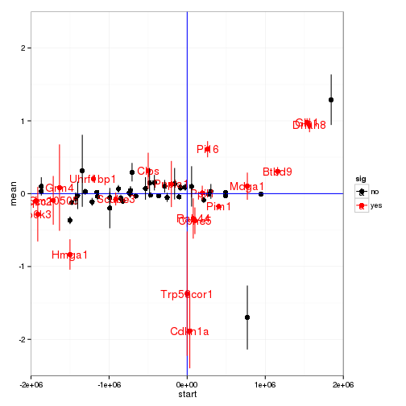 


```r
genesOfInterest<-c("Trp53cor1","LacZ","Trp53",alwaysSigGenes)
genes<-getGenes(cuff,genesOfInterest)
genesAnnot<-annotation(genes)
genesFPKMreps<-repFpkm(genes)
geneFpkms<-merge(genesAnnot,genesFPKMreps,by.x="gene_id",by.y="gene_id")
colstokeep<-c("gene_id","gene_short_name","sample_name","replicate","rep_name","fpkm")
gf<-geneFpkms[,colstokeep]
gf_wide<-dcast(gf,rep_name+sample_name~gene_short_name)
```

```
## Using fpkm as value column: use value.var to override.
```

```r
se <- function(x) sqrt(var(x)/length(x))
gf_mean<-aggregate(gf_wide,by=list(gf_wide$sample_name),FUN=mean)
```

```
## Warning in mean.default(X[[1L]], ...): argument is not numeric or logical:
## returning NA
```

```
## Warning in mean.default(X[[2L]], ...): argument is not numeric or logical:
## returning NA
```

```
## Warning in mean.default(X[[3L]], ...): argument is not numeric or logical:
## returning NA
```

```
## Warning in mean.default(X[[4L]], ...): argument is not numeric or logical:
## returning NA
```

```
## Warning in mean.default(X[[5L]], ...): argument is not numeric or logical:
## returning NA
```

```
## Warning in mean.default(X[[6L]], ...): argument is not numeric or logical:
## returning NA
```

```
## Warning in mean.default(X[[7L]], ...): argument is not numeric or logical:
## returning NA
```

```
## Warning in mean.default(X[[8L]], ...): argument is not numeric or logical:
## returning NA
```

```
## Warning in mean.default(X[[9L]], ...): argument is not numeric or logical:
## returning NA
```

```
## Warning in mean.default(X[[10L]], ...): argument is not numeric or
## logical: returning NA
```

```
## Warning in mean.default(X[[11L]], ...): argument is not numeric or
## logical: returning NA
```

```
## Warning in mean.default(X[[12L]], ...): argument is not numeric or
## logical: returning NA
```

```
## Warning in mean.default(X[[13L]], ...): argument is not numeric or
## logical: returning NA
```

```
## Warning in mean.default(X[[14L]], ...): argument is not numeric or
## logical: returning NA
```

```
## Warning in mean.default(X[[15L]], ...): argument is not numeric or
## logical: returning NA
```

```
## Warning in mean.default(X[[16L]], ...): argument is not numeric or
## logical: returning NA
```

```
## Warning in mean.default(X[[1L]], ...): argument is not numeric or logical:
## returning NA
```

```
## Warning in mean.default(X[[2L]], ...): argument is not numeric or logical:
## returning NA
```

```
## Warning in mean.default(X[[3L]], ...): argument is not numeric or logical:
## returning NA
```

```
## Warning in mean.default(X[[4L]], ...): argument is not numeric or logical:
## returning NA
```

```
## Warning in mean.default(X[[5L]], ...): argument is not numeric or logical:
## returning NA
```

```
## Warning in mean.default(X[[6L]], ...): argument is not numeric or logical:
## returning NA
```

```
## Warning in mean.default(X[[7L]], ...): argument is not numeric or logical:
## returning NA
```

```
## Warning in mean.default(X[[8L]], ...): argument is not numeric or logical:
## returning NA
```

```
## Warning in mean.default(X[[9L]], ...): argument is not numeric or logical:
## returning NA
```

```
## Warning in mean.default(X[[10L]], ...): argument is not numeric or
## logical: returning NA
```

```
## Warning in mean.default(X[[11L]], ...): argument is not numeric or
## logical: returning NA
```

```
## Warning in mean.default(X[[12L]], ...): argument is not numeric or
## logical: returning NA
```

```
## Warning in mean.default(X[[13L]], ...): argument is not numeric or
## logical: returning NA
```

```
## Warning in mean.default(X[[14L]], ...): argument is not numeric or
## logical: returning NA
```

```
## Warning in mean.default(X[[15L]], ...): argument is not numeric or
## logical: returning NA
```

```
## Warning in mean.default(X[[16L]], ...): argument is not numeric or
## logical: returning NA
```

```r
#gf_std<-aggregate(gf_wide,by=list(gf_wide$sample_name),FUN=std)
gf_se<-aggregate(gf_wide,by=list(gf_wide$sample_name),FUN=se)
```

```
## Warning in var(x): NAs introduced by coercion
```

```
## Warning in var(x): NAs introduced by coercion
```

```
## Warning in var(x): NAs introduced by coercion
```

```
## Warning in var(x): NAs introduced by coercion
```

```
## Warning in var(x): NAs introduced by coercion
```

```
## Warning in var(x): NAs introduced by coercion
```

```
## Warning in var(x): NAs introduced by coercion
```

```
## Warning in var(x): NAs introduced by coercion
```

```
## Warning in var(x): NAs introduced by coercion
```

```
## Warning in var(x): NAs introduced by coercion
```

```
## Warning in var(x): NAs introduced by coercion
```

```
## Warning in var(x): NAs introduced by coercion
```

```
## Warning in var(x): NAs introduced by coercion
```

```
## Warning in var(x): NAs introduced by coercion
```

```
## Warning in var(x): NAs introduced by coercion
```

```
## Warning in var(x): NAs introduced by coercion
```

```
## Warning in var(x): NAs introduced by coercion
```

```
## Warning in var(x): NAs introduced by coercion
```

```
## Warning in var(x): NAs introduced by coercion
```

```
## Warning in var(x): NAs introduced by coercion
```

```
## Warning in var(x): NAs introduced by coercion
```

```
## Warning in var(x): NAs introduced by coercion
```

```
## Warning in var(x): NAs introduced by coercion
```

```
## Warning in var(x): NAs introduced by coercion
```

```
## Warning in var(x): NAs introduced by coercion
```

```
## Warning in var(x): NAs introduced by coercion
```

```
## Warning in var(x): NAs introduced by coercion
```

```
## Warning in var(x): NAs introduced by coercion
```

```
## Warning in var(x): NAs introduced by coercion
```

```
## Warning in var(x): NAs introduced by coercion
```

```
## Warning in var(x): NAs introduced by coercion
```

```
## Warning in var(x): NAs introduced by coercion
```

```r
#p21-lincp21
wtavg<-gf_mean[grep("wt",gf_mean$Group.1),]
wtse<-gf_se[grep("wt",gf_se$Group.1),]
limits<-aes(ymax=wtavg$Cdkn1a+wtse$Cdkn1a,ymin=wtavg$Cdkn1a-wtse$Cdkn1a)
plot<-ggplot(wtavg,aes(y=Cdkn1a,x=Trp53cor1,label=Group.1))+geom_point()+geom_errorbar(limits,width=0.2)+geom_text()
plot
```

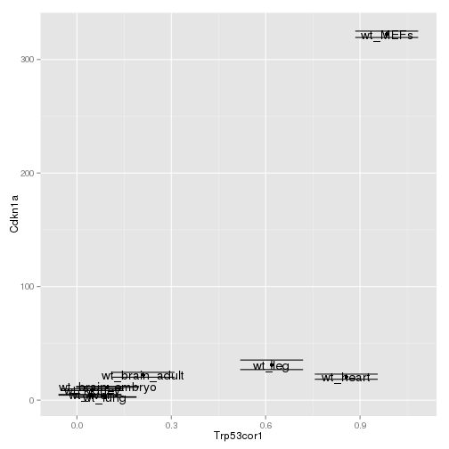 

```r
#Fit 
fit<-lm(wtavg$Cdkn1a~wtavg$Trp53cor1)
summary(fit)$r.squared #0.4674
```

```
## [1] 0.4705607
```

```r
#Glo1-lincp21
limits<-aes(ymax=wtavg$Glo1+wtse$Glo1,ymin=wtavg$Glo1-wtse$Glo1)
plot<-ggplot(wtavg,aes(y=Glo1,x=Trp53cor1,label=Group.1))+geom_point()+geom_errorbar(limits,width=0.2)+geom_text()
plot
```

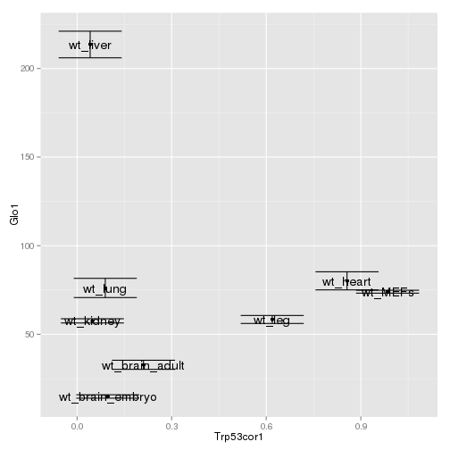 

```r
#Gm9825-lincp21
limits<-aes(ymax=wtavg$Gm9825+wtse$Gm9825,ymin=wtavg$Gm9825-wtse$Gm9825)
plot<-ggplot(wtavg,aes(y=Gm9825,x=Trp53cor1,label=Group.1))+geom_point()+geom_errorbar(limits,width=0.2)+geom_text()
plot
```

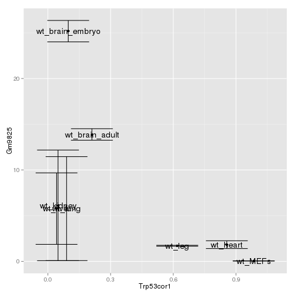 

```r
#KO_Lacz-lincp21
#GET KOavg
koavg<-gf_mean[grep("ko",gf_mean$Group.1),]
kose<-gf_se[grep("ko",gf_se$Group.1),]
limits<-aes(ymax=koavg$LacZ+kose$LacZ,ymin=koavg$LacZ-kose$LacZ)
plot<-ggplot(koavg,aes(y=LacZ,x=wtavg$Trp53cor1,label=Group.1))+geom_point()+geom_errorbar(limits,width=0.2)+geom_text()
plot
```

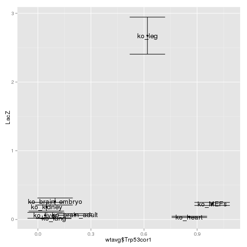 

```r
#Rnps1-lincp21
limits<-aes(ymax=wtavg$Rnps1+wtse$Rnps1,ymin=wtavg$Rnps1-wtse$Rnps1)
plot<-ggplot(wtavg,aes(y=Rnps1,x=Trp53cor1,label=Group.1))+geom_point()+geom_errorbar(limits,width=0.2)+geom_text()
plot
```

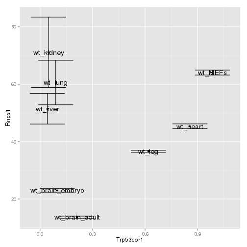 


```r
fc<-getLogFoldChangeTable(cuff)
fc$gene_id<-row.names(fc)
annot<-annotation(genes(cuff))
annot<-ddply(annot,.(gene_id),head,n=1)
a<-annot[,c("gene_id","gene_short_name")]
dat<-merge(a,fc,by.x="gene_id",by.y="gene_id")
fcGenesofInterest<-dat[which(dat$gene_short_name %in% genesOfInterest),]

dat.melt<-melt(fcGenesofInterest,id.vars=c("gene_id","gene_short_name"))
dat.cast<-dcast(dat.melt,variable~gene_short_name)
lincp21_exps<-wtavg[,c("Group.1","Trp53cor1")]
lincp21_exps$Group.1<-gsub("wt_","",lincp21_exps$Group.1)
colnames(lincp21_exps)<-c("sample","WT_lincp21_FPKMavg")
dat<-merge(dat.cast,lincp21_exps,by.x="variable",by.y="sample")

#p21-lincp21
plot<-ggplot(dat,aes(y=Cdkn1a,x=WT_lincp21_FPKMavg,label=variable))+geom_point()+geom_text()
plot
```

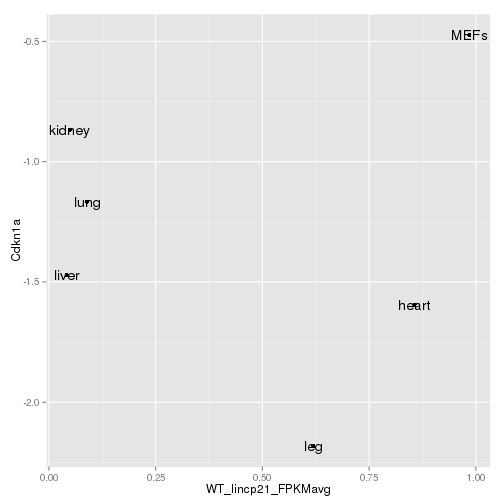 

```r
#Fit 


#Glo1-lincp21
plot<-ggplot(dat,aes(y=Glo1,x=WT_lincp21_FPKMavg,label=variable))+geom_point()+geom_text()
plot
```

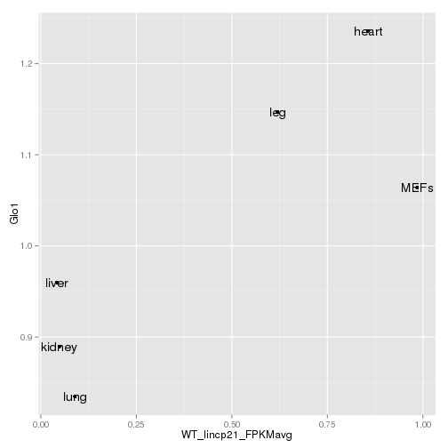 

```r
#Gm9825-lincp21
limits<-aes(ymax=wtavg$Gm9825+wtse$Gm9825,ymin=wtavg$Gm9825-wtse$Gm9825)
plot<-ggplot(wtavg,aes(y=Gm9825,x=Trp53cor1,label=Group.1))+geom_point()+geom_errorbar(limits,width=0.2)+geom_text()
plot
```

 

```r
#KO_Lacz-lincp21
#GET KOavg
plot<-ggplot(dat,aes(y=LacZ,x=WT_lincp21_FPKMavg,label=variable))+geom_point()+geom_text()
plot
```

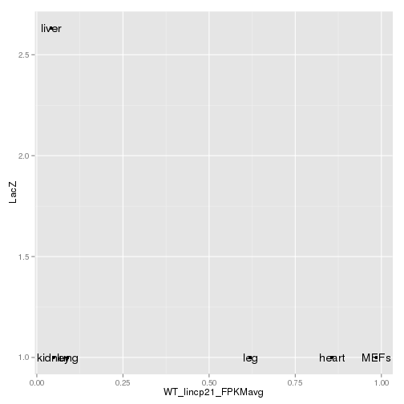 

```r
#Rnps1-lincp21
plot<-ggplot(dat,aes(y=Rnps1,x=WT_lincp21_FPKMavg,label=variable))+geom_point()+geom_text()
plot
```

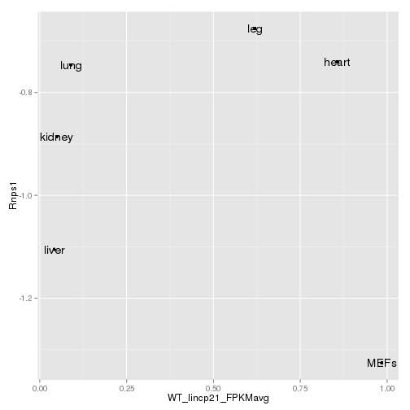 


