Trp53cor1 KO vs WT (brain)
======================================


This file shows the wt-v-ko comparison for Trp53cor1. 

Cuff overview:


```
## CuffSet instance with:
## 	 2 samples
## 	 26754 genes
## 	 77524 isoforms
## 	 0 TSS
## 	 23066 CDS
## 	 0 promoters
## 	 0 splicing
## 	 19954 relCDS
```

# QC

## Dispersion

Dispersion plot for genes in cuff:
(Overdispersion can lead to innacurate quants)

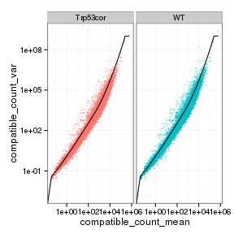 

## Cross-replicate variability (fpkmSCVplot)
Differences in CV 2 can result in lower numbers of differentially expressed genes due to a higher degree of variability between replicate fpkm estimates.

Genes:

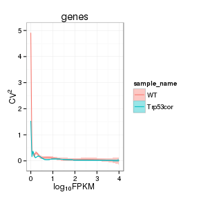 

Isoforms: 

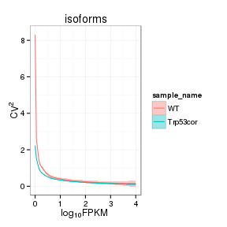 

## MvA plot


```
## Error in dat$y + pseudocount: non-numeric argument to binary operator
```
   
### MvA plot counts


```
## Error in dat$y + pseudocount: non-numeric argument to binary operator
```

## Scatterplot matrix

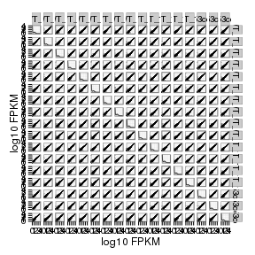 

## Distributions

### Boxplots

Boxplot (genes)

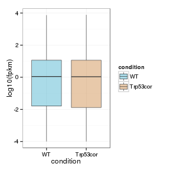 

Boxplot (genes, replicates)

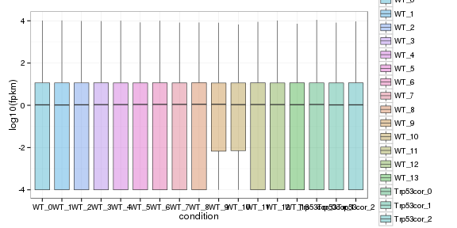 

Boxplot (isoforms)

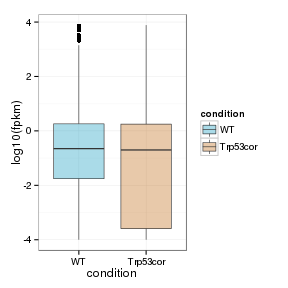 

Boxplot (isoforms, replicates)

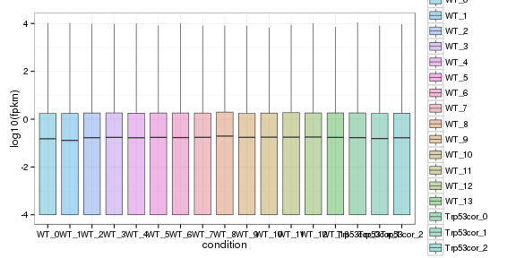 

### Density

Density (genes)

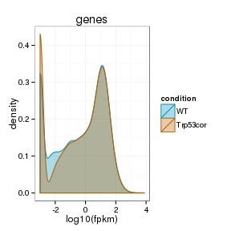 

Density (genes, replicates)

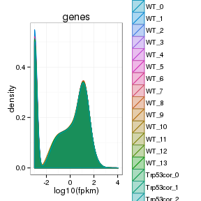 


## Clustering

### Replicate Clusters

 

```
## NULL
```

### PCA (genes)

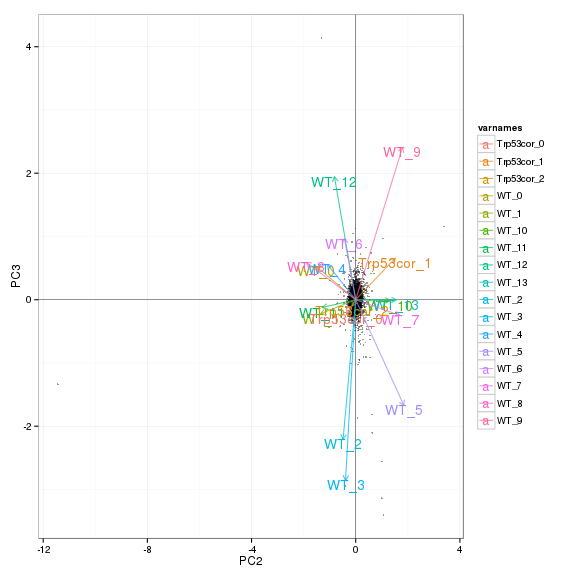 

### MDS (genes)

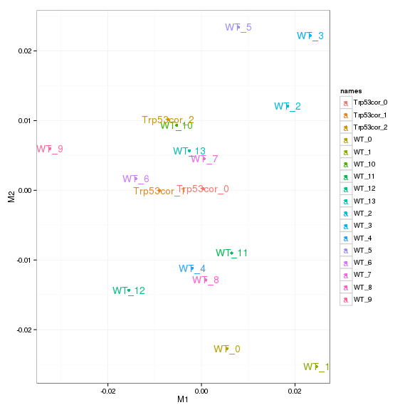 


# KO assessment

## Endogenous lncRNA expression

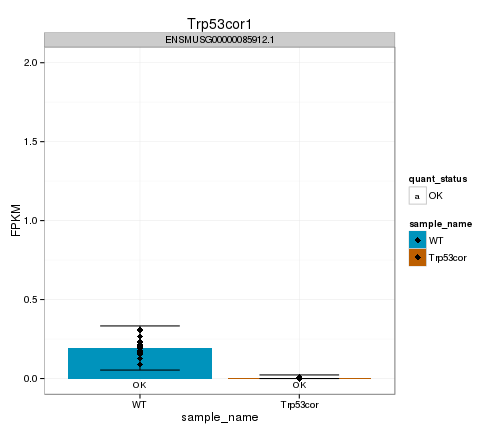 

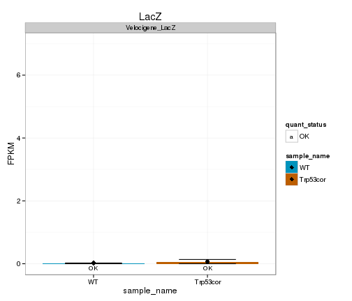 

## Digital Genotyping (LacZ vs Endogenous lncRNA and Sex)

Eif2s3y is a y-expressed gene, Xist is an x-expressed gene 
Expression plot (endogenous linc, lacZ, Y-expressed gene):

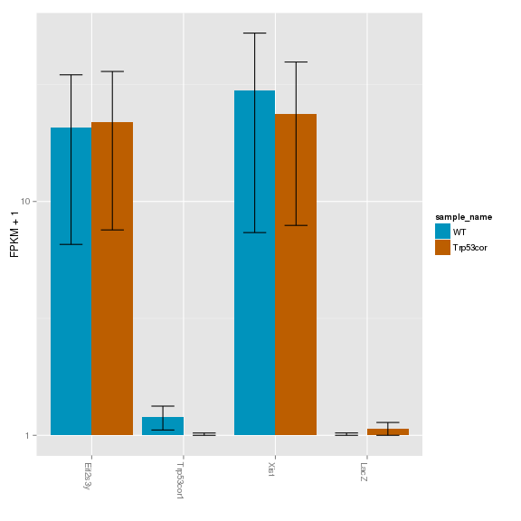 

Expression heatmap:

 

### Track visualization 


```
## Error in validObject(.Object): invalid class "ReferenceDataTrack" object: The referenced file '/n/rinn_data1/users/agroff/seq/OtherMice/Diana/lincP21/bam/abundances.cxb/accepted_hits.bam' does not exist
```

# Differential Analysis

## Differential Genes 


There are 69 significantly differentially expressed genes. They are:

<!-- html table generated in R 3.0.2 by xtable 1.7-3 package -->
<!-- Wed Mar 25 19:44:47 2015 -->
<TABLE border=1>
<TR> <TH>  </TH> <TH> geneAnnot$gene_short_name </TH>  </TR>
  <TR> <TD align="right"> 1 </TD> <TD> Gabra2 </TD> </TR>
  <TR> <TD align="right"> 2 </TD> <TD> Arrdc2 </TD> </TR>
  <TR> <TD align="right"> 3 </TD> <TD> Nes </TD> </TR>
  <TR> <TD align="right"> 4 </TD> <TD> Epha2 </TD> </TR>
  <TR> <TD align="right"> 5 </TD> <TD> Khsrp </TD> </TR>
  <TR> <TD align="right"> 6 </TD> <TD> Odc1 </TD> </TR>
  <TR> <TD align="right"> 7 </TD> <TD> Tjap1 </TD> </TR>
  <TR> <TD align="right"> 8 </TD> <TD> Etnppl </TD> </TR>
  <TR> <TD align="right"> 9 </TD> <TD> Fabp7 </TD> </TR>
  <TR> <TD align="right"> 10 </TD> <TD> Sgk1 </TD> </TR>
  <TR> <TD align="right"> 11 </TD> <TD> Adi1 </TD> </TR>
  <TR> <TD align="right"> 12 </TD> <TD> Serpina3n </TD> </TR>
  <TR> <TD align="right"> 13 </TD> <TD> Kcnv1 </TD> </TR>
  <TR> <TD align="right"> 14 </TD> <TD> Cdkn1a </TD> </TR>
  <TR> <TD align="right"> 15 </TD> <TD> Park2 </TD> </TR>
  <TR> <TD align="right"> 16 </TD> <TD> Mpc1 </TD> </TR>
  <TR> <TD align="right"> 17 </TD> <TD> Flywch2 </TD> </TR>
  <TR> <TD align="right"> 18 </TD> <TD> Mut </TD> </TR>
  <TR> <TD align="right"> 19 </TD> <TD> Enpp4 </TD> </TR>
  <TR> <TD align="right"> 20 </TD> <TD> Ppil1 </TD> </TR>
  <TR> <TD align="right"> 21 </TD> <TD> Cpne5 </TD> </TR>
  <TR> <TD align="right"> 22 </TD> <TD> Pi16 </TD> </TR>
  <TR> <TD align="right"> 23 </TD> <TD> Glo1 </TD> </TR>
  <TR> <TD align="right"> 24 </TD> <TD> Prss41 </TD> </TR>
  <TR> <TD align="right"> 25 </TD> <TD> Atp6v0c </TD> </TR>
  <TR> <TD align="right"> 26 </TD> <TD> Spsb3 </TD> </TR>
  <TR> <TD align="right"> 27 </TD> <TD> Adamts10 </TD> </TR>
  <TR> <TD align="right"> 28 </TD> <TD> Rps24 </TD> </TR>
  <TR> <TD align="right"> 29 </TD> <TD> Rps6 </TD> </TR>
  <TR> <TD align="right"> 30 </TD> <TD> Adamts9 </TD> </TR>
  <TR> <TD align="right"> 31 </TD> <TD> Gkn3 </TD> </TR>
  <TR> <TD align="right"> 32 </TD> <TD> A2m </TD> </TR>
  <TR> <TD align="right"> 33 </TD> <TD> Hddc3 </TD> </TR>
  <TR> <TD align="right"> 34 </TD> <TD> Tlr13 </TD> </TR>
  <TR> <TD align="right"> 35 </TD> <TD> Arhgap27 </TD> </TR>
  <TR> <TD align="right"> 36 </TD> <TD> Rnps1 </TD> </TR>
  <TR> <TD align="right"> 37 </TD> <TD> Lars2 </TD> </TR>
  <TR> <TD align="right"> 38 </TD> <TD> 3110052M02Rik </TD> </TR>
  <TR> <TD align="right"> 39 </TD> <TD> Decr2 </TD> </TR>
  <TR> <TD align="right"> 40 </TD> <TD> Cramp1l </TD> </TR>
  <TR> <TD align="right"> 41 </TD> <TD> Gm129 </TD> </TR>
  <TR> <TD align="right"> 42 </TD> <TD> Akap12 </TD> </TR>
  <TR> <TD align="right"> 43 </TD> <TD> Itpkb </TD> </TR>
  <TR> <TD align="right"> 44 </TD> <TD> Lyplal1 </TD> </TR>
  <TR> <TD align="right"> 45 </TD> <TD> Fmo2 </TD> </TR>
  <TR> <TD align="right"> 46 </TD> <TD> Rps19 </TD> </TR>
  <TR> <TD align="right"> 47 </TD> <TD> Maff </TD> </TR>
  <TR> <TD align="right"> 48 </TD> <TD> Gm9493 </TD> </TR>
  <TR> <TD align="right"> 49 </TD> <TD> Zfp758 </TD> </TR>
  <TR> <TD align="right"> 50 </TD> <TD> Acp1 </TD> </TR>
  <TR> <TD align="right"> 51 </TD> <TD> Hmga1 </TD> </TR>
  <TR> <TD align="right"> 52 </TD> <TD> Tmem252 </TD> </TR>
  <TR> <TD align="right"> 53 </TD> <TD> Pla2g4e </TD> </TR>
  <TR> <TD align="right"> 54 </TD> <TD> Tagap1 </TD> </TR>
  <TR> <TD align="right"> 55 </TD> <TD> Arntl </TD> </TR>
  <TR> <TD align="right"> 56 </TD> <TD> Per2 </TD> </TR>
  <TR> <TD align="right"> 57 </TD> <TD> H2-T22 </TD> </TR>
  <TR> <TD align="right"> 58 </TD> <TD> Ide </TD> </TR>
  <TR> <TD align="right"> 59 </TD> <TD> Cox5b </TD> </TR>
  <TR> <TD align="right"> 60 </TD> <TD> H2-T23 </TD> </TR>
  <TR> <TD align="right"> 61 </TD> <TD> Zfp760 </TD> </TR>
  <TR> <TD align="right"> 62 </TD> <TD> H2-Bl </TD> </TR>
  <TR> <TD align="right"> 63 </TD> <TD> 9030025P20Rik </TD> </TR>
  <TR> <TD align="right"> 64 </TD> <TD> Hmga1-rs1 </TD> </TR>
  <TR> <TD align="right"> 65 </TD> <TD> Apold1 </TD> </TR>
  <TR> <TD align="right"> 66 </TD> <TD> AA465934 </TD> </TR>
  <TR> <TD align="right"> 67 </TD> <TD> Rpl41 </TD> </TR>
  <TR> <TD align="right"> 68 </TD> <TD> Gm9825 </TD> </TR>
  <TR> <TD align="right"> 69 </TD> <TD> Tmem181b-ps </TD> </TR>
   </TABLE>
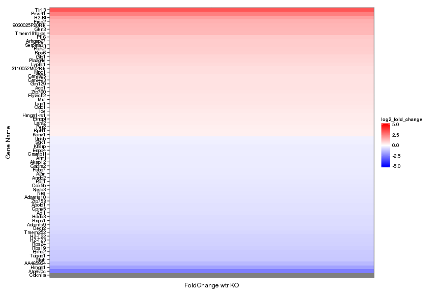 

Expression heatmap of sigGenes

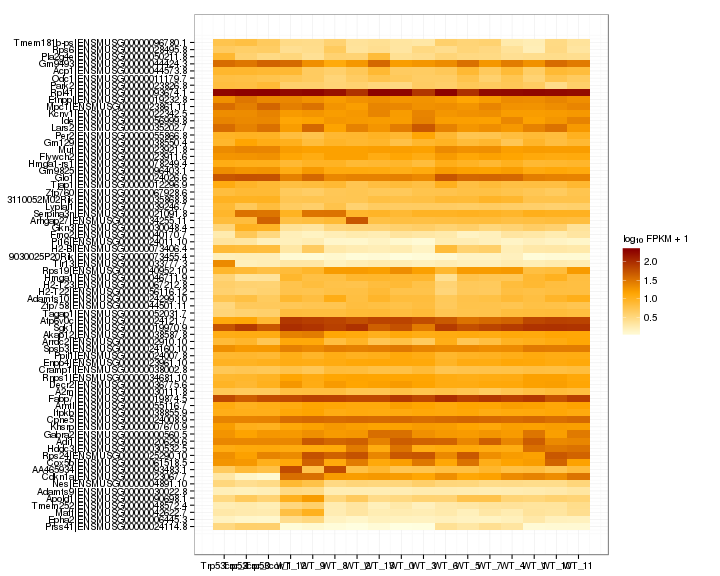 

Foldchange heatmap of sigGenes 

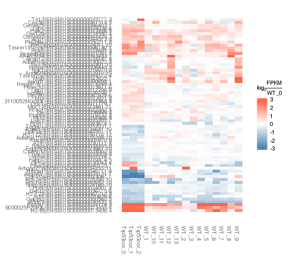 


Now, look at genes that are detectably expressed (FPKM>0.5, yes I know it should be 1), and log2foldchange>2 in any direction: 22 genes

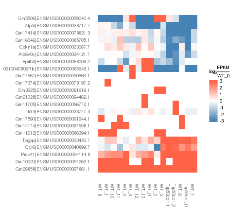 


Now, those that are expressed, changing and called sig: 4 genes 

 

### Expression-level/significance relationship

Scatter plot of significant genes only:


```
## Error in .local(object, x, y, logMode, pseudocount, labels, smooth, ...): One or more values of 'x' or 'y' are not valid sample names!
```

Volcano Plot


```
## Error in .local(object, x, y, features, ...): One or more values of 'x' or 'y' are not valid sample names!
```

Volcano plot with significant genes only:


```
## Error in .local(object, x, y, ...): One or more values of 'x' or 'y' are not valid sample names!
```

### Differential Isoforms between conditions

Per isoform difference between conditions:

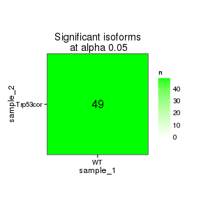 

```
## Error in getGenes(cuff, isoformSigIDs, level = "isoforms"): unused argument (level = "isoforms")
```

These isoforms are:


```
## Error in as.data.frame(isoAnnot$gene_short_name): error in evaluating the argument 'x' in selecting a method for function 'as.data.frame': Error: object 'isoAnnot' not found
```

DE isoform heatmap


```
## Error in csHeatmap(isoformSigGenes, cluster = "both", replicates = T, : error in evaluating the argument 'object' in selecting a method for function 'csHeatmap': Error: object 'isoformSigGenes' not found
```

Isoform foldchange heatmap by isoform:


```
## Error in csFoldChangeHeatmap(isoforms(isoformSigGenes), "WT", replicates = TRUE, : error in evaluating the argument 'object' in selecting a method for function 'csFoldChangeHeatmap': Error in isoforms(isoformSigGenes) : 
##   error in evaluating the argument 'object' in selecting a method for function 'isoforms': Error: object 'isoformSigGenes' not found
```

# Gene/Pathway Analysis

## GSEA

Enrichment and zscores are calculated based on expression in KO vs WT (fpkmKO/fpkmWT), so genes that are down regulated in KO are shown in blue, while upregulation is shown in red. 

KO/WT
Blue = down in KO
Red = Up in KO


Biocarta enrichment: 

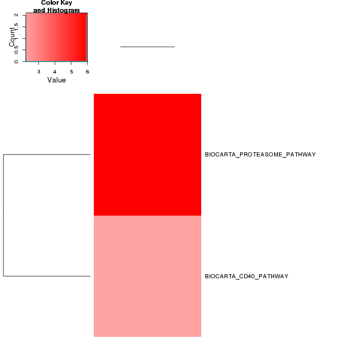 

Biocarta zscore: 

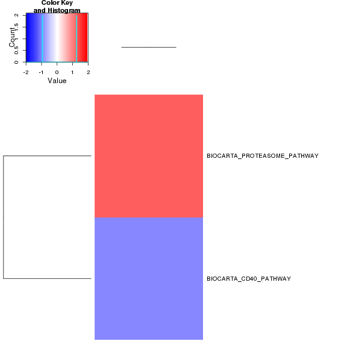 

Reactome enrichment:

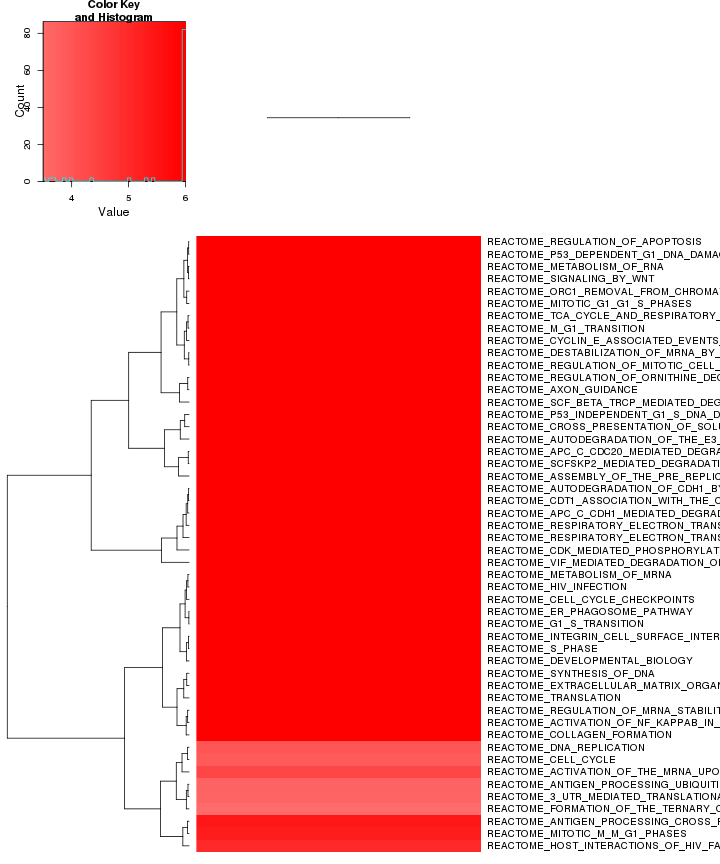 

Reactome zscore: 

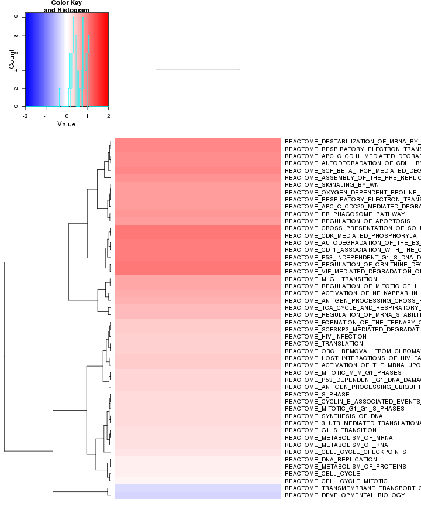 

Kegg enrichment: 

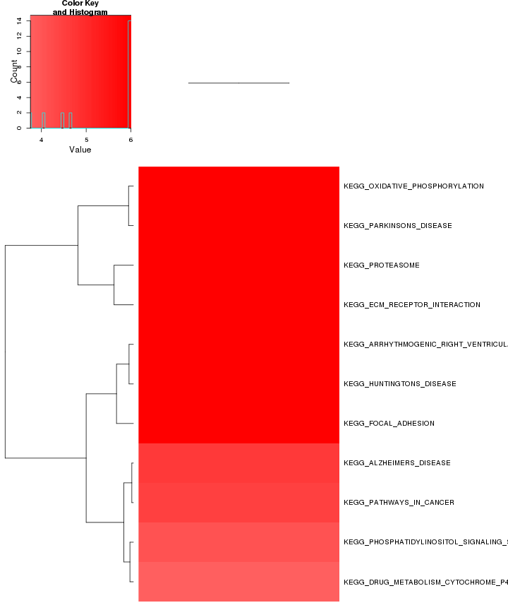 

Kegg zscore: 

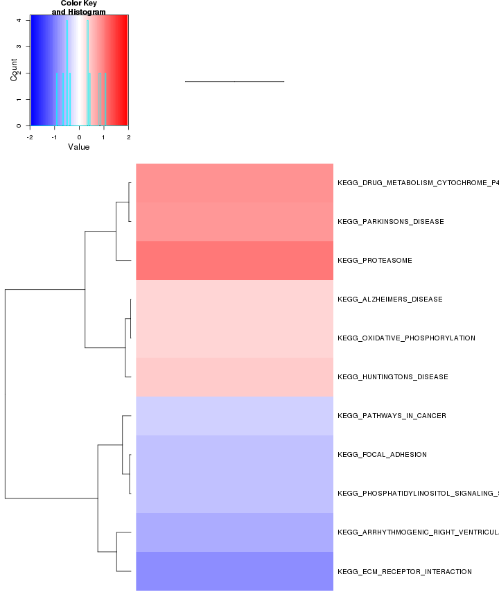 


p53 enrichment: 

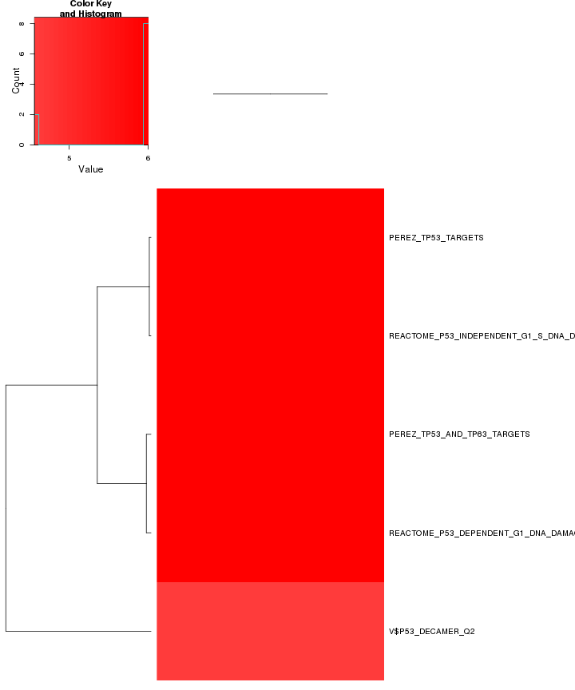 

p53 zscore: 

 

Oncogene enrichment: 

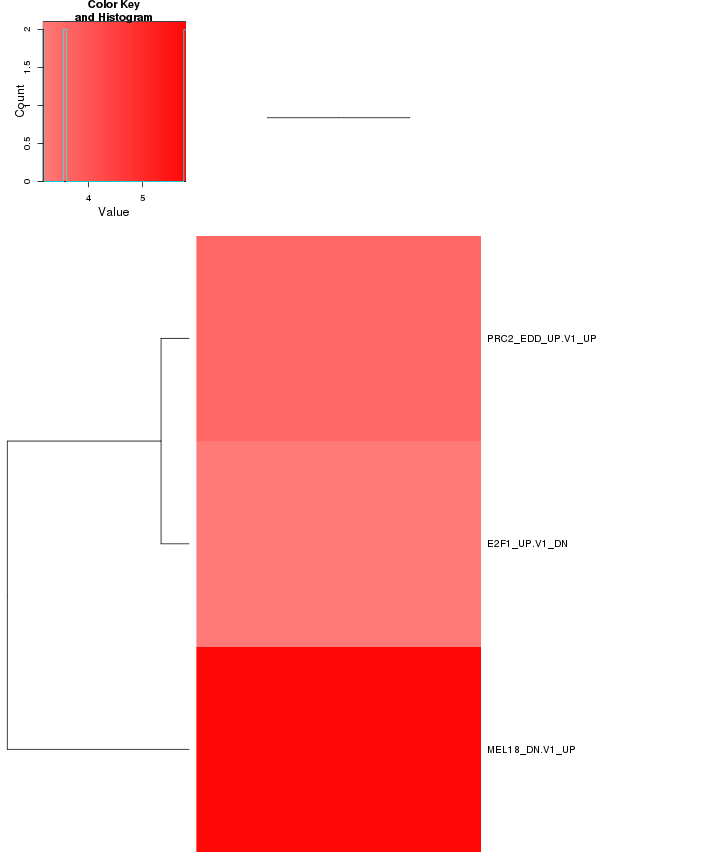 

Oncogene zscore:

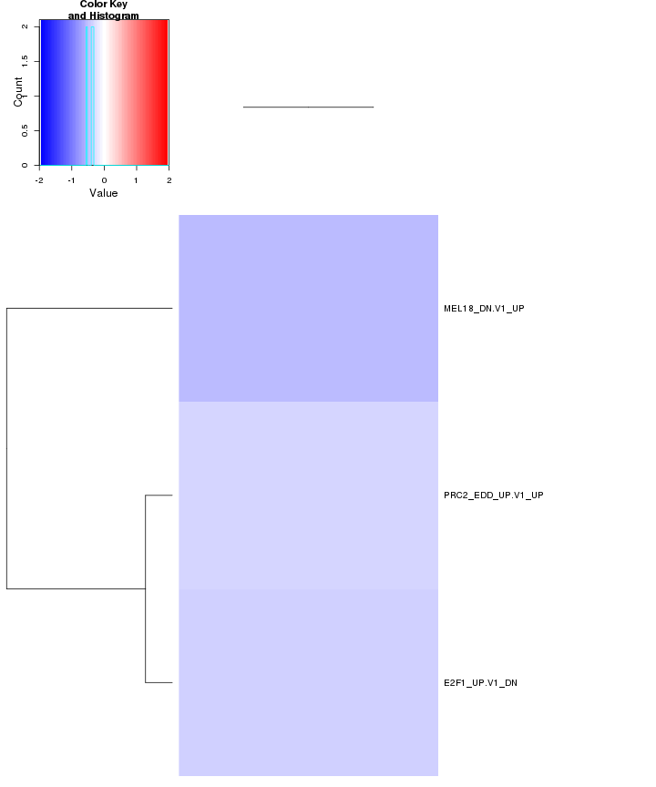 


Jacks enrichment

```
## Error in if (dim(x_ordered)[1] > 1) {: argument is of length zero
```


Jacks zscore


```
## Error in x[, 1]: incorrect number of dimensions
```

```
## Error in as.matrix(x_ordered): error in evaluating the argument 'x' in selecting a method for function 'as.matrix': Error: object 'x_ordered' not found
```

```
## Error in eval(expr, envir, enclos): object 'x_ordered' not found
```


All enrichment 


There are 390 categories enriched (p<0.0001). They are:

 

ALL zscore:

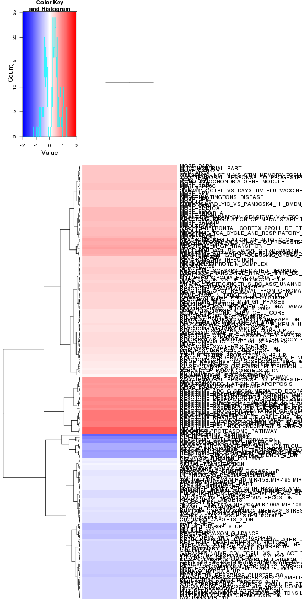 

## GO enrichment 
Cluster profiler used to call enichments of significantly differentially regulated genes that map to Entrez IDs. 


```
## Error in unit(tic_pos.c, "mm"): 'x' and 'units' must have length > 0
```

```
## Error in unit(tic_pos.c, "mm"): 'x' and 'units' must have length > 0
```

```
## Error in unit(tic_pos.c, "mm"): 'x' and 'units' must have length > 0
```

```
## Error in unit(tic_pos.c, "mm"): 'x' and 'units' must have length > 0
```

```
## Error in unit(tic_pos.c, "mm"): 'x' and 'units' must have length > 0
```

# Cis vs Trans (locally)

log2 Foldchange and test statistic are calculated with the ratio of fpkm(KO)/fpkm(WT), thus the test_stat is positive if a gene is higher in the KO and negative if a gene has lower expression in the KO


The pvalue for genes significantly regulated in a region this size  is: 0.0064 

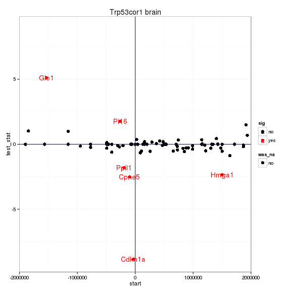 

# Notes

## Samples used are:
<!-- html table generated in R 3.0.2 by xtable 1.7-3 package -->
<!-- Wed Mar 25 22:24:55 2015 -->
<TABLE border=1>
<TR> <TH>  </TH> <TH> 11 </TH>  </TR>
  <TR> <TD align="right"> 1 </TD> <TD> abundances.cxb </TD> </TR>
  <TR> <TD align="right"> 2 </TD> <TD> abundances.cxb </TD> </TR>
  <TR> <TD align="right"> 3 </TD> <TD> abundances.cxb </TD> </TR>
  <TR> <TD align="right"> 4 </TD> <TD> abundances.cxb </TD> </TR>
  <TR> <TD align="right"> 5 </TD> <TD> abundances.cxb </TD> </TR>
  <TR> <TD align="right"> 6 </TD> <TD> abundances.cxb </TD> </TR>
  <TR> <TD align="right"> 7 </TD> <TD> abundances.cxb </TD> </TR>
  <TR> <TD align="right"> 8 </TD> <TD> abundances.cxb </TD> </TR>
  <TR> <TD align="right"> 9 </TD> <TD> abundances.cxb </TD> </TR>
  <TR> <TD align="right"> 10 </TD> <TD> abundances.cxb </TD> </TR>
  <TR> <TD align="right"> 11 </TD> <TD> abundances.cxb </TD> </TR>
  <TR> <TD align="right"> 12 </TD> <TD> abundances.cxb </TD> </TR>
  <TR> <TD align="right"> 13 </TD> <TD> abundances.cxb </TD> </TR>
  <TR> <TD align="right"> 14 </TD> <TD> abundances.cxb </TD> </TR>
  <TR> <TD align="right"> 15 </TD> <TD> abundances.cxb </TD> </TR>
  <TR> <TD align="right"> 16 </TD> <TD> abundances.cxb </TD> </TR>
  <TR> <TD align="right"> 17 </TD> <TD> abundances.cxb </TD> </TR>
   </TABLE>

## Replicates
<!-- html table generated in R 3.0.2 by xtable 1.7-3 package -->
<!-- Wed Mar 25 22:24:55 2015 -->
<TABLE border=1>
<TR> <TH>  </TH> <TH> file </TH> <TH> sample_name </TH> <TH> replicate </TH> <TH> rep_name </TH> <TH> total_mass </TH> <TH> norm_mass </TH> <TH> internal_scale </TH> <TH> external_scale </TH>  </TR>
  <TR> <TD align="right"> 1 </TD> <TD> /n/rinn_data1/seq/lgoff/Projects/BrainMap/data/quants/JR729/abundances.cxb </TD> <TD> WT </TD> <TD align="right">   0 </TD> <TD> WT_0 </TD> <TD align="right"> 26334400.00 </TD> <TD align="right"> 34671700.00 </TD> <TD align="right"> 0.76 </TD> <TD align="right"> 1.00 </TD> </TR>
  <TR> <TD align="right"> 2 </TD> <TD> /n/rinn_data1/seq/lgoff/Projects/BrainMap/data/quants/JR728/abundances.cxb </TD> <TD> WT </TD> <TD align="right">   1 </TD> <TD> WT_1 </TD> <TD align="right"> 20329200.00 </TD> <TD align="right"> 34671700.00 </TD> <TD align="right"> 0.58 </TD> <TD align="right"> 1.00 </TD> </TR>
  <TR> <TD align="right"> 3 </TD> <TD> /n/rinn_data1/seq/lgoff/Projects/BrainMap/data/quants/JR796/abundances.cxb </TD> <TD> WT </TD> <TD align="right">   2 </TD> <TD> WT_2 </TD> <TD align="right"> 34089000.00 </TD> <TD align="right"> 34671700.00 </TD> <TD align="right"> 0.98 </TD> <TD align="right"> 1.00 </TD> </TR>
  <TR> <TD align="right"> 4 </TD> <TD> /n/rinn_data1/seq/lgoff/Projects/BrainMap/data/quants/JR797/abundances.cxb </TD> <TD> WT </TD> <TD align="right">   3 </TD> <TD> WT_3 </TD> <TD align="right"> 28103300.00 </TD> <TD align="right"> 34671700.00 </TD> <TD align="right"> 0.80 </TD> <TD align="right"> 1.00 </TD> </TR>
  <TR> <TD align="right"> 5 </TD> <TD> /n/rinn_data1/seq/lgoff/Projects/BrainMap/data/quants/JR740/abundances.cxb </TD> <TD> WT </TD> <TD align="right">   4 </TD> <TD> WT_4 </TD> <TD align="right"> 35808200.00 </TD> <TD align="right"> 34671700.00 </TD> <TD align="right"> 1.03 </TD> <TD align="right"> 1.00 </TD> </TR>
  <TR> <TD align="right"> 6 </TD> <TD> /n/rinn_data1/seq/lgoff/Projects/BrainMap/data/quants/JR800/abundances.cxb </TD> <TD> WT </TD> <TD align="right">   5 </TD> <TD> WT_5 </TD> <TD align="right"> 37012200.00 </TD> <TD align="right"> 34671700.00 </TD> <TD align="right"> 1.07 </TD> <TD align="right"> 1.00 </TD> </TR>
  <TR> <TD align="right"> 7 </TD> <TD> /n/rinn_data1/seq/lgoff/Projects/BrainMap/data/quants/JR827/abundances.cxb </TD> <TD> WT </TD> <TD align="right">   6 </TD> <TD> WT_6 </TD> <TD align="right"> 27786600.00 </TD> <TD align="right"> 34671700.00 </TD> <TD align="right"> 0.81 </TD> <TD align="right"> 1.00 </TD> </TR>
  <TR> <TD align="right"> 8 </TD> <TD> /n/rinn_data1/seq/lgoff/Projects/BrainMap/data/quants/JR778/abundances.cxb </TD> <TD> WT </TD> <TD align="right">   7 </TD> <TD> WT_7 </TD> <TD align="right"> 39541900.00 </TD> <TD align="right"> 34671700.00 </TD> <TD align="right"> 1.15 </TD> <TD align="right"> 1.00 </TD> </TR>
  <TR> <TD align="right"> 9 </TD> <TD> /n/rinn_data1/seq/lgoff/Projects/BrainMap/data/quants/JR734/abundances.cxb </TD> <TD> WT </TD> <TD align="right">   8 </TD> <TD> WT_8 </TD> <TD align="right"> 34480600.00 </TD> <TD align="right"> 34671700.00 </TD> <TD align="right"> 1.01 </TD> <TD align="right"> 1.00 </TD> </TR>
  <TR> <TD align="right"> 10 </TD> <TD> /n/rinn_data1/seq/lgoff/Projects/BrainMap/data/quants/JR802/abundances.cxb </TD> <TD> WT </TD> <TD align="right">   9 </TD> <TD> WT_9 </TD> <TD align="right"> 45467400.00 </TD> <TD align="right"> 34671700.00 </TD> <TD align="right"> 1.30 </TD> <TD align="right"> 1.00 </TD> </TR>
  <TR> <TD align="right"> 11 </TD> <TD> /n/rinn_data1/seq/lgoff/Projects/BrainMap/data/quants/JR803/abundances.cxb </TD> <TD> WT </TD> <TD align="right">  10 </TD> <TD> WT_10 </TD> <TD align="right"> 52130400.00 </TD> <TD align="right"> 34671700.00 </TD> <TD align="right"> 1.50 </TD> <TD align="right"> 1.00 </TD> </TR>
  <TR> <TD align="right"> 12 </TD> <TD> /n/rinn_data1/seq/lgoff/Projects/BrainMap/data/quants/JR735/abundances.cxb </TD> <TD> WT </TD> <TD align="right">  11 </TD> <TD> WT_11 </TD> <TD align="right"> 34994400.00 </TD> <TD align="right"> 34671700.00 </TD> <TD align="right"> 1.02 </TD> <TD align="right"> 1.00 </TD> </TR>
  <TR> <TD align="right"> 13 </TD> <TD> /n/rinn_data1/seq/lgoff/Projects/BrainMap/data/quants/JR785/abundances.cxb </TD> <TD> WT </TD> <TD align="right">  12 </TD> <TD> WT_12 </TD> <TD align="right"> 34173600.00 </TD> <TD align="right"> 34671700.00 </TD> <TD align="right"> 0.97 </TD> <TD align="right"> 1.00 </TD> </TR>
  <TR> <TD align="right"> 14 </TD> <TD> /n/rinn_data1/seq/lgoff/Projects/BrainMap/data/quants/JR781/abundances.cxb </TD> <TD> WT </TD> <TD align="right">  13 </TD> <TD> WT_13 </TD> <TD align="right"> 41538900.00 </TD> <TD align="right"> 34671700.00 </TD> <TD align="right"> 1.21 </TD> <TD align="right"> 1.00 </TD> </TR>
  <TR> <TD align="right"> 15 </TD> <TD> /n/rinn_data1/seq/lgoff/Projects/BrainMap/data/quants/JR743/abundances.cxb </TD> <TD> Trp53cor </TD> <TD align="right">   0 </TD> <TD> Trp53cor_0 </TD> <TD align="right"> 32358500.00 </TD> <TD align="right"> 34671700.00 </TD> <TD align="right"> 0.94 </TD> <TD align="right"> 1.00 </TD> </TR>
  <TR> <TD align="right"> 16 </TD> <TD> /n/rinn_data1/seq/lgoff/Projects/BrainMap/data/quants/JR786/abundances.cxb </TD> <TD> Trp53cor </TD> <TD align="right">   1 </TD> <TD> Trp53cor_1 </TD> <TD align="right"> 38185400.00 </TD> <TD align="right"> 34671700.00 </TD> <TD align="right"> 1.10 </TD> <TD align="right"> 1.00 </TD> </TR>
  <TR> <TD align="right"> 17 </TD> <TD> /n/rinn_data1/seq/lgoff/Projects/BrainMap/data/quants/JR805/abundances.cxb </TD> <TD> Trp53cor </TD> <TD align="right">   2 </TD> <TD> Trp53cor_2 </TD> <TD align="right"> 41355100.00 </TD> <TD align="right"> 34671700.00 </TD> <TD align="right"> 1.19 </TD> <TD align="right"> 1.00 </TD> </TR>
   </TABLE>

## Session Info

```
## R version 3.0.2 (2013-09-25)
## Platform: x86_64-unknown-linux-gnu (64-bit)
## 
## locale:
##  [1] LC_CTYPE=en_US.UTF-8       LC_NUMERIC=C              
##  [3] LC_TIME=en_US.UTF-8        LC_COLLATE=en_US.UTF-8    
##  [5] LC_MONETARY=en_US.UTF-8    LC_MESSAGES=en_US.UTF-8   
##  [7] LC_PAPER=en_US.UTF-8       LC_NAME=C                 
##  [9] LC_ADDRESS=C               LC_TELEPHONE=C            
## [11] LC_MEASUREMENT=en_US.UTF-8 LC_IDENTIFICATION=C       
## 
## attached base packages:
## [1] grid      parallel  methods   stats     graphics  grDevices utils    
## [8] datasets  base     
## 
## other attached packages:
##  [1] plyr_1.8.1                         
##  [2] stringr_0.6.2                      
##  [3] seqbias_1.10.0                     
##  [4] BSgenome.Mmusculus.UCSC.mm10_1.3.19
##  [5] BSgenome_1.30.0                    
##  [6] Biostrings_2.30.1                  
##  [7] GO.db_2.10.1                       
##  [8] org.Mm.eg.db_2.10.1                
##  [9] clusterProfiler_1.13.1             
## [10] DOSE_2.0.0                         
## [11] ReactomePA_1.6.1                   
## [12] AnnotationDbi_1.24.0               
## [13] Biobase_2.22.0                     
## [14] mgcv_1.8-2                         
## [15] nlme_3.1-117                       
## [16] RMySQL_0.9-3                       
## [17] RColorBrewer_1.0-5                 
## [18] gridExtra_0.9.1                    
## [19] gtable_0.1.2                       
## [20] marray_1.40.0                      
## [21] gplots_2.14.2                      
## [22] GSA_1.03                           
## [23] limma_3.18.13                      
## [24] xtable_1.7-3                       
## [25] cummeRbund_2.7.2                   
## [26] Gviz_1.6.0                         
## [27] rtracklayer_1.22.7                 
## [28] GenomicRanges_1.14.4               
## [29] XVector_0.2.0                      
## [30] IRanges_1.20.7                     
## [31] fastcluster_1.1.13                 
## [32] reshape2_1.4                       
## [33] ggplot2_1.0.0                      
## [34] RSQLite_0.11.4                     
## [35] DBI_0.3.1                          
## [36] BiocGenerics_0.8.0                 
## [37] knitr_1.7                          
## 
## loaded via a namespace (and not attached):
##  [1] biomaRt_2.18.0         biovizBase_1.10.8      bitops_1.0-6          
##  [4] caTools_1.17.1         cluster_1.15.2         colorspace_1.2-4      
##  [7] dichromat_2.0-0        digest_0.6.4           DO.db_2.7             
## [10] evaluate_0.5.5         formatR_1.0            Formula_1.1-2         
## [13] gdata_2.13.3           GenomicFeatures_1.14.5 GOSemSim_1.20.3       
## [16] graph_1.40.1           graphite_1.8.1         gtools_3.4.1          
## [19] Hmisc_3.14-4           igraph_0.7.1           KEGG.db_2.10.1        
## [22] KernSmooth_2.23-12     labeling_0.2           lattice_0.20-29       
## [25] latticeExtra_0.6-26    MASS_7.3-33            Matrix_1.1-4          
## [28] munsell_0.4.2          org.Hs.eg.db_2.10.1    proto_0.3-10          
## [31] qvalue_1.36.0          Rcpp_0.11.3            RCurl_1.95-4.3        
## [34] reactome.db_1.46.1     Rsamtools_1.14.3       scales_0.2.4          
## [37] splines_3.0.2          stats4_3.0.2           survival_2.37-7       
## [40] tcltk_3.0.2            tools_3.0.2            XML_3.98-1.1          
## [43] zlibbioc_1.8.0
```

## Run Info

```
##           param
## 1      cmd_line
## 2       version
## 3  SVN_revision
## 4 boost_version
## 5        genome
##                                                                                                                                                                                                                                                                                                                                                                                                                                                                                                                                                                                                                                                                                                                                                                                                                                                                                                                                                                                                                                                                                                                                                                                                                                                                                                                                                                                                                                                                                                                                         value
## 1 cuffdiff -p 10 -L WT,Trp53cor -o /n/rinn_data1/seq/lgoff/Projects/BrainMap/data/diffs/Trp53cor_vs_WT_Adult /n/rinn_data1/seq/lgoff/Projects/BrainMap/data/annotation/mm10_gencode_vM2_with_lncRNAs_and_LacZ.gtf /n/rinn_data1/seq/lgoff/Projects/BrainMap/data/quants/JR729/abundances.cxb,/n/rinn_data1/seq/lgoff/Projects/BrainMap/data/quants/JR728/abundances.cxb,/n/rinn_data1/seq/lgoff/Projects/BrainMap/data/quants/JR796/abundances.cxb,/n/rinn_data1/seq/lgoff/Projects/BrainMap/data/quants/JR797/abundances.cxb,/n/rinn_data1/seq/lgoff/Projects/BrainMap/data/quants/JR740/abundances.cxb,/n/rinn_data1/seq/lgoff/Projects/BrainMap/data/quants/JR800/abundances.cxb,/n/rinn_data1/seq/lgoff/Projects/BrainMap/data/quants/JR827/abundances.cxb,/n/rinn_data1/seq/lgoff/Projects/BrainMap/data/quants/JR778/abundances.cxb,/n/rinn_data1/seq/lgoff/Projects/BrainMap/data/quants/JR734/abundances.cxb,/n/rinn_data1/seq/lgoff/Projects/BrainMap/data/quants/JR802/abundances.cxb,/n/rinn_data1/seq/lgoff/Projects/BrainMap/data/quants/JR803/abundances.cxb,/n/rinn_data1/seq/lgoff/Projects/BrainMap/data/quants/JR735/abundances.cxb,/n/rinn_data1/seq/lgoff/Projects/BrainMap/data/quants/JR785/abundances.cxb,/n/rinn_data1/seq/lgoff/Projects/BrainMap/data/quants/JR781/abundances.cxb /n/rinn_data1/seq/lgoff/Projects/BrainMap/data/quants/JR743/abundances.cxb,/n/rinn_data1/seq/lgoff/Projects/BrainMap/data/quants/JR786/abundances.cxb,/n/rinn_data1/seq/lgoff/Projects/BrainMap/data/quants/JR805/abundances.cxb 
## 2                                                                                                                                                                                                                                                                                                                                                                                                                                                                                                                                                                                                                                                                                                                                                                                                                                                                                                                                                                                                                                                                                                                                                                                                                                                                                                                                                                                                                                                                                                                                       2.2.1
## 3                                                                                                                                                                                                                                                                                                                                                                                                                                                                                                                                                                                                                                                                                                                                                                                                                                                                                                                                                                                                                                                                                                                                                                                                                                                                                                                                                                                                                                                                                                                                        4237
## 4                                                                                                                                                                                                                                                                                                                                                                                                                                                                                                                                                                                                                                                                                                                                                                                                                                                                                                                                                                                                                                                                                                                                                                                                                                                                                                                                                                                                                                                                                                                                      104700
## 5                                                                                                                                                                                                                                                                                                                                                                                                                                                                                                                                                                                                                                                                                                                                                                                                                                                                                                                                                                                                                                                                                                                                                                                                                                                                                                                                                                                                                                                                                                                                        mm10
```

