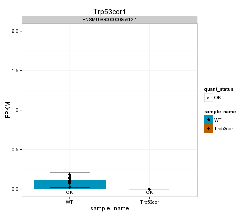
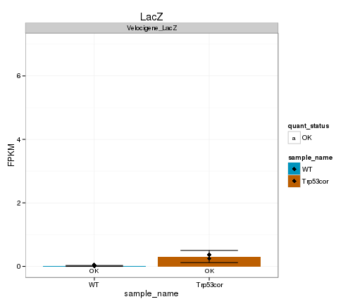
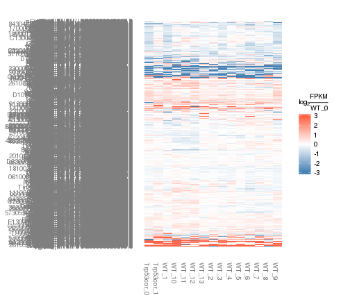

Figure 3 template 
========================================================


Figure 3 plots for brain

 

 


```
## Error in sqliteExecStatement(con, statement, bind.data): RS-DBI driver: (error in statement: near ")": syntax error)
```

Number of DE genes (FDR 0.05): 0


```
## Error in csFoldChangeHeatmap(DEgenes, "WT", replicates = TRUE, replicate_num = 0, : error in evaluating the argument 'object' in selecting a method for function 'csFoldChangeHeatmap': Error: object 'DEgenes' not found
```

Universe DE genes foldchange heatmap:
 


Now, look at genes that are detectably expressed (FPKM>0.5, yes I know it should be 1), and log2foldchange>2 in any direction: 26 genes


Tracks for Glo1: 


```
## Error in validObject(.Object): invalid class "ReferenceDataTrack" object: The referenced file '/n/rinn_data1/users/agroff/seq/OtherMice/Diana/lincP21/bam/abundances.cxb/accepted_hits.bam' does not exist
```


GO terms associated with sigDE genes: 


```
## Error in plot(goBP, showCategory = 20): object 'goBP' not found
```

```
## Error in plot(goMF, showCategory = 20): object 'goMF' not found
```

```
## Error in plot(goCC, showCategory = 20): object 'goCC' not found
```

```
## Error in plot(kegg, showCategory = 20): object 'kegg' not found
```

```
## Error in plot(pathway, showCategory = 20): object 'pathway' not found
```

```
## Error in detach("package:biomaRt"): invalid 'name' argument
```


Zscore:


