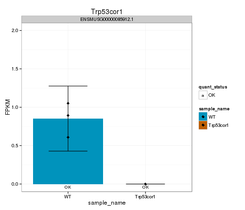
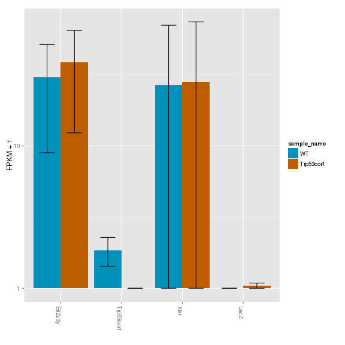

Trp53cor1 KO vs WT (Heart)
======================================


```
## Error in file(file, "r"): cannot open the connection
```


This file shows the wt-v-ko comparison for Trp53cor1. 

Cuff overview:


```
## CuffSet instance with:
## 	 2 samples
## 	 26754 genes
## 	 77524 isoforms
## 	 0 TSS
## 	 23066 CDS
## 	 0 promoters
## 	 0 splicing
## 	 19954 relCDS
```

# QC

## Dispersion

Dispersion plot for genes in cuff:
(Overdispersion can lead to innacurate quants)

 

## Cross-replicate variability (fpkmSCVplot)
Differences in CV 2 can result in lower numbers of differentially expressed genes due to a higher degree of variability between replicate fpkm estimates.

Genes:

 

Isoforms: 

 

## MvA plot

 
   
### MvA plot counts

 

## Scatterplot matrix

 

## Distributions

### Boxplots

Boxplot (genes)

 

Boxplot (genes, replicates)

 

Boxplot (isoforms)

 

Boxplot (isoforms, replicates)

 

### Density

Density (genes)

 

Density (genes, replicates)

 


## Clustering

### Replicate Clusters

 

```
## NULL
```

### PCA (genes)

 

### MDS (genes)

 


# KO assessment

## Endogenous lncRNA expression

 

 

## Digital Genotyping (LacZ vs Endogenous lncRNA and Sex)

Eif2s3y is a y-expressed gene, Xist is an x-expressed gene 
Expression plot (endogenous linc, lacZ, Y-expressed gene):

 

Expression heatmap:

 

### Track visualization 


