Trp53cor1 KO vs WT (Liver)
======================================


This file shows the wt-v-ko comparison for Trp53cor1. 

Cuff overview:


```
## CuffSet instance with:
## 	 2 samples
## 	 26754 genes
## 	 77524 isoforms
## 	 0 TSS
## 	 23066 CDS
## 	 0 promoters
## 	 0 splicing
## 	 19954 relCDS
```

# QC

## Dispersion

Dispersion plot for genes in cuff:
(Overdispersion can lead to innacurate quants)

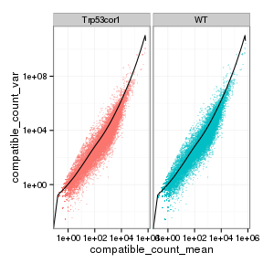 

## Cross-replicate variability (fpkmSCVplot)
Differences in CV 2 can result in lower numbers of differentially expressed genes due to a higher degree of variability between replicate fpkm estimates.

Genes:

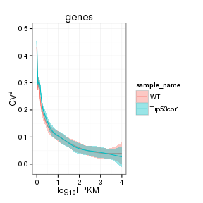 

Isoforms: 

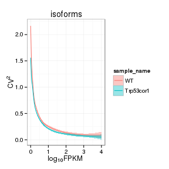 

## MvA plot

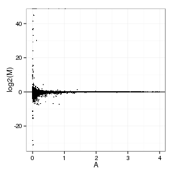 
   
### MvA plot counts

 

## Scatterplot matrix

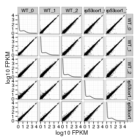 

## Distributions

### Boxplots

Boxplot (genes)

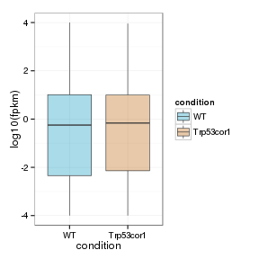 

Boxplot (genes, replicates)

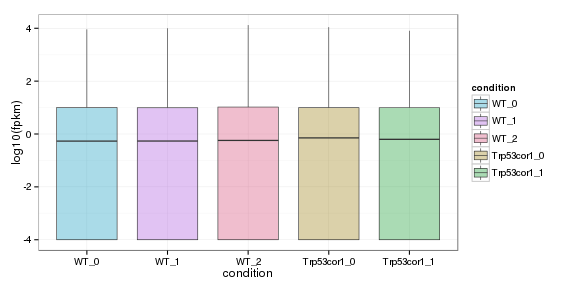 

Boxplot (isoforms)

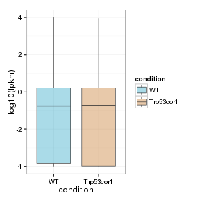 

Boxplot (isoforms, replicates)

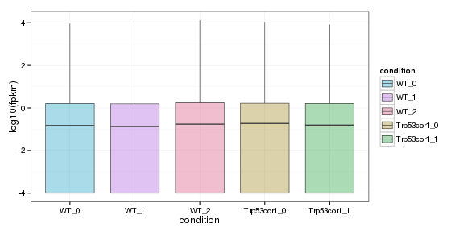 

### Density

Density (genes)

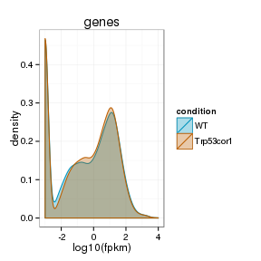 

Density (genes, replicates)

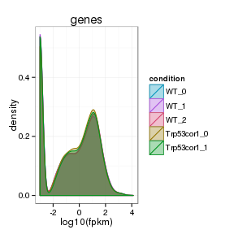 


## Clustering

### Replicate Clusters

 

```
## NULL
```

### PCA (genes)

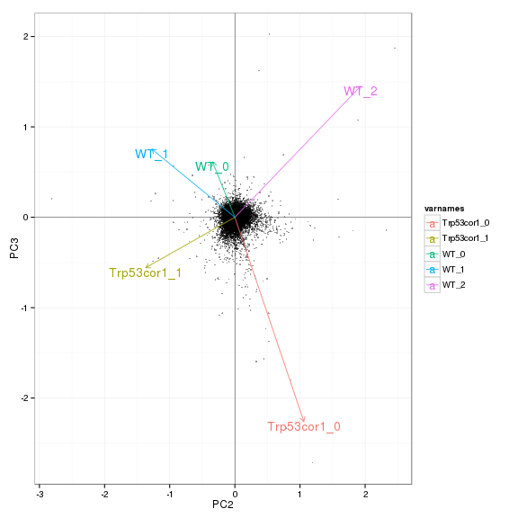 

### MDS (genes)

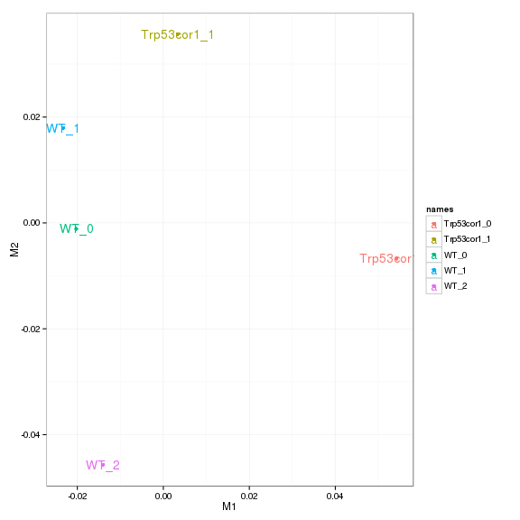 


# KO assessment

## Endogenous lncRNA expression

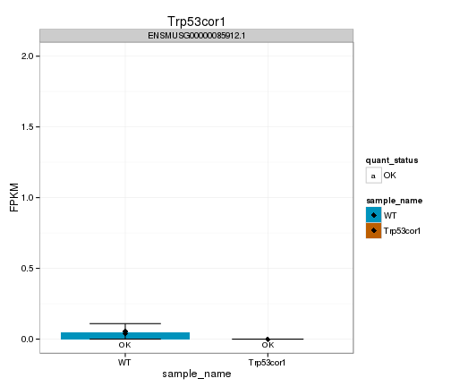 

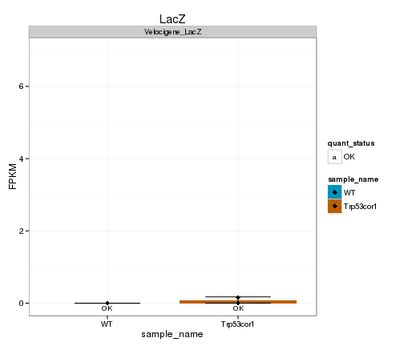 

## Digital Genotyping (LacZ vs Endogenous lncRNA and Sex)

Eif2s3y is a y-expressed gene, Xist is an x-expressed gene 
Expression plot (endogenous linc, lacZ, Y-expressed gene):

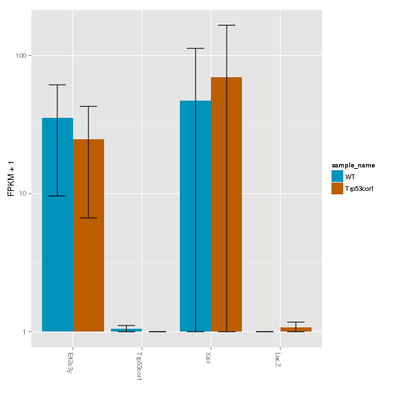 

Expression heatmap:

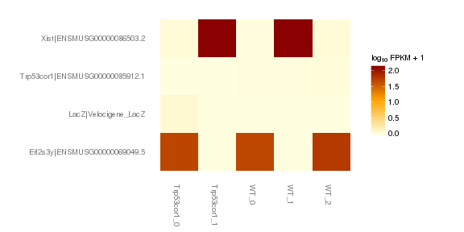 

### Track visualization 

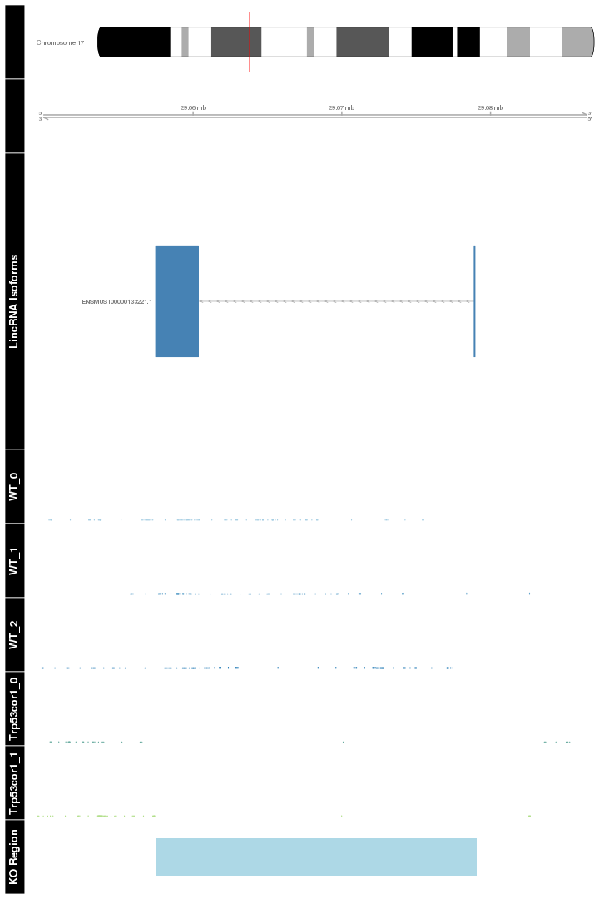 

# Differential Analysis

## Differential Genes 


There are 141 significantly differentially expressed genes. They are:

<!-- html table generated in R 3.0.2 by xtable 1.7-3 package -->
<!-- Wed Mar 25 11:39:25 2015 -->
<TABLE border=1>
<TR> <TH>  </TH> <TH> geneAnnot$gene_short_name </TH>  </TR>
  <TR> <TD align="right"> 1 </TD> <TD> Gcg </TD> </TR>
  <TR> <TD align="right"> 2 </TD> <TD> Sox9 </TD> </TR>
  <TR> <TD align="right"> 3 </TD> <TD> Col6a1 </TD> </TR>
  <TR> <TD align="right"> 4 </TD> <TD> Cnn1 </TD> </TR>
  <TR> <TD align="right"> 5 </TD> <TD> Col1a1 </TD> </TR>
  <TR> <TD align="right"> 6 </TD> <TD> Sst </TD> </TR>
  <TR> <TD align="right"> 7 </TD> <TD> Wisp1 </TD> </TR>
  <TR> <TD align="right"> 8 </TD> <TD> Ephb3 </TD> </TR>
  <TR> <TD align="right"> 9 </TD> <TD> Cav1 </TD> </TR>
  <TR> <TD align="right"> 10 </TD> <TD> Celsr1 </TD> </TR>
  <TR> <TD align="right"> 11 </TD> <TD> Sulf1 </TD> </TR>
  <TR> <TD align="right"> 12 </TD> <TD> Gast </TD> </TR>
  <TR> <TD align="right"> 13 </TD> <TD> Pyy </TD> </TR>
  <TR> <TD align="right"> 14 </TD> <TD> Wfdc2 </TD> </TR>
  <TR> <TD align="right"> 15 </TD> <TD> Jph2 </TD> </TR>
  <TR> <TD align="right"> 16 </TD> <TD> Myh11 </TD> </TR>
  <TR> <TD align="right"> 17 </TD> <TD> Col6a2 </TD> </TR>
  <TR> <TD align="right"> 18 </TD> <TD> Myl7 </TD> </TR>
  <TR> <TD align="right"> 19 </TD> <TD> Ntn1 </TD> </TR>
  <TR> <TD align="right"> 20 </TD> <TD> Krt19 </TD> </TR>
  <TR> <TD align="right"> 21 </TD> <TD> Galnt16 </TD> </TR>
  <TR> <TD align="right"> 22 </TD> <TD> Barx1 </TD> </TR>
  <TR> <TD align="right"> 23 </TD> <TD> Cartpt </TD> </TR>
  <TR> <TD align="right"> 24 </TD> <TD> Adamdec1 </TD> </TR>
  <TR> <TD align="right"> 25 </TD> <TD> Efs </TD> </TR>
  <TR> <TD align="right"> 26 </TD> <TD> Sema5a </TD> </TR>
  <TR> <TD align="right"> 27 </TD> <TD> Trp63 </TD> </TR>
  <TR> <TD align="right"> 28 </TD> <TD> Slc15a2 </TD> </TR>
  <TR> <TD align="right"> 29 </TD> <TD> Cdkn1a </TD> </TR>
  <TR> <TD align="right"> 30 </TD> <TD> Nfatc4 </TD> </TR>
  <TR> <TD align="right"> 31 </TD> <TD> Thbs2 </TD> </TR>
  <TR> <TD align="right"> 32 </TD> <TD> Cldn6 </TD> </TR>
  <TR> <TD align="right"> 33 </TD> <TD> Polh </TD> </TR>
  <TR> <TD align="right"> 34 </TD> <TD> Enpp4 </TD> </TR>
  <TR> <TD align="right"> 35 </TD> <TD> Guca1b </TD> </TR>
  <TR> <TD align="right"> 36 </TD> <TD> Tspo2 </TD> </TR>
  <TR> <TD align="right"> 37 </TD> <TD> Glo1 </TD> </TR>
  <TR> <TD align="right"> 38 </TD> <TD> E4f1 </TD> </TR>
  <TR> <TD align="right"> 39 </TD> <TD> Meiob </TD> </TR>
  <TR> <TD align="right"> 40 </TD> <TD> Ift140 </TD> </TR>
  <TR> <TD align="right"> 41 </TD> <TD> Clps </TD> </TR>
  <TR> <TD align="right"> 42 </TD> <TD> Dpysl3 </TD> </TR>
  <TR> <TD align="right"> 43 </TD> <TD> Lox </TD> </TR>
  <TR> <TD align="right"> 44 </TD> <TD> Setbp1 </TD> </TR>
  <TR> <TD align="right"> 45 </TD> <TD> Fbn2 </TD> </TR>
  <TR> <TD align="right"> 46 </TD> <TD> Col3a1 </TD> </TR>
  <TR> <TD align="right"> 47 </TD> <TD> Col9a1 </TD> </TR>
  <TR> <TD align="right"> 48 </TD> <TD> Igfbp5 </TD> </TR>
  <TR> <TD align="right"> 49 </TD> <TD> Tnnt2 </TD> </TR>
  <TR> <TD align="right"> 50 </TD> <TD> Ifi202b </TD> </TR>
  <TR> <TD align="right"> 51 </TD> <TD> F5 </TD> </TR>
  <TR> <TD align="right"> 52 </TD> <TD> Prrx1 </TD> </TR>
  <TR> <TD align="right"> 53 </TD> <TD> Pax6 </TD> </TR>
  <TR> <TD align="right"> 54 </TD> <TD> Mdk </TD> </TR>
  <TR> <TD align="right"> 55 </TD> <TD> Stmn2 </TD> </TR>
  <TR> <TD align="right"> 56 </TD> <TD> Sfrp2 </TD> </TR>
  <TR> <TD align="right"> 57 </TD> <TD> Spink4 </TD> </TR>
  <TR> <TD align="right"> 58 </TD> <TD> Elavl4 </TD> </TR>
  <TR> <TD align="right"> 59 </TD> <TD> Sema3c </TD> </TR>
  <TR> <TD align="right"> 60 </TD> <TD> Spp1 </TD> </TR>
  <TR> <TD align="right"> 61 </TD> <TD> Sparcl1 </TD> </TR>
  <TR> <TD align="right"> 62 </TD> <TD> Col1a2 </TD> </TR>
  <TR> <TD align="right"> 63 </TD> <TD> Eln </TD> </TR>
  <TR> <TD align="right"> 64 </TD> <TD> Ptn </TD> </TR>
  <TR> <TD align="right"> 65 </TD> <TD> Emp1 </TD> </TR>
  <TR> <TD align="right"> 66 </TD> <TD> Kcnj8 </TD> </TR>
  <TR> <TD align="right"> 67 </TD> <TD> Col4a5 </TD> </TR>
  <TR> <TD align="right"> 68 </TD> <TD> Dcx </TD> </TR>
  <TR> <TD align="right"> 69 </TD> <TD> Slit2 </TD> </TR>
  <TR> <TD align="right"> 70 </TD> <TD> Fgfr1 </TD> </TR>
  <TR> <TD align="right"> 71 </TD> <TD> Cdh11 </TD> </TR>
  <TR> <TD align="right"> 72 </TD> <TD> St14 </TD> </TR>
  <TR> <TD align="right"> 73 </TD> <TD> Stra6 </TD> </TR>
  <TR> <TD align="right"> 74 </TD> <TD> Col12a1 </TD> </TR>
  <TR> <TD align="right"> 75 </TD> <TD> Loxl1 </TD> </TR>
  <TR> <TD align="right"> 76 </TD> <TD> Adamts15 </TD> </TR>
  <TR> <TD align="right"> 77 </TD> <TD> Serpini2 </TD> </TR>
  <TR> <TD align="right"> 78 </TD> <TD> Rnps1 </TD> </TR>
  <TR> <TD align="right"> 79 </TD> <TD> Abi3bp </TD> </TR>
  <TR> <TD align="right"> 80 </TD> <TD> Ror1 </TD> </TR>
  <TR> <TD align="right"> 81 </TD> <TD> Acta2 </TD> </TR>
  <TR> <TD align="right"> 82 </TD> <TD> Ins1 </TD> </TR>
  <TR> <TD align="right"> 83 </TD> <TD> 3110052M02Rik </TD> </TR>
  <TR> <TD align="right"> 84 </TD> <TD> Islr </TD> </TR>
  <TR> <TD align="right"> 85 </TD> <TD> Cpe </TD> </TR>
  <TR> <TD align="right"> 86 </TD> <TD> Cdon </TD> </TR>
  <TR> <TD align="right"> 87 </TD> <TD> Notch3 </TD> </TR>
  <TR> <TD align="right"> 88 </TD> <TD> Spon1 </TD> </TR>
  <TR> <TD align="right"> 89 </TD> <TD> Lyplal1 </TD> </TR>
  <TR> <TD align="right"> 90 </TD> <TD> Igfbp2 </TD> </TR>
  <TR> <TD align="right"> 91 </TD> <TD> Lrrc17 </TD> </TR>
  <TR> <TD align="right"> 92 </TD> <TD> Abcc8 </TD> </TR>
  <TR> <TD align="right"> 93 </TD> <TD> Ltbp4 </TD> </TR>
  <TR> <TD align="right"> 94 </TD> <TD> Col16a1 </TD> </TR>
  <TR> <TD align="right"> 95 </TD> <TD> Sh3pxd2b </TD> </TR>
  <TR> <TD align="right"> 96 </TD> <TD> Myh6 </TD> </TR>
  <TR> <TD align="right"> 97 </TD> <TD> BC006965 </TD> </TR>
  <TR> <TD align="right"> 98 </TD> <TD> Pgm5 </TD> </TR>
  <TR> <TD align="right"> 99 </TD> <TD> Trem1 </TD> </TR>
  <TR> <TD align="right"> 100 </TD> <TD> Itpr3 </TD> </TR>
  <TR> <TD align="right"> 101 </TD> <TD> Unc5cl </TD> </TR>
  <TR> <TD align="right"> 102 </TD> <TD> Tubb2b </TD> </TR>
  <TR> <TD align="right"> 103 </TD> <TD> Epcam </TD> </TR>
  <TR> <TD align="right"> 104 </TD> <TD> Slitrk6 </TD> </TR>
  <TR> <TD align="right"> 105 </TD> <TD> Hmga1 </TD> </TR>
  <TR> <TD align="right"> 106 </TD> <TD> Fat4 </TD> </TR>
  <TR> <TD align="right"> 107 </TD> <TD> Sfn </TD> </TR>
  <TR> <TD align="right"> 108 </TD> <TD> Flrt2 </TD> </TR>
  <TR> <TD align="right"> 109 </TD> <TD> Cldn4 </TD> </TR>
  <TR> <TD align="right"> 110 </TD> <TD> Osr1 </TD> </TR>
  <TR> <TD align="right"> 111 </TD> <TD> Tmem200a </TD> </TR>
  <TR> <TD align="right"> 112 </TD> <TD> Fzd2 </TD> </TR>
  <TR> <TD align="right"> 113 </TD> <TD> Emilin3 </TD> </TR>
  <TR> <TD align="right"> 114 </TD> <TD> Map1b </TD> </TR>
  <TR> <TD align="right"> 115 </TD> <TD> Gas1 </TD> </TR>
  <TR> <TD align="right"> 116 </TD> <TD> Zfp943 </TD> </TR>
  <TR> <TD align="right"> 117 </TD> <TD> H2-T24 </TD> </TR>
  <TR> <TD align="right"> 118 </TD> <TD> Krt15 </TD> </TR>
  <TR> <TD align="right"> 119 </TD> <TD> Cpa1 </TD> </TR>
  <TR> <TD align="right"> 120 </TD> <TD> Ntrk2 </TD> </TR>
  <TR> <TD align="right"> 121 </TD> <TD> Ide </TD> </TR>
  <TR> <TD align="right"> 122 </TD> <TD> Actg2 </TD> </TR>
  <TR> <TD align="right"> 123 </TD> <TD> Ntng1 </TD> </TR>
  <TR> <TD align="right"> 124 </TD> <TD> Ntm </TD> </TR>
  <TR> <TD align="right"> 125 </TD> <TD> Mfap2 </TD> </TR>
  <TR> <TD align="right"> 126 </TD> <TD> Myl4 </TD> </TR>
  <TR> <TD align="right"> 127 </TD> <TD> Krt5 </TD> </TR>
  <TR> <TD align="right"> 128 </TD> <TD> Col23a1 </TD> </TR>
  <TR> <TD align="right"> 129 </TD> <TD> Mocs1 </TD> </TR>
  <TR> <TD align="right"> 130 </TD> <TD> Fxyd6 </TD> </TR>
  <TR> <TD align="right"> 131 </TD> <TD> Pi15 </TD> </TR>
  <TR> <TD align="right"> 132 </TD> <TD> Agtr2 </TD> </TR>
  <TR> <TD align="right"> 133 </TD> <TD> Flnc </TD> </TR>
  <TR> <TD align="right"> 134 </TD> <TD> Cacng7 </TD> </TR>
  <TR> <TD align="right"> 135 </TD> <TD> Zfp213 </TD> </TR>
  <TR> <TD align="right"> 136 </TD> <TD> Cpa2 </TD> </TR>
  <TR> <TD align="right"> 137 </TD> <TD> 2610203C20Rik </TD> </TR>
  <TR> <TD align="right"> 138 </TD> <TD> Sox4 </TD> </TR>
  <TR> <TD align="right"> 139 </TD> <TD> Hmga1-rs1 </TD> </TR>
  <TR> <TD align="right"> 140 </TD> <TD> Rps2-ps10 </TD> </TR>
  <TR> <TD align="right"> 141 </TD> <TD> Gm9825 </TD> </TR>
   </TABLE>
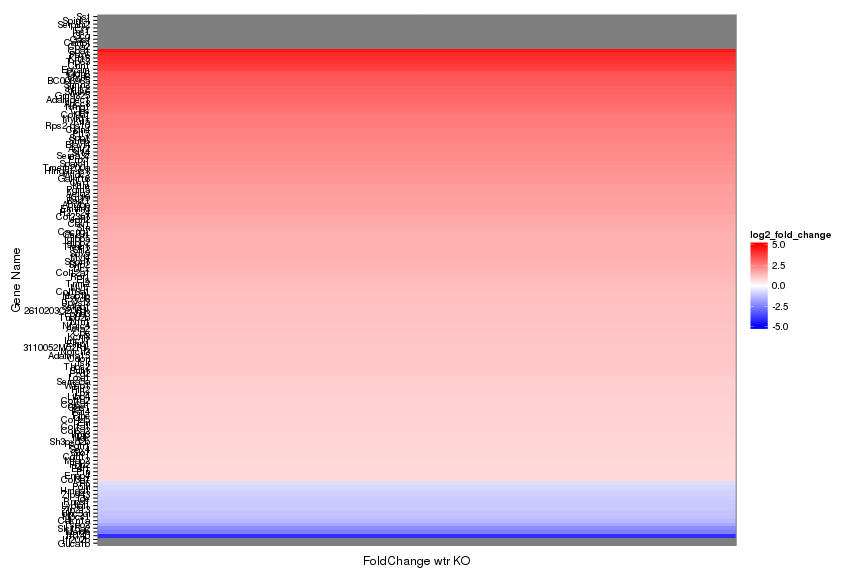 

Expression heatmap of sigGenes

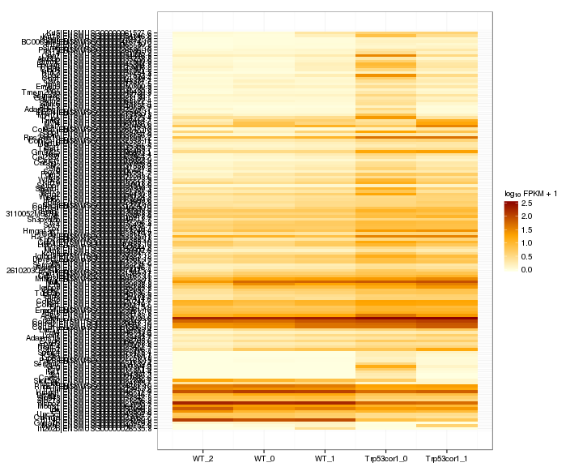 

Foldchange heatmap of sigGenes 

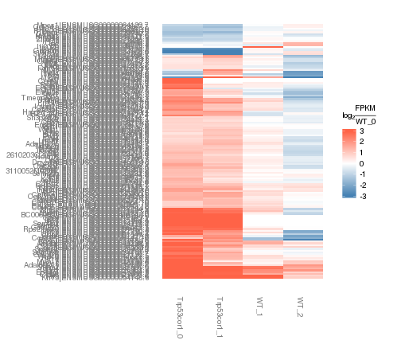 


Now, look at genes that are detectably expressed (FPKM>0.5, yes I know it should be 1), and log2foldchange>2 in any direction: 116 genes

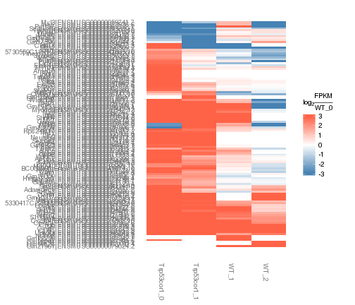 


Now, those that are expressed, changing and called sig: 39 genes 

 

### Expression-level/significance relationship

Scatter plot of significant genes only:

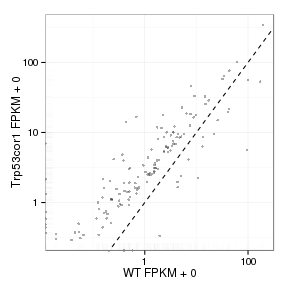 

Volcano Plot

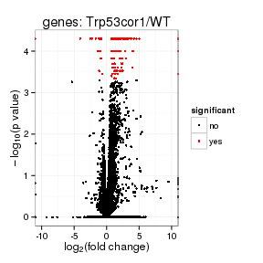 

Volcano plot with significant genes only:

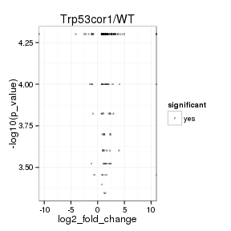 

### Differential Isoforms between conditions

Per isoform difference between conditions:

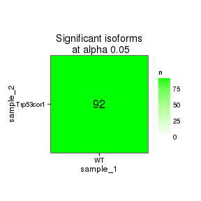 

```
## Error in getGenes(cuff, isoformSigIDs, level = "isoforms"): unused argument (level = "isoforms")
```

These isoforms are:


```
## Error in as.data.frame(isoAnnot$gene_short_name): error in evaluating the argument 'x' in selecting a method for function 'as.data.frame': Error: object 'isoAnnot' not found
```

DE isoform heatmap


```
## Error in csHeatmap(isoformSigGenes, cluster = "both", replicates = T, : error in evaluating the argument 'object' in selecting a method for function 'csHeatmap': Error: object 'isoformSigGenes' not found
```

Isoform foldchange heatmap by isoform:


```
## Error in csFoldChangeHeatmap(isoforms(isoformSigGenes), "WT", replicates = TRUE, : error in evaluating the argument 'object' in selecting a method for function 'csFoldChangeHeatmap': Error in isoforms(isoformSigGenes) : 
##   error in evaluating the argument 'object' in selecting a method for function 'isoforms': Error: object 'isoformSigGenes' not found
```

# Gene/Pathway Analysis

## GSEA

Enrichment and zscores are calculated based on expression in KO vs WT (fpkmKO/fpkmWT), so genes that are down regulated in KO are shown in blue, while upregulation is shown in red. 

KO/WT
Blue = down in KO
Red = Up in KO


Biocarta enrichment: 

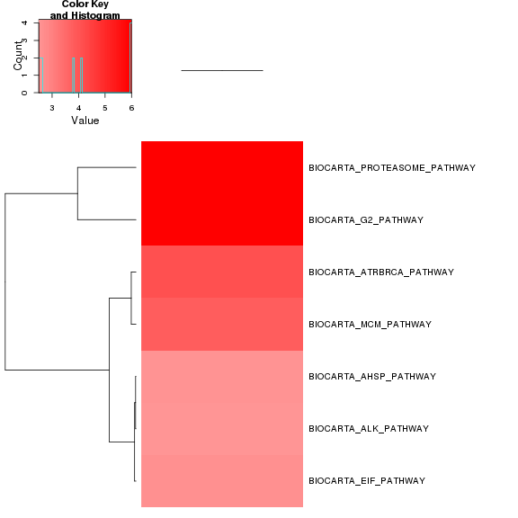 

Biocarta zscore: 

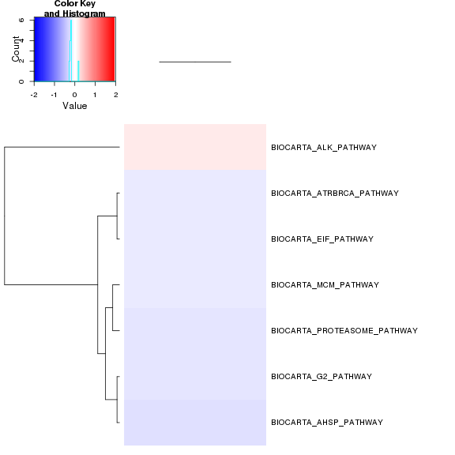 

Reactome enrichment:


```
## Error in (function (side, at = NULL, labels = TRUE, tick = TRUE, line = NA, : no locations are finite
```

 

Reactome zscore: 

 

Kegg enrichment: 


```
## Error in x_ordered[1:50, ]: subscript out of bounds
```

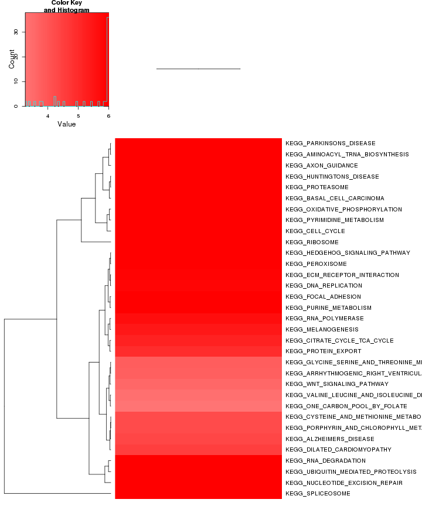 

Kegg zscore: 


```
## Error in x_ordered[1:50, ]: subscript out of bounds
```

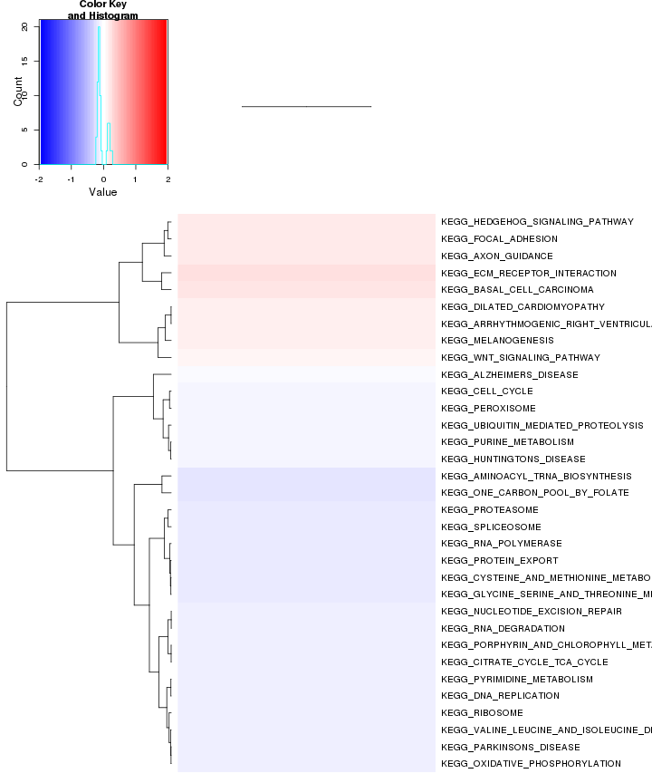 


p53 enrichment: 

 

p53 zscore: 

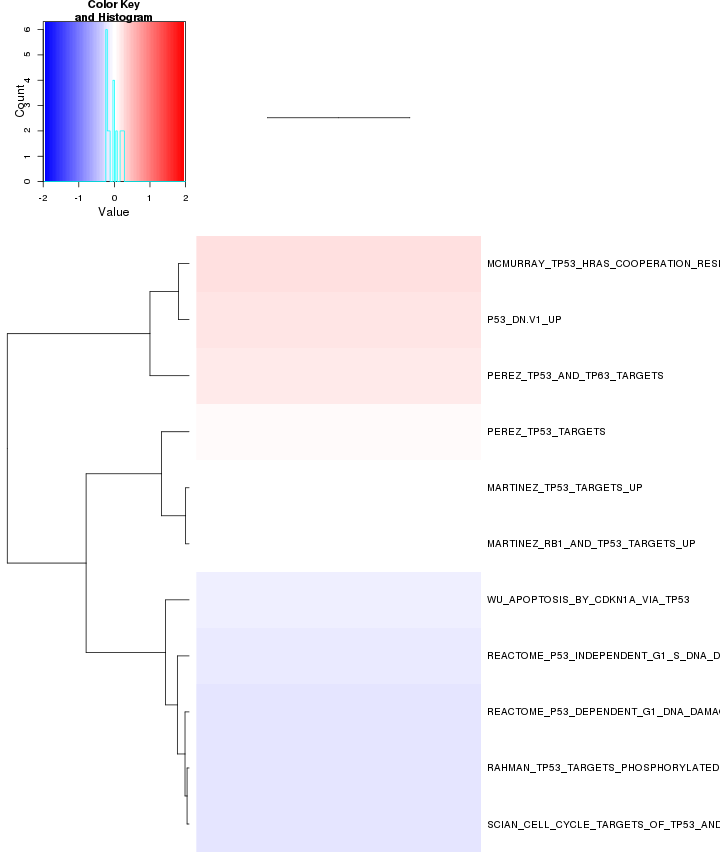 

Oncogene enrichment: 


```
## Error in x_ordered[1:50, ]: subscript out of bounds
```

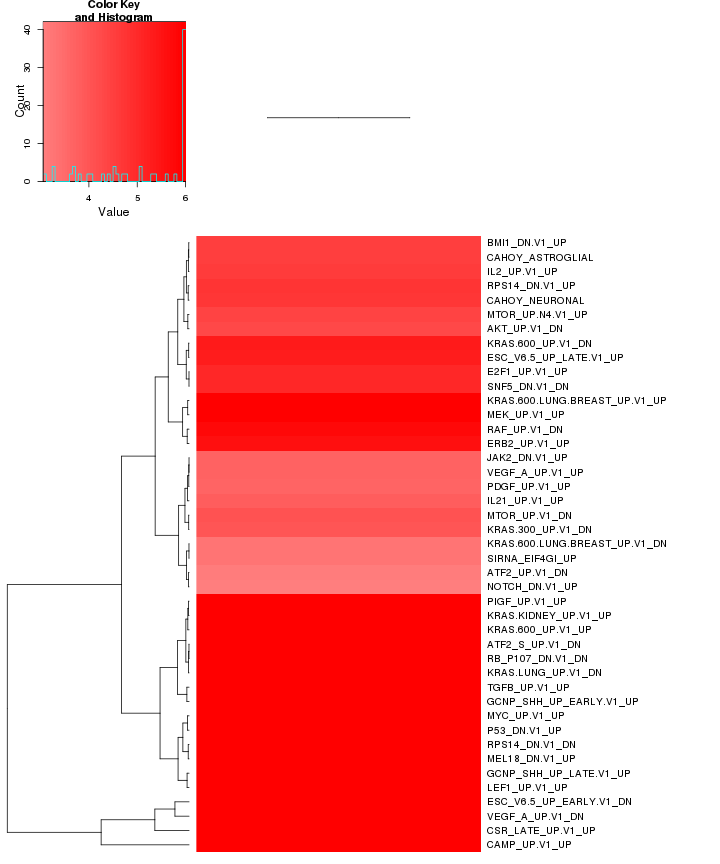 

Oncogene zscore:


```
## Error in x_ordered[1:50, ]: subscript out of bounds
```

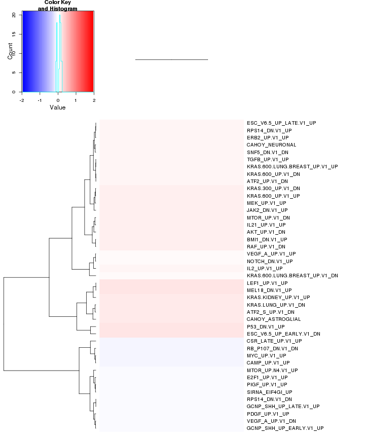 


Jacks enrichment
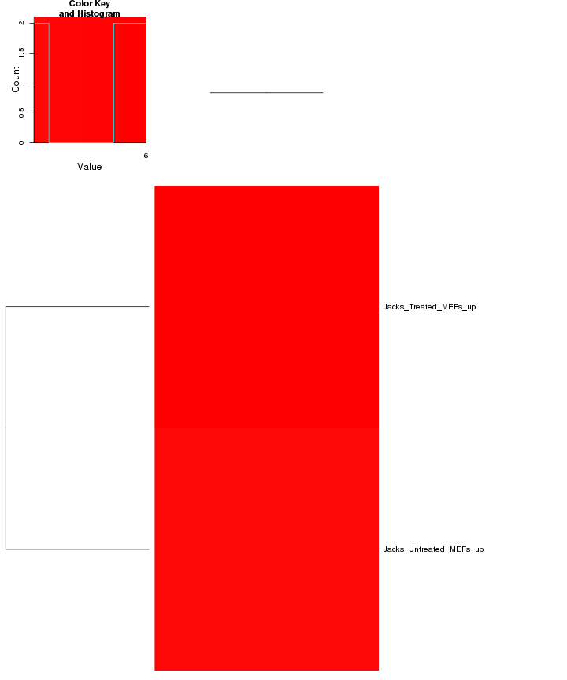 


Jacks zscore

 


All enrichment 


There are 2786 categories enriched (p<0.0001). They are:


```
## Error in (function (side, at = NULL, labels = TRUE, tick = TRUE, line = NA, : no locations are finite
```

 

ALL zscore:

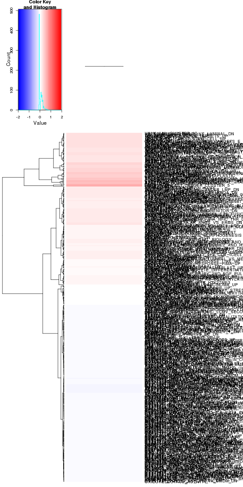 

## GO enrichment 
Cluster profiler used to call enichments of significantly differentially regulated genes that map to Entrez IDs. 


```
## [1] "ERROR: The estimated pi0 <= 0. Check that you have valid p-values or use another lambda method."
```

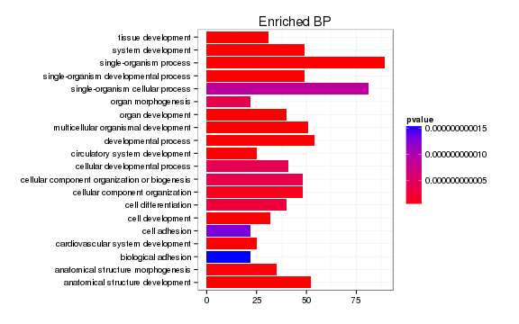 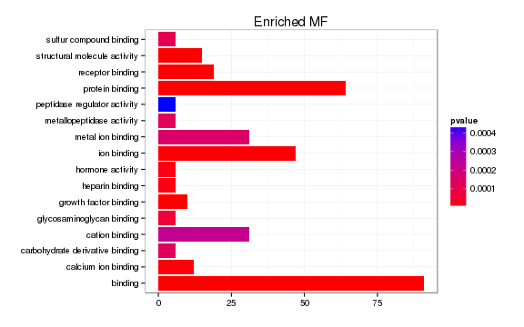 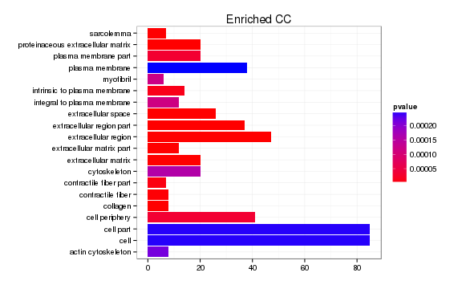 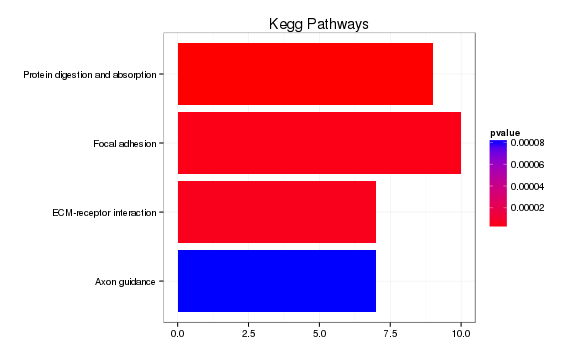 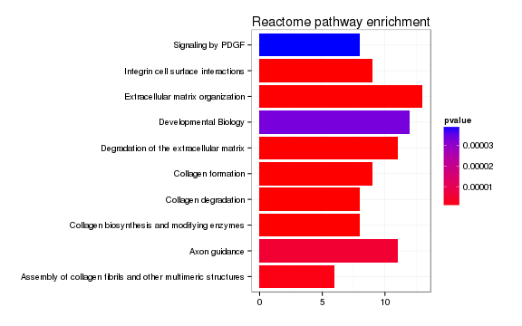 

# Cis vs Trans (locally)

log2 Foldchange and test statistic are calculated with the ratio of fpkm(KO)/fpkm(WT), thus the test_stat is positive if a gene is higher in the KO and negative if a gene has lower expression in the KO


The pvalue for genes significantly regulated in a region this size  is: 0.0132 

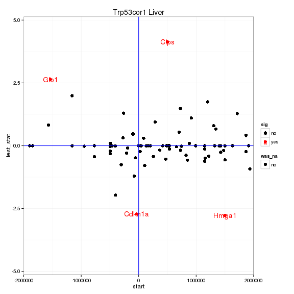 

# Notes

## Samples used are:
<!-- html table generated in R 3.0.2 by xtable 1.7-3 package -->
<!-- Wed Mar 25 13:59:11 2015 -->
<TABLE border=1>
<TR> <TH>  </TH> <TH> 11 </TH>  </TR>
  <TR> <TD align="right"> 1 </TD> <TD> JR917 </TD> </TR>
  <TR> <TD align="right"> 2 </TD> <TD> JR933 </TD> </TR>
  <TR> <TD align="right"> 3 </TD> <TD> JR925 </TD> </TR>
  <TR> <TD align="right"> 4 </TD> <TD> JR926 </TD> </TR>
  <TR> <TD align="right"> 5 </TD> <TD> JR934 </TD> </TR>
   </TABLE>

## Replicates
<!-- html table generated in R 3.0.2 by xtable 1.7-3 package -->
<!-- Wed Mar 25 13:59:11 2015 -->
<TABLE border=1>
<TR> <TH>  </TH> <TH> file </TH> <TH> sample_name </TH> <TH> replicate </TH> <TH> rep_name </TH> <TH> total_mass </TH> <TH> norm_mass </TH> <TH> internal_scale </TH> <TH> external_scale </TH>  </TR>
  <TR> <TD align="right"> 1 </TD> <TD> /n/rinn_data1/users/agroff/seq/OtherMice/Diana/lincP21/quants/JR917/abundances.cxb </TD> <TD> WT </TD> <TD align="right">   0 </TD> <TD> WT_0 </TD> <TD align="right"> 37248000.00 </TD> <TD align="right"> 36429300.00 </TD> <TD align="right"> 1.03 </TD> <TD align="right"> 1.00 </TD> </TR>
  <TR> <TD align="right"> 2 </TD> <TD> /n/rinn_data1/users/agroff/seq/OtherMice/Diana/lincP21/quants/JR933/abundances.cxb </TD> <TD> WT </TD> <TD align="right">   1 </TD> <TD> WT_1 </TD> <TD align="right"> 34229100.00 </TD> <TD align="right"> 36429300.00 </TD> <TD align="right"> 0.91 </TD> <TD align="right"> 1.00 </TD> </TR>
  <TR> <TD align="right"> 3 </TD> <TD> /n/rinn_data1/users/agroff/seq/OtherMice/Diana/lincP21/quants/JR925/abundances.cxb </TD> <TD> WT </TD> <TD align="right">   2 </TD> <TD> WT_2 </TD> <TD align="right"> 40066200.00 </TD> <TD align="right"> 36429300.00 </TD> <TD align="right"> 1.05 </TD> <TD align="right"> 1.00 </TD> </TR>
  <TR> <TD align="right"> 4 </TD> <TD> /n/rinn_data1/users/agroff/seq/OtherMice/Diana/lincP21/quants/JR926/abundances.cxb </TD> <TD> Trp53cor1 </TD> <TD align="right">   0 </TD> <TD> Trp53cor1_0 </TD> <TD align="right"> 40299500.00 </TD> <TD align="right"> 36429300.00 </TD> <TD align="right"> 1.17 </TD> <TD align="right"> 1.00 </TD> </TR>
  <TR> <TD align="right"> 5 </TD> <TD> /n/rinn_data1/users/agroff/seq/OtherMice/Diana/lincP21/quants/JR934/abundances.cxb </TD> <TD> Trp53cor1 </TD> <TD align="right">   1 </TD> <TD> Trp53cor1_1 </TD> <TD align="right"> 30681900.00 </TD> <TD align="right"> 36429300.00 </TD> <TD align="right"> 0.86 </TD> <TD align="right"> 1.00 </TD> </TR>
   </TABLE>

## Session Info

```
## R version 3.0.2 (2013-09-25)
## Platform: x86_64-unknown-linux-gnu (64-bit)
## 
## locale:
##  [1] LC_CTYPE=en_US.UTF-8       LC_NUMERIC=C              
##  [3] LC_TIME=en_US.UTF-8        LC_COLLATE=en_US.UTF-8    
##  [5] LC_MONETARY=en_US.UTF-8    LC_MESSAGES=en_US.UTF-8   
##  [7] LC_PAPER=en_US.UTF-8       LC_NAME=C                 
##  [9] LC_ADDRESS=C               LC_TELEPHONE=C            
## [11] LC_MEASUREMENT=en_US.UTF-8 LC_IDENTIFICATION=C       
## 
## attached base packages:
## [1] grid      parallel  methods   stats     graphics  grDevices utils    
## [8] datasets  base     
## 
## other attached packages:
##  [1] plyr_1.8.1                         
##  [2] stringr_0.6.2                      
##  [3] seqbias_1.10.0                     
##  [4] BSgenome.Mmusculus.UCSC.mm10_1.3.19
##  [5] BSgenome_1.30.0                    
##  [6] Biostrings_2.30.1                  
##  [7] GO.db_2.10.1                       
##  [8] org.Mm.eg.db_2.10.1                
##  [9] clusterProfiler_1.13.1             
## [10] DOSE_2.0.0                         
## [11] ReactomePA_1.6.1                   
## [12] AnnotationDbi_1.24.0               
## [13] Biobase_2.22.0                     
## [14] mgcv_1.8-2                         
## [15] nlme_3.1-117                       
## [16] RMySQL_0.9-3                       
## [17] RColorBrewer_1.0-5                 
## [18] gridExtra_0.9.1                    
## [19] gtable_0.1.2                       
## [20] marray_1.40.0                      
## [21] gplots_2.14.2                      
## [22] GSA_1.03                           
## [23] limma_3.18.13                      
## [24] xtable_1.7-3                       
## [25] cummeRbund_2.7.2                   
## [26] Gviz_1.6.0                         
## [27] rtracklayer_1.22.7                 
## [28] GenomicRanges_1.14.4               
## [29] XVector_0.2.0                      
## [30] IRanges_1.20.7                     
## [31] fastcluster_1.1.13                 
## [32] reshape2_1.4                       
## [33] ggplot2_1.0.0                      
## [34] RSQLite_0.11.4                     
## [35] DBI_0.3.1                          
## [36] BiocGenerics_0.8.0                 
## [37] knitr_1.7                          
## 
## loaded via a namespace (and not attached):
##  [1] biomaRt_2.18.0         biovizBase_1.10.8      bitops_1.0-6          
##  [4] caTools_1.17.1         cluster_1.15.2         colorspace_1.2-4      
##  [7] dichromat_2.0-0        digest_0.6.4           DO.db_2.7             
## [10] evaluate_0.5.5         formatR_1.0            Formula_1.1-2         
## [13] gdata_2.13.3           GenomicFeatures_1.14.5 GOSemSim_1.20.3       
## [16] graph_1.40.1           graphite_1.8.1         gtools_3.4.1          
## [19] Hmisc_3.14-4           igraph_0.7.1           KEGG.db_2.10.1        
## [22] KernSmooth_2.23-12     labeling_0.2           lattice_0.20-29       
## [25] latticeExtra_0.6-26    MASS_7.3-33            Matrix_1.1-4          
## [28] munsell_0.4.2          org.Hs.eg.db_2.10.1    proto_0.3-10          
## [31] qvalue_1.36.0          Rcpp_0.11.3            RCurl_1.95-4.3        
## [34] reactome.db_1.46.1     Rsamtools_1.14.3       scales_0.2.4          
## [37] splines_3.0.2          stats4_3.0.2           survival_2.37-7       
## [40] tcltk_3.0.2            tools_3.0.2            XML_3.98-1.1          
## [43] zlibbioc_1.8.0
```

## Run Info

```
##           param
## 1      cmd_line
## 2       version
## 3  SVN_revision
## 4 boost_version
## 5        genome
##                                                                                                                                                                                                                                                                                                                                                                                                                                                                                                                                                                                                                                                            value
## 1 cuffdiff -p 10 -L WT,Trp53cor1 -o /n/rinn_data1/users/agroff/seq/OtherMice/Diana/lincP21/diff/Trp53cor1_E14.5_LIVER_noKO0 /n/rinn_data1/seq/lgoff/Projects/BrainMap/data/annotation/mm10_gencode_vM2_with_lncRNAs_and_LacZ.gtf /n/rinn_data1/users/agroff/seq/OtherMice/Diana/lincP21/quants/JR917/abundances.cxb,/n/rinn_data1/users/agroff/seq/OtherMice/Diana/lincP21/quants/JR933/abundances.cxb,/n/rinn_data1/users/agroff/seq/OtherMice/Diana/lincP21/quants/JR925/abundances.cxb /n/rinn_data1/users/agroff/seq/OtherMice/Diana/lincP21/quants/JR926/abundances.cxb,/n/rinn_data1/users/agroff/seq/OtherMice/Diana/lincP21/quants/JR934/abundances.cxb 
## 2                                                                                                                                                                                                                                                                                                                                                                                                                                                                                                                                                                                                                                                          2.2.1
## 3                                                                                                                                                                                                                                                                                                                                                                                                                                                                                                                                                                                                                                                           4237
## 4                                                                                                                                                                                                                                                                                                                                                                                                                                                                                                                                                                                                                                                         104700
## 5                                                                                                                                                                                                                                                                                                                                                                                                                                                                                                                                                                                                                                                           mm10
```

