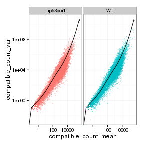
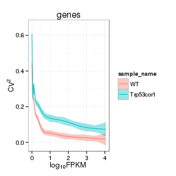
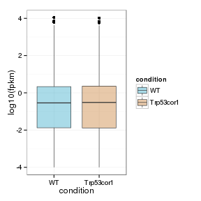
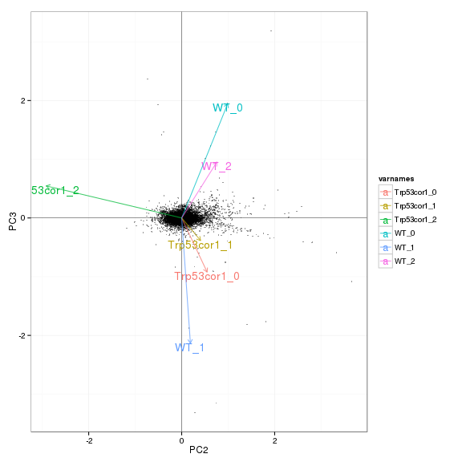
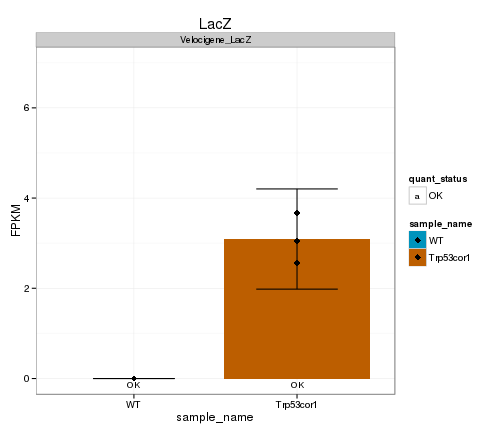
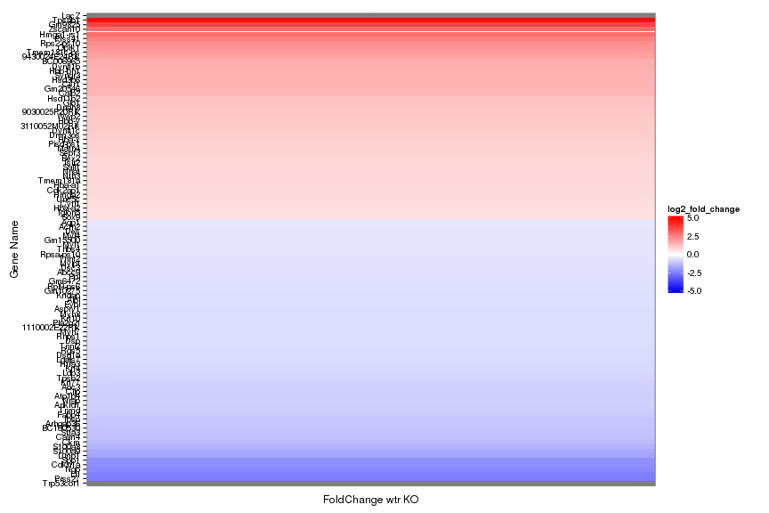
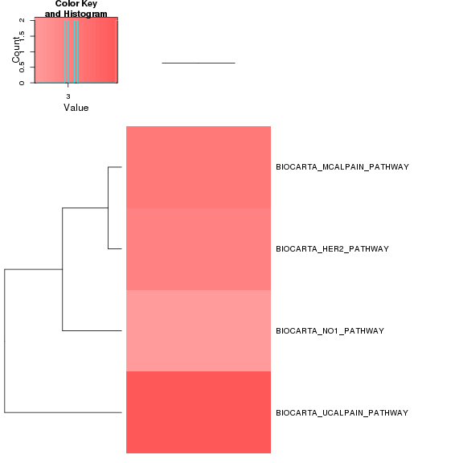

Trp53cor1 KO vs WT (Embryonic)
======================================


```
## Error in file(file, "r"): cannot open the connection
```


```
## Error in as.character(x): cannot coerce type 'closure' to vector of type 'character'
```

This file shows the wt-v-ko comparison for Trp53cor1. 

Cuff overview:


```
## CuffSet instance with:
## 	 2 samples
## 	 26754 genes
## 	 77524 isoforms
## 	 0 TSS
## 	 23066 CDS
## 	 0 promoters
## 	 0 splicing
## 	 19954 relCDS
```

# QC

## Dispersion

Dispersion plot for genes in cuff:
(Overdispersion can lead to innacurate quants)

 

## Cross-replicate variability (fpkmSCVplot)
Differences in CV 2 can result in lower numbers of differentially expressed genes due to a higher degree of variability between replicate fpkm estimates.

Genes:

 

Isoforms: 

 

## MvA plot

 
   
### MvA plot counts

 

## Scatterplot matrix

 

## Distributions

### Boxplots

Boxplot (genes)

 

Boxplot (genes, replicates)

 

Boxplot (isoforms)

 

Boxplot (isoforms, replicates)

 

### Density

Density (genes)

 

Density (genes, replicates)

 


## Clustering

### Replicate Clusters

 

```
## NULL
```

### PCA (genes)

 

### MDS (genes)

 


# KO assessment

## Endogenous lncRNA expression

 

 

## Digital Genotyping (LacZ vs Endogenous lncRNA and Sex)

Eif2s3y is a y-expressed gene, Xist is an x-expressed gene 
Expression plot (endogenous linc, lacZ, Y-expressed gene):

 

Expression heatmap:

 

### Track visualization 


```
## Error in as.vector(x, "character"): cannot coerce type 'closure' to vector of type 'character'
```

```
## Error: dims [product 3] do not match the length of object [4]
```

```
## pdf 
##   2
```

# Differential Analysis

## Differential Genes 


There are 58 significantly differentially expressed genes. They are:

<!-- html table generated in R 3.0.2 by xtable 1.7-3 package -->
<!-- Thu Apr 14 11:36:53 2016 -->
<TABLE border=1>
<TR> <TH>  </TH> <TH> geneAnnot$gene_short_name </TH>  </TR>
  <TR> <TD align="right"> 1 </TD> <TD> Cnn1 </TD> </TR>
  <TR> <TD align="right"> 2 </TD> <TD> Ier3 </TD> </TR>
  <TR> <TD align="right"> 3 </TD> <TD> Cmah </TD> </TR>
  <TR> <TD align="right"> 4 </TD> <TD> Sulf1 </TD> </TR>
  <TR> <TD align="right"> 5 </TD> <TD> Myh11 </TD> </TR>
  <TR> <TD align="right"> 6 </TD> <TD> Arg1 </TD> </TR>
  <TR> <TD align="right"> 7 </TD> <TD> Adamdec1 </TD> </TR>
  <TR> <TD align="right"> 8 </TD> <TD> Slc15a2 </TD> </TR>
  <TR> <TD align="right"> 9 </TD> <TD> Cdkn1a </TD> </TR>
  <TR> <TD align="right"> 10 </TD> <TD> Cldn6 </TD> </TR>
  <TR> <TD align="right"> 11 </TD> <TD> Polh </TD> </TR>
  <TR> <TD align="right"> 12 </TD> <TD> Enpp4 </TD> </TR>
  <TR> <TD align="right"> 13 </TD> <TD> Tspo2 </TD> </TR>
  <TR> <TD align="right"> 14 </TD> <TD> Glo1 </TD> </TR>
  <TR> <TD align="right"> 15 </TD> <TD> E4f1 </TD> </TR>
  <TR> <TD align="right"> 16 </TD> <TD> Meiob </TD> </TR>
  <TR> <TD align="right"> 17 </TD> <TD> Ift140 </TD> </TR>
  <TR> <TD align="right"> 18 </TD> <TD> Clps </TD> </TR>
  <TR> <TD align="right"> 19 </TD> <TD> Igfbp5 </TD> </TR>
  <TR> <TD align="right"> 20 </TD> <TD> Cfh </TD> </TR>
  <TR> <TD align="right"> 21 </TD> <TD> Ifi202b </TD> </TR>
  <TR> <TD align="right"> 22 </TD> <TD> Hao1 </TD> </TR>
  <TR> <TD align="right"> 23 </TD> <TD> Stmn2 </TD> </TR>
  <TR> <TD align="right"> 24 </TD> <TD> Spp1 </TD> </TR>
  <TR> <TD align="right"> 25 </TD> <TD> Sparcl1 </TD> </TR>
  <TR> <TD align="right"> 26 </TD> <TD> Col1a2 </TD> </TR>
  <TR> <TD align="right"> 27 </TD> <TD> Ctrb1 </TD> </TR>
  <TR> <TD align="right"> 28 </TD> <TD> Akr1c14 </TD> </TR>
  <TR> <TD align="right"> 29 </TD> <TD> Cfhr2 </TD> </TR>
  <TR> <TD align="right"> 30 </TD> <TD> Hsd17b13 </TD> </TR>
  <TR> <TD align="right"> 31 </TD> <TD> Rnps1 </TD> </TR>
  <TR> <TD align="right"> 32 </TD> <TD> Acta2 </TD> </TR>
  <TR> <TD align="right"> 33 </TD> <TD> 3110052M02Rik </TD> </TR>
  <TR> <TD align="right"> 34 </TD> <TD> Azgp1 </TD> </TR>
  <TR> <TD align="right"> 35 </TD> <TD> Cyp3a16 </TD> </TR>
  <TR> <TD align="right"> 36 </TD> <TD> Igfbp2 </TD> </TR>
  <TR> <TD align="right"> 37 </TD> <TD> Myh6 </TD> </TR>
  <TR> <TD align="right"> 38 </TD> <TD> Pgm5 </TD> </TR>
  <TR> <TD align="right"> 39 </TD> <TD> Trem1 </TD> </TR>
  <TR> <TD align="right"> 40 </TD> <TD> Unc5cl </TD> </TR>
  <TR> <TD align="right"> 41 </TD> <TD> Epcam </TD> </TR>
  <TR> <TD align="right"> 42 </TD> <TD> Slitrk6 </TD> </TR>
  <TR> <TD align="right"> 43 </TD> <TD> Hmga1 </TD> </TR>
  <TR> <TD align="right"> 44 </TD> <TD> Gm4737 </TD> </TR>
  <TR> <TD align="right"> 45 </TD> <TD> H2-T24 </TD> </TR>
  <TR> <TD align="right"> 46 </TD> <TD> Krt15 </TD> </TR>
  <TR> <TD align="right"> 47 </TD> <TD> Cpa1 </TD> </TR>
  <TR> <TD align="right"> 48 </TD> <TD> Fxyd3 </TD> </TR>
  <TR> <TD align="right"> 49 </TD> <TD> Actg2 </TD> </TR>
  <TR> <TD align="right"> 50 </TD> <TD> Kng2 </TD> </TR>
  <TR> <TD align="right"> 51 </TD> <TD> Krt5 </TD> </TR>
  <TR> <TD align="right"> 52 </TD> <TD> Mocs1 </TD> </TR>
  <TR> <TD align="right"> 53 </TD> <TD> Zfp948 </TD> </TR>
  <TR> <TD align="right"> 54 </TD> <TD> Zfp213 </TD> </TR>
  <TR> <TD align="right"> 55 </TD> <TD> Cpa2 </TD> </TR>
  <TR> <TD align="right"> 56 </TD> <TD> Hmga1-rs1 </TD> </TR>
  <TR> <TD align="right"> 57 </TD> <TD> Rps2-ps10 </TD> </TR>
  <TR> <TD align="right"> 58 </TD> <TD> Gm9825 </TD> </TR>
   </TABLE>
 

Expression heatmap of sigGenes

 

Foldchange heatmap of sigGenes 

 


```
## Error in (function (classes, fdef, mtable) : unable to find an inherited method for function 'csFoldChangeHeatmap' for signature '"standardGeneric"'
```


```
## Error in sqliteExecStatement(con, statement, bind.data): RS-DBI driver: (error in statement: near ")": syntax error)
```

### Expression-level/significance relationship

Scatter plot of significant genes only:

 

Volcano Plot

 

Volcano plot with significant genes only:

 


# Gene/Pathway Analysis

##

Enrichment and zscores are calculated based on expression in KO vs WT (fpkmKO/fpkmWT), so genes that are down regulated in KO are shown in blue, while upregulation is shown in red. 

KO/WT
Blue = down in KO
Red = Up in KO


Biocarta enrichment: 

 

Biocarta zscore: 

 

Reactome enrichment:

 

Reactome zscore: 

 


p53 enrichment: 

 

p53 zscore: 

 


## GO enrichment 
Cluster profiler used to call enichments of significantly differentially regulated genes that map to Entrez IDs. 


```
## Error in useMart("ENSEMBL_MART_ENSEMBL", "mmusculus_gene_ensembl", host = "www.ensembl.org"): Incorrect BioMart name, use the listMarts function to see which BioMart databases are available
```

```
## Error in martCheck(mart): object 'ensembl' not found
```

```
## Error in strsplit(as.character(sigEntrez), ", "): object 'sigEntrez' not found
```

```
## Error in unlist(sigEZ): error in evaluating the argument 'x' in selecting a method for function 'unlist': Error: object 'sigEZ' not found
```

```
## Error in enrich.internal(gene, organism = organism, pvalueCutoff = pvalueCutoff, : object 'sigEZ' not found
```

```
## Error in enrich.internal(gene, organism = organism, pvalueCutoff = pvalueCutoff, : object 'sigEZ' not found
```

```
## Error in enrich.internal(gene, organism = organism, pvalueCutoff = pvalueCutoff, : object 'sigEZ' not found
```

```
## Error in enrich.internal(gene, organism = organism, pvalueCutoff = pvalueCutoff, : object 'sigEZ' not found
```

```
## Error in enrich.internal(gene, organism = organism, pvalueCutoff = pvalueCutoff, : object 'sigEZ' not found
```


```
## Error in plot(goBP, showCategory = 20): error in evaluating the argument 'x' in selecting a method for function 'plot': Error: object 'goBP' not found
```

```
## Error in plot(goMF, showCategory = 20): error in evaluating the argument 'x' in selecting a method for function 'plot': Error: object 'goMF' not found
```

```
## Error in plot(goCC, showCategory = 20): error in evaluating the argument 'x' in selecting a method for function 'plot': Error: object 'goCC' not found
```

```
## Error in plot(kegg, showCategory = 20): error in evaluating the argument 'x' in selecting a method for function 'plot': Error: object 'kegg' not found
```

```
## Error in plot(pathway, showCategory = 20): error in evaluating the argument 'x' in selecting a method for function 'plot': Error: object 'pathway' not found
```

# Cis vs Trans (locally)

log2 Foldchange and test statistic are calculated with the ratio of fpkm(KO)/fpkm(WT), thus the test_stat is positive if a gene is higher in the KO and negative if a gene has lower expression in the KO


```
## Error in hist(numGenesinRandomRegions, 100) + abline(v = nGenes_lncRNA): non-numeric argument to binary operator
```

 

```
## [1] "t-stat is: -11.4868321656036"
```

```
## [1] "2-sided p value for 84genes in a 4mb region, is: 0.00000000000000000000000000000238094725232689"
```

```
## [1] "one sided t-test for if most windows have fewer genes than this window 0.00000000000000000000000000000119047362616344"
```

```
## 
## 	One Sample t-test
## 
## data:  numGenesinRandomRegions
## t = -11.4868, df = 9999, p-value < 0.00000000000000022
## alternative hypothesis: true mean is less than 84
## 95 percent confidence interval:
##      -Inf 78.32298
## sample estimates:
## mean of x 
##   77.3741
```

```
## pdf 
##   2
```

The pvalue for genes significantly regulated in a region this size  is: 0.0099 

 


# Notes

## Samples used are:
<!-- html table generated in R 3.0.2 by xtable 1.7-3 package -->
<!-- Thu Apr 14 14:12:23 2016 -->
<TABLE border=1>
<TR> <TH>  </TH> <TH> 11 </TH>  </TR>
  <TR> <TD align="right"> 1 </TD> <TD> JR917 </TD> </TR>
  <TR> <TD align="right"> 2 </TD> <TD> JR933 </TD> </TR>
  <TR> <TD align="right"> 3 </TD> <TD> JR925 </TD> </TR>
  <TR> <TD align="right"> 4 </TD> <TD> lincp21_Liver_WT1 </TD> </TR>
  <TR> <TD align="right"> 5 </TD> <TD> lincp21_Liver_WT2 </TD> </TR>
  <TR> <TD align="right"> 6 </TD> <TD> JR926 </TD> </TR>
  <TR> <TD align="right"> 7 </TD> <TD> JR934 </TD> </TR>
  <TR> <TD align="right"> 8 </TD> <TD> lincp21_Liver_KO1 </TD> </TR>
  <TR> <TD align="right"> 9 </TD> <TD> lincp21_Liver_KO2 </TD> </TR>
   </TABLE>

## Replicates
<!-- html table generated in R 3.0.2 by xtable 1.7-3 package -->
<!-- Thu Apr 14 14:12:23 2016 -->
<TABLE border=1>
<TR> <TH>  </TH> <TH> file </TH> <TH> sample_name </TH> <TH> replicate </TH> <TH> rep_name </TH> <TH> total_mass </TH> <TH> norm_mass </TH> <TH> internal_scale </TH> <TH> external_scale </TH>  </TR>
  <TR> <TD align="right"> 1 </TD> <TD> /n/rinn_data1/users/agroff/seq/OtherMice/Diana/lincP21/quants/JR917/abundances.cxb </TD> <TD> WT </TD> <TD align="right">   0 </TD> <TD> WT_0 </TD> <TD align="right"> 37248000.00 </TD> <TD align="right"> 26534800.00 </TD> <TD align="right"> 1.48 </TD> <TD align="right"> 1.00 </TD> </TR>
  <TR> <TD align="right"> 2 </TD> <TD> /n/rinn_data1/users/agroff/seq/OtherMice/Diana/lincP21/quants/JR933/abundances.cxb </TD> <TD> WT </TD> <TD align="right">   1 </TD> <TD> WT_1 </TD> <TD align="right"> 34229100.00 </TD> <TD align="right"> 26534800.00 </TD> <TD align="right"> 1.32 </TD> <TD align="right"> 1.00 </TD> </TR>
  <TR> <TD align="right"> 3 </TD> <TD> /n/rinn_data1/users/agroff/seq/OtherMice/Diana/lincP21/quants/JR925/abundances.cxb </TD> <TD> WT </TD> <TD align="right">   2 </TD> <TD> WT_2 </TD> <TD align="right"> 40066200.00 </TD> <TD align="right"> 26534800.00 </TD> <TD align="right"> 1.52 </TD> <TD align="right"> 1.00 </TD> </TR>
  <TR> <TD align="right"> 4 </TD> <TD> /n/rinn_data1/users/agroff/seq/OtherMice/Diana/lincP21/quants/lincp21_Liver_WT1/abundances.cxb </TD> <TD> WT </TD> <TD align="right">   3 </TD> <TD> WT_3 </TD> <TD align="right"> 22564500.00 </TD> <TD align="right"> 26534800.00 </TD> <TD align="right"> 0.81 </TD> <TD align="right"> 1.00 </TD> </TR>
  <TR> <TD align="right"> 5 </TD> <TD> /n/rinn_data1/users/agroff/seq/OtherMice/Diana/lincP21/quants/lincp21_Liver_WT2/abundances.cxb </TD> <TD> WT </TD> <TD align="right">   4 </TD> <TD> WT_4 </TD> <TD align="right"> 17810700.00 </TD> <TD align="right"> 26534800.00 </TD> <TD align="right"> 0.65 </TD> <TD align="right"> 1.00 </TD> </TR>
  <TR> <TD align="right"> 6 </TD> <TD> /n/rinn_data1/users/agroff/seq/OtherMice/Diana/lincP21/quants/JR926/abundances.cxb </TD> <TD> Trp53cor1 </TD> <TD align="right">   0 </TD> <TD> Trp53cor1_0 </TD> <TD align="right"> 40299500.00 </TD> <TD align="right"> 26534800.00 </TD> <TD align="right"> 1.67 </TD> <TD align="right"> 1.00 </TD> </TR>
  <TR> <TD align="right"> 7 </TD> <TD> /n/rinn_data1/users/agroff/seq/OtherMice/Diana/lincP21/quants/JR934/abundances.cxb </TD> <TD> Trp53cor1 </TD> <TD align="right">   1 </TD> <TD> Trp53cor1_1 </TD> <TD align="right"> 30681900.00 </TD> <TD align="right"> 26534800.00 </TD> <TD align="right"> 1.24 </TD> <TD align="right"> 1.00 </TD> </TR>
  <TR> <TD align="right"> 8 </TD> <TD> /n/rinn_data1/users/agroff/seq/OtherMice/Diana/lincP21/quants/lincp21_Liver_KO1/abundances.cxb </TD> <TD> Trp53cor1 </TD> <TD align="right">   2 </TD> <TD> Trp53cor1_2 </TD> <TD align="right"> 15729200.00 </TD> <TD align="right"> 26534800.00 </TD> <TD align="right"> 0.54 </TD> <TD align="right"> 1.00 </TD> </TR>
  <TR> <TD align="right"> 9 </TD> <TD> /n/rinn_data1/users/agroff/seq/OtherMice/Diana/lincP21/quants/lincp21_Liver_KO2/abundances.cxb </TD> <TD> Trp53cor1 </TD> <TD align="right">   3 </TD> <TD> Trp53cor1_3 </TD> <TD align="right"> 16292900.00 </TD> <TD align="right"> 26534800.00 </TD> <TD align="right"> 0.58 </TD> <TD align="right"> 1.00 </TD> </TR>
   </TABLE>

## Session Info

```
## R version 3.0.2 (2013-09-25)
## Platform: x86_64-unknown-linux-gnu (64-bit)
## 
## locale:
##  [1] LC_CTYPE=en_US.UTF-8       LC_NUMERIC=C              
##  [3] LC_TIME=en_US.UTF-8        LC_COLLATE=en_US.UTF-8    
##  [5] LC_MONETARY=en_US.UTF-8    LC_MESSAGES=en_US.UTF-8   
##  [7] LC_PAPER=en_US.UTF-8       LC_NAME=C                 
##  [9] LC_ADDRESS=C               LC_TELEPHONE=C            
## [11] LC_MEASUREMENT=en_US.UTF-8 LC_IDENTIFICATION=C       
## 
## attached base packages:
## [1] grid      parallel  methods   stats     graphics  grDevices utils    
## [8] datasets  base     
## 
## other attached packages:
##  [1] plyr_1.8.1                         
##  [2] stringr_0.6.2                      
##  [3] seqbias_1.10.0                     
##  [4] BSgenome.Mmusculus.UCSC.mm10_1.3.19
##  [5] BSgenome_1.30.0                    
##  [6] Biostrings_2.30.1                  
##  [7] org.Mm.eg.db_2.10.1                
##  [8] clusterProfiler_1.13.1             
##  [9] DOSE_2.0.0                         
## [10] ReactomePA_1.6.1                   
## [11] AnnotationDbi_1.24.0               
## [12] Biobase_2.22.0                     
## [13] mgcv_1.8-2                         
## [14] nlme_3.1-117                       
## [15] RMySQL_0.9-3                       
## [16] RColorBrewer_1.0-5                 
## [17] gridExtra_0.9.1                    
## [18] gtable_0.1.2                       
## [19] marray_1.40.0                      
## [20] gplots_2.14.2                      
## [21] GSA_1.03                           
## [22] limma_3.18.13                      
## [23] xtable_1.7-3                       
## [24] cummeRbund_2.7.2                   
## [25] Gviz_1.6.0                         
## [26] rtracklayer_1.22.7                 
## [27] GenomicRanges_1.14.4               
## [28] XVector_0.2.0                      
## [29] IRanges_1.20.7                     
## [30] fastcluster_1.1.13                 
## [31] reshape2_1.4                       
## [32] ggplot2_1.0.0                      
## [33] RSQLite_0.11.4                     
## [34] DBI_0.3.1                          
## [35] BiocGenerics_0.8.0                 
## [36] knitr_1.7                          
## 
## loaded via a namespace (and not attached):
##  [1] biomaRt_2.18.0         biovizBase_1.10.8      bitops_1.0-6          
##  [4] caTools_1.17.1         cluster_1.15.2         colorspace_1.2-4      
##  [7] dichromat_2.0-0        digest_0.6.4           DO.db_2.7             
## [10] evaluate_0.5.5         formatR_1.0            Formula_1.1-2         
## [13] gdata_2.13.3           GenomicFeatures_1.14.5 GO.db_2.10.1          
## [16] GOSemSim_1.20.3        graph_1.40.1           graphite_1.8.1        
## [19] gtools_3.4.1           Hmisc_3.14-4           igraph_0.7.1          
## [22] KEGG.db_2.10.1         KernSmooth_2.23-12     labeling_0.2          
## [25] lattice_0.20-29        latticeExtra_0.6-26    MASS_7.3-33           
## [28] Matrix_1.1-4           munsell_0.4.2          org.Hs.eg.db_2.10.1   
## [31] proto_0.3-10           qvalue_1.36.0          Rcpp_0.11.3           
## [34] RCurl_1.95-4.3         reactome.db_1.46.1     Rsamtools_1.14.3      
## [37] scales_0.2.4           splines_3.0.2          stats4_3.0.2          
## [40] survival_2.37-7        tcltk_3.0.2            tools_3.0.2           
## [43] XML_3.98-1.1           zlibbioc_1.8.0
```

## Run Info

```
##           param
## 1      cmd_line
## 2       version
## 3  SVN_revision
## 4 boost_version
## 5        genome
##                                                                                                                                                                                                                                                                                                                                                                                                                                                                                                                                                                                                                                                                                                                                                                                                                                                                                                                                                                                                                                                        value
## 1 cuffdiff -p 10 -L WT,Trp53cor1 -o /n/rinn_data1/users/agroff/seq/OtherMice/Diana/lincP21/diff/Trp53cor1_E14.5_Liver_b0329 /n/rinn_data1/seq/lgoff/Projects/BrainMap/data/annotation/mm10_gencode_vM2_with_lncRNAs_and_LacZ.gtf /n/rinn_data1/users/agroff/seq/OtherMice/Diana/lincP21/quants/JR917/abundances.cxb,/n/rinn_data1/users/agroff/seq/OtherMice/Diana/lincP21/quants/JR933/abundances.cxb,/n/rinn_data1/users/agroff/seq/OtherMice/Diana/lincP21/quants/JR925/abundances.cxb,/n/rinn_data1/users/agroff/seq/OtherMice/Diana/lincP21/quants/lincp21_Liver_WT1/abundances.cxb,/n/rinn_data1/users/agroff/seq/OtherMice/Diana/lincP21/quants/lincp21_Liver_WT2/abundances.cxb /n/rinn_data1/users/agroff/seq/OtherMice/Diana/lincP21/quants/JR926/abundances.cxb,/n/rinn_data1/users/agroff/seq/OtherMice/Diana/lincP21/quants/JR934/abundances.cxb,/n/rinn_data1/users/agroff/seq/OtherMice/Diana/lincP21/quants/lincp21_Liver_KO1/abundances.cxb,/n/rinn_data1/users/agroff/seq/OtherMice/Diana/lincP21/quants/lincp21_Liver_KO2/abundances.cxb 
## 2                                                                                                                                                                                                                                                                                                                                                                                                                                                                                                                                                                                                                                                                                                                                                                                                                                                                                                                                                                                                                                                      2.2.1
## 3                                                                                                                                                                                                                                                                                                                                                                                                                                                                                                                                                                                                                                                                                                                                                                                                                                                                                                                                                                                                                                                       4237
## 4                                                                                                                                                                                                                                                                                                                                                                                                                                                                                                                                                                                                                                                                                                                                                                                                                                                                                                                                                                                                                                                     104700
## 5                                                                                                                                                                                                                                                                                                                                                                                                                                                                                                                                                                                                                                                                                                                                                                                                                                                                                                                                                                                                                                                       mm10
```

