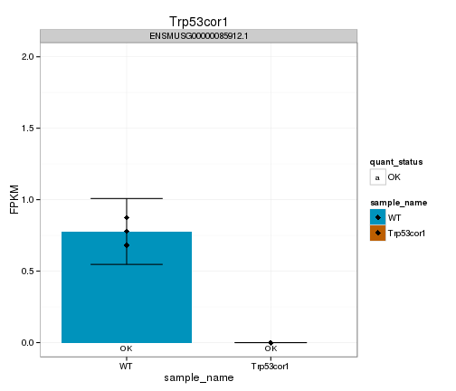
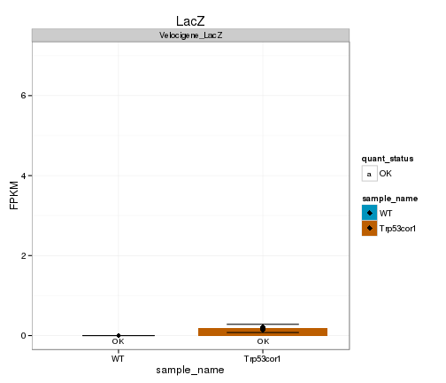
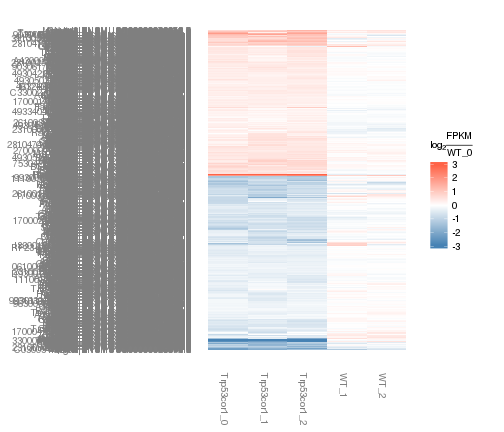
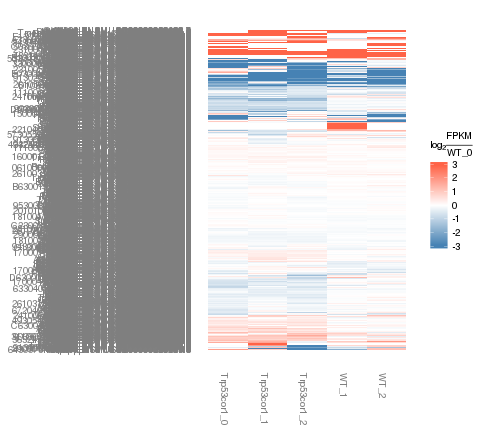
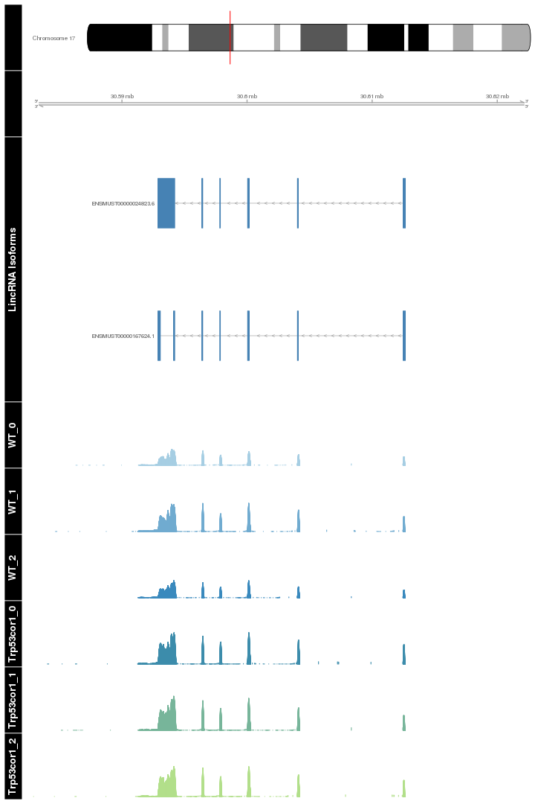

Figure 3 template 
========================================================


Figure 3 plots for mikeMEFs

 

 


Number of DE genes (FDR 0.05): 1279

 

Universe DE genes foldchange heatmap:
 


Now, look at genes that are detectably expressed (FPKM>0.5, yes I know it should be 1), and log2foldchange>2 in any direction: 36 genes


Tracks for Glo1: 

 


GO terms associated with sigDE genes: 


```
## Error in plot(goBP, showCategory = 20): object 'goBP' not found
```

```
## Error in plot(goMF, showCategory = 20): object 'goMF' not found
```

```
## Error in plot(goCC, showCategory = 20): object 'goCC' not found
```

```
## Error in plot(kegg, showCategory = 20): object 'kegg' not found
```

```
## Error in plot(pathway, showCategory = 20): object 'pathway' not found
```

```
## Error in detach("package:biomaRt"): invalid 'name' argument
```


Zscore:


