Trp53cor1 KO vs WT (rmdup_mikeMEFs)
======================================


This file shows the wt-v-ko comparison for Trp53cor1. 

Cuff overview:


```
## CuffSet instance with:
## 	 2 samples
## 	 26754 genes
## 	 77524 isoforms
## 	 0 TSS
## 	 23066 CDS
## 	 0 promoters
## 	 0 splicing
## 	 19954 relCDS
```

# QC

## Dispersion

Dispersion plot for genes in cuff:
(Overdispersion can lead to innacurate quants)

 

## Cross-replicate variability (fpkmSCVplot)
Differences in CV 2 can result in lower numbers of differentially expressed genes due to a higher degree of variability between replicate fpkm estimates.

Genes:

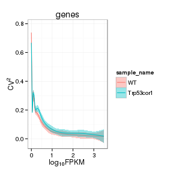 

Isoforms: 

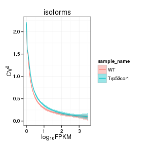 

## MvA plot

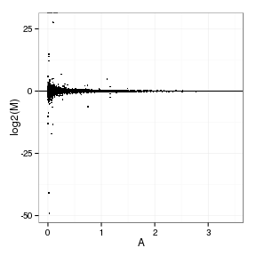 
   
### MvA plot counts

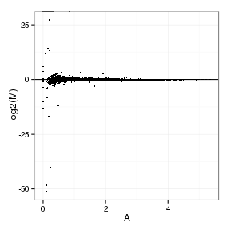 

## Scatterplot matrix

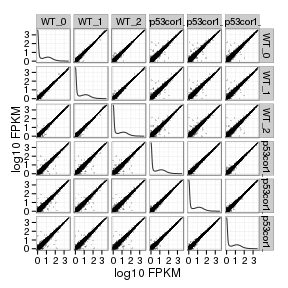 

## Distributions

### Boxplots

Boxplot (genes)

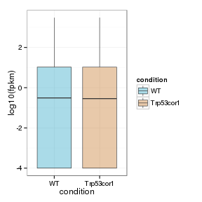 

Boxplot (genes, replicates)

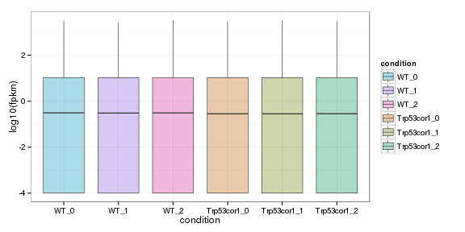 

Boxplot (isoforms)

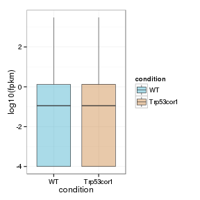 

Boxplot (isoforms, replicates)

 

### Density

Density (genes)

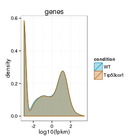 

Density (genes, replicates)

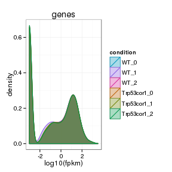 


## Clustering

### Replicate Clusters

 

```
## NULL
```

### PCA (genes)

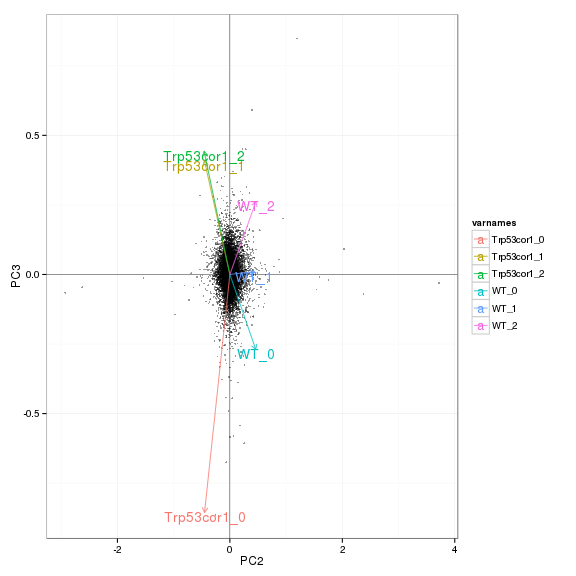 

### MDS (genes)

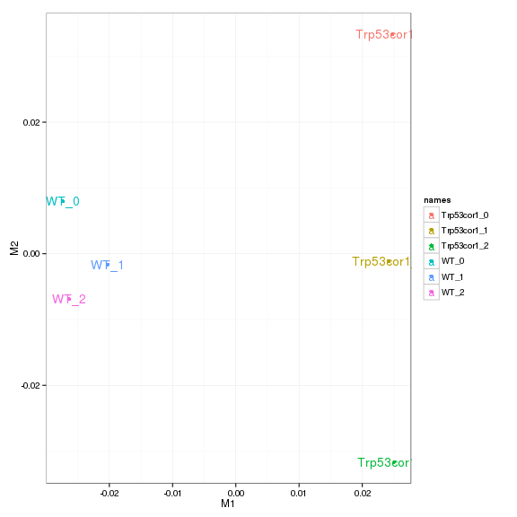 


# KO assessment

## Endogenous lncRNA expression

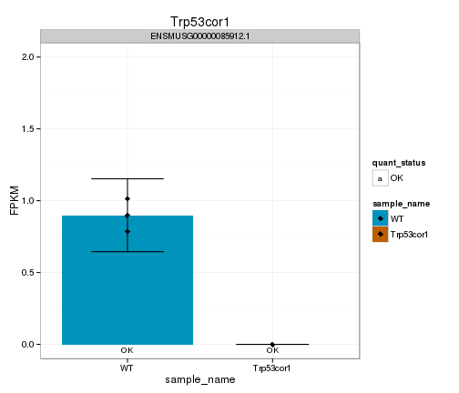 

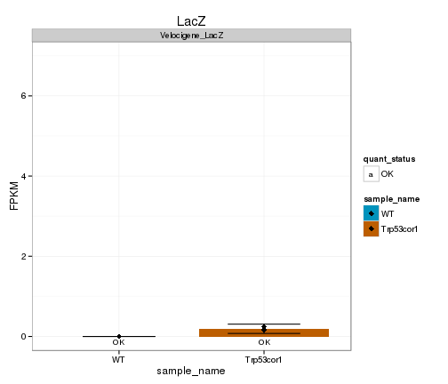 

## Digital Genotyping (LacZ vs Endogenous lncRNA and Sex)

Eif2s3y is a y-expressed gene, Xist is an x-expressed gene 
Expression plot (endogenous linc, lacZ, Y-expressed gene):

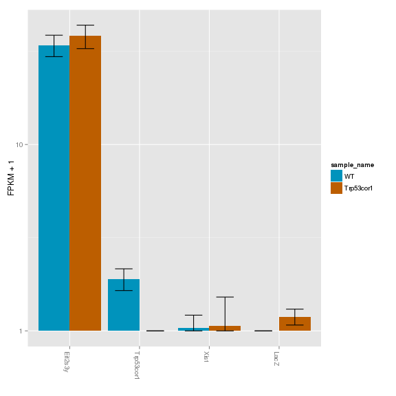 

Expression heatmap:

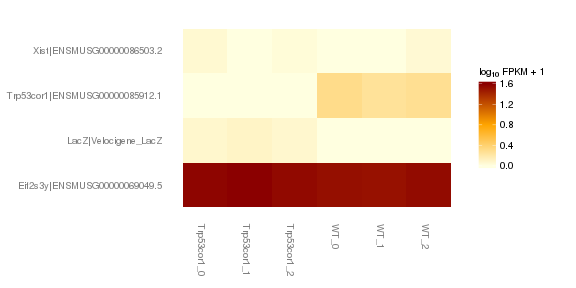 

### Track visualization 


```
## Error in validObject(.Object): invalid class "ReferenceDataTrack" object: The referenced file '/n/rinn_data1/users/agroff/seq/OtherMice/Diana/lincP21/bam/rmdup_mikeMEFs_wt1/accepted_hits.bam' does not exist
```

# Differential Analysis

## Differential Genes 


There are 1241 significantly differentially expressed genes. They are:

<!-- html table generated in R 3.0.2 by xtable 1.7-3 package -->
<!-- Mon Apr  6 11:39:03 2015 -->
<TABLE border=1>
<TR> <TH>  </TH> <TH> geneAnnot$gene_short_name </TH>  </TR>
  <TR> <TD align="right"> 1 </TD> <TD> H19 </TD> </TR>
  <TR> <TD align="right"> 2 </TD> <TD> Tbx4 </TD> </TR>
  <TR> <TD align="right"> 3 </TD> <TD> Trim25 </TD> </TR>
  <TR> <TD align="right"> 4 </TD> <TD> Scpep1 </TD> </TR>
  <TR> <TD align="right"> 5 </TD> <TD> Pemt </TD> </TR>
  <TR> <TD align="right"> 6 </TD> <TD> Grasp </TD> </TR>
  <TR> <TD align="right"> 7 </TD> <TD> Tom1l2 </TD> </TR>
  <TR> <TD align="right"> 8 </TD> <TD> Dynlt1c </TD> </TR>
  <TR> <TD align="right"> 9 </TD> <TD> Gm2a </TD> </TR>
  <TR> <TD align="right"> 10 </TD> <TD> Cd52 </TD> </TR>
  <TR> <TD align="right"> 11 </TD> <TD> Hoxa10 </TD> </TR>
  <TR> <TD align="right"> 12 </TD> <TD> Ccl3 </TD> </TR>
  <TR> <TD align="right"> 13 </TD> <TD> Lgals9 </TD> </TR>
  <TR> <TD align="right"> 14 </TD> <TD> Cnnm3 </TD> </TR>
  <TR> <TD align="right"> 15 </TD> <TD> Pcnt </TD> </TR>
  <TR> <TD align="right"> 16 </TD> <TD> Uhrf1 </TD> </TR>
  <TR> <TD align="right"> 17 </TD> <TD> Ckb </TD> </TR>
  <TR> <TD align="right"> 18 </TD> <TD> Rarg </TD> </TR>
  <TR> <TD align="right"> 19 </TD> <TD> Ube2c </TD> </TR>
  <TR> <TD align="right"> 20 </TD> <TD> Meox1 </TD> </TR>
  <TR> <TD align="right"> 21 </TD> <TD> Irx2 </TD> </TR>
  <TR> <TD align="right"> 22 </TD> <TD> Itga3 </TD> </TR>
  <TR> <TD align="right"> 23 </TD> <TD> Foxm1 </TD> </TR>
  <TR> <TD align="right"> 24 </TD> <TD> Tcea3 </TD> </TR>
  <TR> <TD align="right"> 25 </TD> <TD> Hoxc11 </TD> </TR>
  <TR> <TD align="right"> 26 </TD> <TD> Hoxd13 </TD> </TR>
  <TR> <TD align="right"> 27 </TD> <TD> Ltbp1 </TD> </TR>
  <TR> <TD align="right"> 28 </TD> <TD> Nfix </TD> </TR>
  <TR> <TD align="right"> 29 </TD> <TD> Slc1a5 </TD> </TR>
  <TR> <TD align="right"> 30 </TD> <TD> Ltbp2 </TD> </TR>
  <TR> <TD align="right"> 31 </TD> <TD> Spag5 </TD> </TR>
  <TR> <TD align="right"> 32 </TD> <TD> Peg3 </TD> </TR>
  <TR> <TD align="right"> 33 </TD> <TD> Zim1 </TD> </TR>
  <TR> <TD align="right"> 34 </TD> <TD> Lmf1 </TD> </TR>
  <TR> <TD align="right"> 35 </TD> <TD> Angptl4 </TD> </TR>
  <TR> <TD align="right"> 36 </TD> <TD> Dbf4 </TD> </TR>
  <TR> <TD align="right"> 37 </TD> <TD> Snx9 </TD> </TR>
  <TR> <TD align="right"> 38 </TD> <TD> Bmp8b </TD> </TR>
  <TR> <TD align="right"> 39 </TD> <TD> Snrpd1 </TD> </TR>
  <TR> <TD align="right"> 40 </TD> <TD> Slc9a3r2 </TD> </TR>
  <TR> <TD align="right"> 41 </TD> <TD> Zfp40 </TD> </TR>
  <TR> <TD align="right"> 42 </TD> <TD> Prkd1 </TD> </TR>
  <TR> <TD align="right"> 43 </TD> <TD> Cse1l </TD> </TR>
  <TR> <TD align="right"> 44 </TD> <TD> Epdr1 </TD> </TR>
  <TR> <TD align="right"> 45 </TD> <TD> Cd36 </TD> </TR>
  <TR> <TD align="right"> 46 </TD> <TD> Cdkn1b </TD> </TR>
  <TR> <TD align="right"> 47 </TD> <TD> Klf4 </TD> </TR>
  <TR> <TD align="right"> 48 </TD> <TD> Fam32a </TD> </TR>
  <TR> <TD align="right"> 49 </TD> <TD> Slc2a3 </TD> </TR>
  <TR> <TD align="right"> 50 </TD> <TD> Car11 </TD> </TR>
  <TR> <TD align="right"> 51 </TD> <TD> Hck </TD> </TR>
  <TR> <TD align="right"> 52 </TD> <TD> Fcgrt </TD> </TR>
  <TR> <TD align="right"> 53 </TD> <TD> Ddr1 </TD> </TR>
  <TR> <TD align="right"> 54 </TD> <TD> Has1 </TD> </TR>
  <TR> <TD align="right"> 55 </TD> <TD> Insig2 </TD> </TR>
  <TR> <TD align="right"> 56 </TD> <TD> Man1a </TD> </TR>
  <TR> <TD align="right"> 57 </TD> <TD> Brd8 </TD> </TR>
  <TR> <TD align="right"> 58 </TD> <TD> Kif20a </TD> </TR>
  <TR> <TD align="right"> 59 </TD> <TD> Col5a3 </TD> </TR>
  <TR> <TD align="right"> 60 </TD> <TD> Angptl2 </TD> </TR>
  <TR> <TD align="right"> 61 </TD> <TD> Atp6v1f </TD> </TR>
  <TR> <TD align="right"> 62 </TD> <TD> Bid </TD> </TR>
  <TR> <TD align="right"> 63 </TD> <TD> Ndrg2 </TD> </TR>
  <TR> <TD align="right"> 64 </TD> <TD> Cd33 </TD> </TR>
  <TR> <TD align="right"> 65 </TD> <TD> Aqp1 </TD> </TR>
  <TR> <TD align="right"> 66 </TD> <TD> Emr1 </TD> </TR>
  <TR> <TD align="right"> 67 </TD> <TD> Pgf </TD> </TR>
  <TR> <TD align="right"> 68 </TD> <TD> Pax3 </TD> </TR>
  <TR> <TD align="right"> 69 </TD> <TD> Lbr </TD> </TR>
  <TR> <TD align="right"> 70 </TD> <TD> Crabp2 </TD> </TR>
  <TR> <TD align="right"> 71 </TD> <TD> Nes </TD> </TR>
  <TR> <TD align="right"> 72 </TD> <TD> Tmem242 </TD> </TR>
  <TR> <TD align="right"> 73 </TD> <TD> Spc25 </TD> </TR>
  <TR> <TD align="right"> 74 </TD> <TD> Slc1a6 </TD> </TR>
  <TR> <TD align="right"> 75 </TD> <TD> Mcm5 </TD> </TR>
  <TR> <TD align="right"> 76 </TD> <TD> Usp40 </TD> </TR>
  <TR> <TD align="right"> 77 </TD> <TD> Insr </TD> </TR>
  <TR> <TD align="right"> 78 </TD> <TD> Sqrdl </TD> </TR>
  <TR> <TD align="right"> 79 </TD> <TD> Gata6 </TD> </TR>
  <TR> <TD align="right"> 80 </TD> <TD> Ctns </TD> </TR>
  <TR> <TD align="right"> 81 </TD> <TD> P2rx5 </TD> </TR>
  <TR> <TD align="right"> 82 </TD> <TD> Tuft1 </TD> </TR>
  <TR> <TD align="right"> 83 </TD> <TD> Atp6v1b2 </TD> </TR>
  <TR> <TD align="right"> 84 </TD> <TD> Crip2 </TD> </TR>
  <TR> <TD align="right"> 85 </TD> <TD> Crip1 </TD> </TR>
  <TR> <TD align="right"> 86 </TD> <TD> Cdc20 </TD> </TR>
  <TR> <TD align="right"> 87 </TD> <TD> Epha2 </TD> </TR>
  <TR> <TD align="right"> 88 </TD> <TD> Pdk1 </TD> </TR>
  <TR> <TD align="right"> 89 </TD> <TD> Aplp1 </TD> </TR>
  <TR> <TD align="right"> 90 </TD> <TD> Pola1 </TD> </TR>
  <TR> <TD align="right"> 91 </TD> <TD> Gmnn </TD> </TR>
  <TR> <TD align="right"> 92 </TD> <TD> Sulf2 </TD> </TR>
  <TR> <TD align="right"> 93 </TD> <TD> Neu1 </TD> </TR>
  <TR> <TD align="right"> 94 </TD> <TD> Ddah2 </TD> </TR>
  <TR> <TD align="right"> 95 </TD> <TD> Lsm2 </TD> </TR>
  <TR> <TD align="right"> 96 </TD> <TD> Tinf2 </TD> </TR>
  <TR> <TD align="right"> 97 </TD> <TD> Khsrp </TD> </TR>
  <TR> <TD align="right"> 98 </TD> <TD> Twist2 </TD> </TR>
  <TR> <TD align="right"> 99 </TD> <TD> Nfib </TD> </TR>
  <TR> <TD align="right"> 100 </TD> <TD> Kdsr </TD> </TR>
  <TR> <TD align="right"> 101 </TD> <TD> Ebf3 </TD> </TR>
  <TR> <TD align="right"> 102 </TD> <TD> Adssl1 </TD> </TR>
  <TR> <TD align="right"> 103 </TD> <TD> Kif11 </TD> </TR>
  <TR> <TD align="right"> 104 </TD> <TD> Enkd1 </TD> </TR>
  <TR> <TD align="right"> 105 </TD> <TD> Atp6v0d1 </TD> </TR>
  <TR> <TD align="right"> 106 </TD> <TD> Ptprs </TD> </TR>
  <TR> <TD align="right"> 107 </TD> <TD> Iglon5 </TD> </TR>
  <TR> <TD align="right"> 108 </TD> <TD> Kif1a </TD> </TR>
  <TR> <TD align="right"> 109 </TD> <TD> Alx3 </TD> </TR>
  <TR> <TD align="right"> 110 </TD> <TD> Stc1 </TD> </TR>
  <TR> <TD align="right"> 111 </TD> <TD> Tppp3 </TD> </TR>
  <TR> <TD align="right"> 112 </TD> <TD> Dnajb9 </TD> </TR>
  <TR> <TD align="right"> 113 </TD> <TD> Naf1 </TD> </TR>
  <TR> <TD align="right"> 114 </TD> <TD> Tsen15 </TD> </TR>
  <TR> <TD align="right"> 115 </TD> <TD> Sirt2 </TD> </TR>
  <TR> <TD align="right"> 116 </TD> <TD> Hmgb3 </TD> </TR>
  <TR> <TD align="right"> 117 </TD> <TD> Abca1 </TD> </TR>
  <TR> <TD align="right"> 118 </TD> <TD> Cybb </TD> </TR>
  <TR> <TD align="right"> 119 </TD> <TD> Lpl </TD> </TR>
  <TR> <TD align="right"> 120 </TD> <TD> Ncapg </TD> </TR>
  <TR> <TD align="right"> 121 </TD> <TD> Ncf1 </TD> </TR>
  <TR> <TD align="right"> 122 </TD> <TD> Wt1 </TD> </TR>
  <TR> <TD align="right"> 123 </TD> <TD> Sulf1 </TD> </TR>
  <TR> <TD align="right"> 124 </TD> <TD> Sdc4 </TD> </TR>
  <TR> <TD align="right"> 125 </TD> <TD> Il13ra1 </TD> </TR>
  <TR> <TD align="right"> 126 </TD> <TD> Brca1 </TD> </TR>
  <TR> <TD align="right"> 127 </TD> <TD> Rarb </TD> </TR>
  <TR> <TD align="right"> 128 </TD> <TD> Cdc6 </TD> </TR>
  <TR> <TD align="right"> 129 </TD> <TD> Atad5 </TD> </TR>
  <TR> <TD align="right"> 130 </TD> <TD> Cd40 </TD> </TR>
  <TR> <TD align="right"> 131 </TD> <TD> Serinc3 </TD> </TR>
  <TR> <TD align="right"> 132 </TD> <TD> Birc5 </TD> </TR>
  <TR> <TD align="right"> 133 </TD> <TD> Pigt </TD> </TR>
  <TR> <TD align="right"> 134 </TD> <TD> Dbndd2 </TD> </TR>
  <TR> <TD align="right"> 135 </TD> <TD> Mmp9 </TD> </TR>
  <TR> <TD align="right"> 136 </TD> <TD> Ctsa </TD> </TR>
  <TR> <TD align="right"> 137 </TD> <TD> Mybl2 </TD> </TR>
  <TR> <TD align="right"> 138 </TD> <TD> Cyth4 </TD> </TR>
  <TR> <TD align="right"> 139 </TD> <TD> Hist1h2bc </TD> </TR>
  <TR> <TD align="right"> 140 </TD> <TD> Mafk </TD> </TR>
  <TR> <TD align="right"> 141 </TD> <TD> Gpx3 </TD> </TR>
  <TR> <TD align="right"> 142 </TD> <TD> Tbx3 </TD> </TR>
  <TR> <TD align="right"> 143 </TD> <TD> Abca5 </TD> </TR>
  <TR> <TD align="right"> 144 </TD> <TD> Myh11 </TD> </TR>
  <TR> <TD align="right"> 145 </TD> <TD> Cxcl16 </TD> </TR>
  <TR> <TD align="right"> 146 </TD> <TD> Atp6v1e1 </TD> </TR>
  <TR> <TD align="right"> 147 </TD> <TD> Chtf18 </TD> </TR>
  <TR> <TD align="right"> 148 </TD> <TD> Lhx9 </TD> </TR>
  <TR> <TD align="right"> 149 </TD> <TD> Aoc3 </TD> </TR>
  <TR> <TD align="right"> 150 </TD> <TD> Fbxo5 </TD> </TR>
  <TR> <TD align="right"> 151 </TD> <TD> Frk </TD> </TR>
  <TR> <TD align="right"> 152 </TD> <TD> Lama4 </TD> </TR>
  <TR> <TD align="right"> 153 </TD> <TD> Perp </TD> </TR>
  <TR> <TD align="right"> 154 </TD> <TD> Hebp2 </TD> </TR>
  <TR> <TD align="right"> 155 </TD> <TD> Slc6a15 </TD> </TR>
  <TR> <TD align="right"> 156 </TD> <TD> Sept10 </TD> </TR>
  <TR> <TD align="right"> 157 </TD> <TD> Dcn </TD> </TR>
  <TR> <TD align="right"> 158 </TD> <TD> Cdk1 </TD> </TR>
  <TR> <TD align="right"> 159 </TD> <TD> Tmpo </TD> </TR>
  <TR> <TD align="right"> 160 </TD> <TD> Sgk1 </TD> </TR>
  <TR> <TD align="right"> 161 </TD> <TD> Arg1 </TD> </TR>
  <TR> <TD align="right"> 162 </TD> <TD> Nedd1 </TD> </TR>
  <TR> <TD align="right"> 163 </TD> <TD> Mtfr2 </TD> </TR>
  <TR> <TD align="right"> 164 </TD> <TD> Cdk17 </TD> </TR>
  <TR> <TD align="right"> 165 </TD> <TD> Ntn4 </TD> </TR>
  <TR> <TD align="right"> 166 </TD> <TD> Ndufa12 </TD> </TR>
  <TR> <TD align="right"> 167 </TD> <TD> Nuak1 </TD> </TR>
  <TR> <TD align="right"> 168 </TD> <TD> Unc5b </TD> </TR>
  <TR> <TD align="right"> 169 </TD> <TD> Ddit4 </TD> </TR>
  <TR> <TD align="right"> 170 </TD> <TD> Plek </TD> </TR>
  <TR> <TD align="right"> 171 </TD> <TD> Avpr1a </TD> </TR>
  <TR> <TD align="right"> 172 </TD> <TD> Lgr5 </TD> </TR>
  <TR> <TD align="right"> 173 </TD> <TD> Ptprb </TD> </TR>
  <TR> <TD align="right"> 174 </TD> <TD> Kcnmb1 </TD> </TR>
  <TR> <TD align="right"> 175 </TD> <TD> E2f7 </TD> </TR>
  <TR> <TD align="right"> 176 </TD> <TD> Mdm1 </TD> </TR>
  <TR> <TD align="right"> 177 </TD> <TD> Aldh1l2 </TD> </TR>
  <TR> <TD align="right"> 178 </TD> <TD> Cpeb4 </TD> </TR>
  <TR> <TD align="right"> 179 </TD> <TD> Hmmr </TD> </TR>
  <TR> <TD align="right"> 180 </TD> <TD> Hcn2 </TD> </TR>
  <TR> <TD align="right"> 181 </TD> <TD> Flt4 </TD> </TR>
  <TR> <TD align="right"> 182 </TD> <TD> Tcn2 </TD> </TR>
  <TR> <TD align="right"> 183 </TD> <TD> Prr11 </TD> </TR>
  <TR> <TD align="right"> 184 </TD> <TD> Ppm1d </TD> </TR>
  <TR> <TD align="right"> 185 </TD> <TD> Matn3 </TD> </TR>
  <TR> <TD align="right"> 186 </TD> <TD> Trib2 </TD> </TR>
  <TR> <TD align="right"> 187 </TD> <TD> Rdh14 </TD> </TR>
  <TR> <TD align="right"> 188 </TD> <TD> Klhl29 </TD> </TR>
  <TR> <TD align="right"> 189 </TD> <TD> Cmpk2 </TD> </TR>
  <TR> <TD align="right"> 190 </TD> <TD> Rnf144a </TD> </TR>
  <TR> <TD align="right"> 191 </TD> <TD> Slc9a3r1 </TD> </TR>
  <TR> <TD align="right"> 192 </TD> <TD> Fam64a </TD> </TR>
  <TR> <TD align="right"> 193 </TD> <TD> Hoxb9 </TD> </TR>
  <TR> <TD align="right"> 194 </TD> <TD> Aurkb </TD> </TR>
  <TR> <TD align="right"> 195 </TD> <TD> Krt19 </TD> </TR>
  <TR> <TD align="right"> 196 </TD> <TD> Foxg1 </TD> </TR>
  <TR> <TD align="right"> 197 </TD> <TD> Coch </TD> </TR>
  <TR> <TD align="right"> 198 </TD> <TD> Pole2 </TD> </TR>
  <TR> <TD align="right"> 199 </TD> <TD> Galc </TD> </TR>
  <TR> <TD align="right"> 200 </TD> <TD> Atp6v1d </TD> </TR>
  <TR> <TD align="right"> 201 </TD> <TD> Smoc1 </TD> </TR>
  <TR> <TD align="right"> 202 </TD> <TD> Efcab11 </TD> </TR>
  <TR> <TD align="right"> 203 </TD> <TD> Ccdc88c </TD> </TR>
  <TR> <TD align="right"> 204 </TD> <TD> 9030617O03Rik </TD> </TR>
  <TR> <TD align="right"> 205 </TD> <TD> Lgmn </TD> </TR>
  <TR> <TD align="right"> 206 </TD> <TD> Ifi27l2b </TD> </TR>
  <TR> <TD align="right"> 207 </TD> <TD> Ppp1r13b </TD> </TR>
  <TR> <TD align="right"> 208 </TD> <TD> Hecw1 </TD> </TR>
  <TR> <TD align="right"> 209 </TD> <TD> Tfap2a </TD> </TR>
  <TR> <TD align="right"> 210 </TD> <TD> Edn1 </TD> </TR>
  <TR> <TD align="right"> 211 </TD> <TD> Dek </TD> </TR>
  <TR> <TD align="right"> 212 </TD> <TD> Serpinb9b </TD> </TR>
  <TR> <TD align="right"> 213 </TD> <TD> Pxdc1 </TD> </TR>
  <TR> <TD align="right"> 214 </TD> <TD> Ly86 </TD> </TR>
  <TR> <TD align="right"> 215 </TD> <TD> Syk </TD> </TR>
  <TR> <TD align="right"> 216 </TD> <TD> Ptch1 </TD> </TR>
  <TR> <TD align="right"> 217 </TD> <TD> Cxcl14 </TD> </TR>
  <TR> <TD align="right"> 218 </TD> <TD> Gkap1 </TD> </TR>
  <TR> <TD align="right"> 219 </TD> <TD> Nkd2 </TD> </TR>
  <TR> <TD align="right"> 220 </TD> <TD> Trip13 </TD> </TR>
  <TR> <TD align="right"> 221 </TD> <TD> Atg10 </TD> </TR>
  <TR> <TD align="right"> 222 </TD> <TD> Arhgef28 </TD> </TR>
  <TR> <TD align="right"> 223 </TD> <TD> Iqgap2 </TD> </TR>
  <TR> <TD align="right"> 224 </TD> <TD> F2rl1 </TD> </TR>
  <TR> <TD align="right"> 225 </TD> <TD> Hcn1 </TD> </TR>
  <TR> <TD align="right"> 226 </TD> <TD> Fgf10 </TD> </TR>
  <TR> <TD align="right"> 227 </TD> <TD> Dnajc9 </TD> </TR>
  <TR> <TD align="right"> 228 </TD> <TD> Txndc16 </TD> </TR>
  <TR> <TD align="right"> 229 </TD> <TD> Bmp4 </TD> </TR>
  <TR> <TD align="right"> 230 </TD> <TD> Gpr65 </TD> </TR>
  <TR> <TD align="right"> 231 </TD> <TD> Ogdhl </TD> </TR>
  <TR> <TD align="right"> 232 </TD> <TD> Anxa8 </TD> </TR>
  <TR> <TD align="right"> 233 </TD> <TD> Ska3 </TD> </TR>
  <TR> <TD align="right"> 234 </TD> <TD> Lcp1 </TD> </TR>
  <TR> <TD align="right"> 235 </TD> <TD> Tsc22d1 </TD> </TR>
  <TR> <TD align="right"> 236 </TD> <TD> Tnfsf11 </TD> </TR>
  <TR> <TD align="right"> 237 </TD> <TD> Rgcc </TD> </TR>
  <TR> <TD align="right"> 238 </TD> <TD> Tdrd3 </TD> </TR>
  <TR> <TD align="right"> 239 </TD> <TD> Diap3 </TD> </TR>
  <TR> <TD align="right"> 240 </TD> <TD> Pbk </TD> </TR>
  <TR> <TD align="right"> 241 </TD> <TD> Stmn4 </TD> </TR>
  <TR> <TD align="right"> 242 </TD> <TD> Ebf2 </TD> </TR>
  <TR> <TD align="right"> 243 </TD> <TD> Bora </TD> </TR>
  <TR> <TD align="right"> 244 </TD> <TD> Bmp1 </TD> </TR>
  <TR> <TD align="right"> 245 </TD> <TD> Pdzd2 </TD> </TR>
  <TR> <TD align="right"> 246 </TD> <TD> Slc22a17 </TD> </TR>
  <TR> <TD align="right"> 247 </TD> <TD> Npr3 </TD> </TR>
  <TR> <TD align="right"> 248 </TD> <TD> Sema5a </TD> </TR>
  <TR> <TD align="right"> 249 </TD> <TD> Rai14 </TD> </TR>
  <TR> <TD align="right"> 250 </TD> <TD> Ank </TD> </TR>
  <TR> <TD align="right"> 251 </TD> <TD> Oxr1 </TD> </TR>
  <TR> <TD align="right"> 252 </TD> <TD> Rad21 </TD> </TR>
  <TR> <TD align="right"> 253 </TD> <TD> Cdh10 </TD> </TR>
  <TR> <TD align="right"> 254 </TD> <TD> Shcbp1 </TD> </TR>
  <TR> <TD align="right"> 255 </TD> <TD> Matn2 </TD> </TR>
  <TR> <TD align="right"> 256 </TD> <TD> Fbxo32 </TD> </TR>
  <TR> <TD align="right"> 257 </TD> <TD> Atad2 </TD> </TR>
  <TR> <TD align="right"> 258 </TD> <TD> Sla </TD> </TR>
  <TR> <TD align="right"> 259 </TD> <TD> Gtse1 </TD> </TR>
  <TR> <TD align="right"> 260 </TD> <TD> Deptor </TD> </TR>
  <TR> <TD align="right"> 261 </TD> <TD> Dscc1 </TD> </TR>
  <TR> <TD align="right"> 262 </TD> <TD> Nell2 </TD> </TR>
  <TR> <TD align="right"> 263 </TD> <TD> Slc38a4 </TD> </TR>
  <TR> <TD align="right"> 264 </TD> <TD> Hoxc10 </TD> </TR>
  <TR> <TD align="right"> 265 </TD> <TD> Nckap1l </TD> </TR>
  <TR> <TD align="right"> 266 </TD> <TD> Cldn1 </TD> </TR>
  <TR> <TD align="right"> 267 </TD> <TD> Il1rap </TD> </TR>
  <TR> <TD align="right"> 268 </TD> <TD> Grina </TD> </TR>
  <TR> <TD align="right"> 269 </TD> <TD> Scrib </TD> </TR>
  <TR> <TD align="right"> 270 </TD> <TD> Mapk12 </TD> </TR>
  <TR> <TD align="right"> 271 </TD> <TD> Pvrl3 </TD> </TR>
  <TR> <TD align="right"> 272 </TD> <TD> Ccdc80 </TD> </TR>
  <TR> <TD align="right"> 273 </TD> <TD> B3gnt5 </TD> </TR>
  <TR> <TD align="right"> 274 </TD> <TD> Hcls1 </TD> </TR>
  <TR> <TD align="right"> 275 </TD> <TD> Masp1 </TD> </TR>
  <TR> <TD align="right"> 276 </TD> <TD> Adamts1 </TD> </TR>
  <TR> <TD align="right"> 277 </TD> <TD> Adamts5 </TD> </TR>
  <TR> <TD align="right"> 278 </TD> <TD> Rcan1 </TD> </TR>
  <TR> <TD align="right"> 279 </TD> <TD> Enah </TD> </TR>
  <TR> <TD align="right"> 280 </TD> <TD> Wnt10b </TD> </TR>
  <TR> <TD align="right"> 281 </TD> <TD> Racgap1 </TD> </TR>
  <TR> <TD align="right"> 282 </TD> <TD> Nr4a1 </TD> </TR>
  <TR> <TD align="right"> 283 </TD> <TD> Krt18 </TD> </TR>
  <TR> <TD align="right"> 284 </TD> <TD> Igfbp6 </TD> </TR>
  <TR> <TD align="right"> 285 </TD> <TD> Calcoco1 </TD> </TR>
  <TR> <TD align="right"> 286 </TD> <TD> Rttn </TD> </TR>
  <TR> <TD align="right"> 287 </TD> <TD> Cdkn1a </TD> </TR>
  <TR> <TD align="right"> 288 </TD> <TD> Serping1 </TD> </TR>
  <TR> <TD align="right"> 289 </TD> <TD> Clec4n </TD> </TR>
  <TR> <TD align="right"> 290 </TD> <TD> Tmem176a </TD> </TR>
  <TR> <TD align="right"> 291 </TD> <TD> Cdca3 </TD> </TR>
  <TR> <TD align="right"> 292 </TD> <TD> Tiam2 </TD> </TR>
  <TR> <TD align="right"> 293 </TD> <TD> 1700010I14Rik </TD> </TR>
  <TR> <TD align="right"> 294 </TD> <TD> Thbs2 </TD> </TR>
  <TR> <TD align="right"> 295 </TD> <TD> Smoc2 </TD> </TR>
  <TR> <TD align="right"> 296 </TD> <TD> Hcfc1r1 </TD> </TR>
  <TR> <TD align="right"> 297 </TD> <TD> Pla2g7 </TD> </TR>
  <TR> <TD align="right"> 298 </TD> <TD> Tnfrsf21 </TD> </TR>
  <TR> <TD align="right"> 299 </TD> <TD> Sgol1 </TD> </TR>
  <TR> <TD align="right"> 300 </TD> <TD> Slc29a1 </TD> </TR>
  <TR> <TD align="right"> 301 </TD> <TD> Slc5a7 </TD> </TR>
  <TR> <TD align="right"> 302 </TD> <TD> Polh </TD> </TR>
  <TR> <TD align="right"> 303 </TD> <TD> Enpp5 </TD> </TR>
  <TR> <TD align="right"> 304 </TD> <TD> Enpp4 </TD> </TR>
  <TR> <TD align="right"> 305 </TD> <TD> Ptk7 </TD> </TR>
  <TR> <TD align="right"> 306 </TD> <TD> Foxp4 </TD> </TR>
  <TR> <TD align="right"> 307 </TD> <TD> Trem2 </TD> </TR>
  <TR> <TD align="right"> 308 </TD> <TD> Nfya </TD> </TR>
  <TR> <TD align="right"> 309 </TD> <TD> Kif6 </TD> </TR>
  <TR> <TD align="right"> 310 </TD> <TD> Ppil1 </TD> </TR>
  <TR> <TD align="right"> 311 </TD> <TD> Glo1 </TD> </TR>
  <TR> <TD align="right"> 312 </TD> <TD> Abcg1 </TD> </TR>
  <TR> <TD align="right"> 313 </TD> <TD> Sik1 </TD> </TR>
  <TR> <TD align="right"> 314 </TD> <TD> Arhgap28 </TD> </TR>
  <TR> <TD align="right"> 315 </TD> <TD> Epb4.1l3 </TD> </TR>
  <TR> <TD align="right"> 316 </TD> <TD> Ndc80 </TD> </TR>
  <TR> <TD align="right"> 317 </TD> <TD> Clip4 </TD> </TR>
  <TR> <TD align="right"> 318 </TD> <TD> Dpy30 </TD> </TR>
  <TR> <TD align="right"> 319 </TD> <TD> Slc30a6 </TD> </TR>
  <TR> <TD align="right"> 320 </TD> <TD> Yipf4 </TD> </TR>
  <TR> <TD align="right"> 321 </TD> <TD> Ndufaf7 </TD> </TR>
  <TR> <TD align="right"> 322 </TD> <TD> Qpct </TD> </TR>
  <TR> <TD align="right"> 323 </TD> <TD> Cyp1b1 </TD> </TR>
  <TR> <TD align="right"> 324 </TD> <TD> Srsf7 </TD> </TR>
  <TR> <TD align="right"> 325 </TD> <TD> Pdpk1 </TD> </TR>
  <TR> <TD align="right"> 326 </TD> <TD> Abca3 </TD> </TR>
  <TR> <TD align="right"> 327 </TD> <TD> Epas1 </TD> </TR>
  <TR> <TD align="right"> 328 </TD> <TD> Nudt12 </TD> </TR>
  <TR> <TD align="right"> 329 </TD> <TD> Myo1f </TD> </TR>
  <TR> <TD align="right"> 330 </TD> <TD> Kifc5b </TD> </TR>
  <TR> <TD align="right"> 331 </TD> <TD> Cdh2 </TD> </TR>
  <TR> <TD align="right"> 332 </TD> <TD> Epb4.1l4a </TD> </TR>
  <TR> <TD align="right"> 333 </TD> <TD> Aif1 </TD> </TR>
  <TR> <TD align="right"> 334 </TD> <TD> Zfp521 </TD> </TR>
  <TR> <TD align="right"> 335 </TD> <TD> Impact </TD> </TR>
  <TR> <TD align="right"> 336 </TD> <TD> Spry4 </TD> </TR>
  <TR> <TD align="right"> 337 </TD> <TD> Trim26 </TD> </TR>
  <TR> <TD align="right"> 338 </TD> <TD> Hbegf </TD> </TR>
  <TR> <TD align="right"> 339 </TD> <TD> Dynap </TD> </TR>
  <TR> <TD align="right"> 340 </TD> <TD> Cep192 </TD> </TR>
  <TR> <TD align="right"> 341 </TD> <TD> Lmnb1 </TD> </TR>
  <TR> <TD align="right"> 342 </TD> <TD> Megf10 </TD> </TR>
  <TR> <TD align="right"> 343 </TD> <TD> Slc12a2 </TD> </TR>
  <TR> <TD align="right"> 344 </TD> <TD> Fbn2 </TD> </TR>
  <TR> <TD align="right"> 345 </TD> <TD> Csf1r </TD> </TR>
  <TR> <TD align="right"> 346 </TD> <TD> Incenp </TD> </TR>
  <TR> <TD align="right"> 347 </TD> <TD> Fads2 </TD> </TR>
  <TR> <TD align="right"> 348 </TD> <TD> Ms4a7 </TD> </TR>
  <TR> <TD align="right"> 349 </TD> <TD> Pcsk5 </TD> </TR>
  <TR> <TD align="right"> 350 </TD> <TD> Atg2a </TD> </TR>
  <TR> <TD align="right"> 351 </TD> <TD> Cdca5 </TD> </TR>
  <TR> <TD align="right"> 352 </TD> <TD> Kif20b </TD> </TR>
  <TR> <TD align="right"> 353 </TD> <TD> Rpp30 </TD> </TR>
  <TR> <TD align="right"> 354 </TD> <TD> Papss2 </TD> </TR>
  <TR> <TD align="right"> 355 </TD> <TD> Lrp5 </TD> </TR>
  <TR> <TD align="right"> 356 </TD> <TD> Rcor2 </TD> </TR>
  <TR> <TD align="right"> 357 </TD> <TD> Cep55 </TD> </TR>
  <TR> <TD align="right"> 358 </TD> <TD> Pik3ap1 </TD> </TR>
  <TR> <TD align="right"> 359 </TD> <TD> Maoa </TD> </TR>
  <TR> <TD align="right"> 360 </TD> <TD> Msr1 </TD> </TR>
  <TR> <TD align="right"> 361 </TD> <TD> Ablim1 </TD> </TR>
  <TR> <TD align="right"> 362 </TD> <TD> Gfra1 </TD> </TR>
  <TR> <TD align="right"> 363 </TD> <TD> Hdgfrp3 </TD> </TR>
  <TR> <TD align="right"> 364 </TD> <TD> Bnc1 </TD> </TR>
  <TR> <TD align="right"> 365 </TD> <TD> Slc16a3 </TD> </TR>
  <TR> <TD align="right"> 366 </TD> <TD> Kazald1 </TD> </TR>
  <TR> <TD align="right"> 367 </TD> <TD> Hexa </TD> </TR>
  <TR> <TD align="right"> 368 </TD> <TD> Sat1 </TD> </TR>
  <TR> <TD align="right"> 369 </TD> <TD> Prdx4 </TD> </TR>
  <TR> <TD align="right"> 370 </TD> <TD> Atp10a </TD> </TR>
  <TR> <TD align="right"> 371 </TD> <TD> 2310003H01Rik </TD> </TR>
  <TR> <TD align="right"> 372 </TD> <TD> Prim1 </TD> </TR>
  <TR> <TD align="right"> 373 </TD> <TD> Pip4k2c </TD> </TR>
  <TR> <TD align="right"> 374 </TD> <TD> Ifitm1 </TD> </TR>
  <TR> <TD align="right"> 375 </TD> <TD> Tk1 </TD> </TR>
  <TR> <TD align="right"> 376 </TD> <TD> Cbx2 </TD> </TR>
  <TR> <TD align="right"> 377 </TD> <TD> Map3k7cl </TD> </TR>
  <TR> <TD align="right"> 378 </TD> <TD> Pfkfb4 </TD> </TR>
  <TR> <TD align="right"> 379 </TD> <TD> Col7a1 </TD> </TR>
  <TR> <TD align="right"> 380 </TD> <TD> Plk4 </TD> </TR>
  <TR> <TD align="right"> 381 </TD> <TD> St8sia2 </TD> </TR>
  <TR> <TD align="right"> 382 </TD> <TD> Slco3a1 </TD> </TR>
  <TR> <TD align="right"> 383 </TD> <TD> Slc25a10 </TD> </TR>
  <TR> <TD align="right"> 384 </TD> <TD> Ccr1 </TD> </TR>
  <TR> <TD align="right"> 385 </TD> <TD> Dhtkd1 </TD> </TR>
  <TR> <TD align="right"> 386 </TD> <TD> Pdgfa </TD> </TR>
  <TR> <TD align="right"> 387 </TD> <TD> Eya1 </TD> </TR>
  <TR> <TD align="right"> 388 </TD> <TD> Slc40a1 </TD> </TR>
  <TR> <TD align="right"> 389 </TD> <TD> Raph1 </TD> </TR>
  <TR> <TD align="right"> 390 </TD> <TD> Sgol2 </TD> </TR>
  <TR> <TD align="right"> 391 </TD> <TD> Col3a1 </TD> </TR>
  <TR> <TD align="right"> 392 </TD> <TD> Il18rap </TD> </TR>
  <TR> <TD align="right"> 393 </TD> <TD> Stk17b </TD> </TR>
  <TR> <TD align="right"> 394 </TD> <TD> Stat1 </TD> </TR>
  <TR> <TD align="right"> 395 </TD> <TD> Nabp1 </TD> </TR>
  <TR> <TD align="right"> 396 </TD> <TD> Tmeff2 </TD> </TR>
  <TR> <TD align="right"> 397 </TD> <TD> Igfbp5 </TD> </TR>
  <TR> <TD align="right"> 398 </TD> <TD> Des </TD> </TR>
  <TR> <TD align="right"> 399 </TD> <TD> Epha4 </TD> </TR>
  <TR> <TD align="right"> 400 </TD> <TD> Inpp5d </TD> </TR>
  <TR> <TD align="right"> 401 </TD> <TD> Asb1 </TD> </TR>
  <TR> <TD align="right"> 402 </TD> <TD> Tnfrsf11a </TD> </TR>
  <TR> <TD align="right"> 403 </TD> <TD> Steap3 </TD> </TR>
  <TR> <TD align="right"> 404 </TD> <TD> Ptprc </TD> </TR>
  <TR> <TD align="right"> 405 </TD> <TD> Cd55 </TD> </TR>
  <TR> <TD align="right"> 406 </TD> <TD> Tnnt2 </TD> </TR>
  <TR> <TD align="right"> 407 </TD> <TD> Rgs16 </TD> </TR>
  <TR> <TD align="right"> 408 </TD> <TD> Ncf2 </TD> </TR>
  <TR> <TD align="right"> 409 </TD> <TD> Kif26b </TD> </TR>
  <TR> <TD align="right"> 410 </TD> <TD> Dpt </TD> </TR>
  <TR> <TD align="right"> 411 </TD> <TD> Ralgps2 </TD> </TR>
  <TR> <TD align="right"> 412 </TD> <TD> Cenpf </TD> </TR>
  <TR> <TD align="right"> 413 </TD> <TD> Mark1 </TD> </TR>
  <TR> <TD align="right"> 414 </TD> <TD> Nek2 </TD> </TR>
  <TR> <TD align="right"> 415 </TD> <TD> Plxna2 </TD> </TR>
  <TR> <TD align="right"> 416 </TD> <TD> Mcm10 </TD> </TR>
  <TR> <TD align="right"> 417 </TD> <TD> Rgs5 </TD> </TR>
  <TR> <TD align="right"> 418 </TD> <TD> Nuf2 </TD> </TR>
  <TR> <TD align="right"> 419 </TD> <TD> Mrc1 </TD> </TR>
  <TR> <TD align="right"> 420 </TD> <TD> Itga8 </TD> </TR>
  <TR> <TD align="right"> 421 </TD> <TD> Mastl </TD> </TR>
  <TR> <TD align="right"> 422 </TD> <TD> Abi2 </TD> </TR>
  <TR> <TD align="right"> 423 </TD> <TD> Stom </TD> </TR>
  <TR> <TD align="right"> 424 </TD> <TD> Grb14 </TD> </TR>
  <TR> <TD align="right"> 425 </TD> <TD> Ifih1 </TD> </TR>
  <TR> <TD align="right"> 426 </TD> <TD> Itga4 </TD> </TR>
  <TR> <TD align="right"> 427 </TD> <TD> Hat1 </TD> </TR>
  <TR> <TD align="right"> 428 </TD> <TD> Dhrs9 </TD> </TR>
  <TR> <TD align="right"> 429 </TD> <TD> Lrp2 </TD> </TR>
  <TR> <TD align="right"> 430 </TD> <TD> Slc43a3 </TD> </TR>
  <TR> <TD align="right"> 431 </TD> <TD> Kif18a </TD> </TR>
  <TR> <TD align="right"> 432 </TD> <TD> Nop10 </TD> </TR>
  <TR> <TD align="right"> 433 </TD> <TD> Sema6d </TD> </TR>
  <TR> <TD align="right"> 434 </TD> <TD> Dut </TD> </TR>
  <TR> <TD align="right"> 435 </TD> <TD> Meis2 </TD> </TR>
  <TR> <TD align="right"> 436 </TD> <TD> Syt13 </TD> </TR>
  <TR> <TD align="right"> 437 </TD> <TD> Chst1 </TD> </TR>
  <TR> <TD align="right"> 438 </TD> <TD> Creb3l1 </TD> </TR>
  <TR> <TD align="right"> 439 </TD> <TD> Jag1 </TD> </TR>
  <TR> <TD align="right"> 440 </TD> <TD> Nusap1 </TD> </TR>
  <TR> <TD align="right"> 441 </TD> <TD> Atrn </TD> </TR>
  <TR> <TD align="right"> 442 </TD> <TD> Casc5 </TD> </TR>
  <TR> <TD align="right"> 443 </TD> <TD> Knstrn </TD> </TR>
  <TR> <TD align="right"> 444 </TD> <TD> Adra1d </TD> </TR>
  <TR> <TD align="right"> 445 </TD> <TD> Mcm8 </TD> </TR>
  <TR> <TD align="right"> 446 </TD> <TD> Bub1 </TD> </TR>
  <TR> <TD align="right"> 447 </TD> <TD> Slc20a1 </TD> </TR>
  <TR> <TD align="right"> 448 </TD> <TD> Cst3 </TD> </TR>
  <TR> <TD align="right"> 449 </TD> <TD> Fam110a </TD> </TR>
  <TR> <TD align="right"> 450 </TD> <TD> Tpx2 </TD> </TR>
  <TR> <TD align="right"> 451 </TD> <TD> Pdrg1 </TD> </TR>
  <TR> <TD align="right"> 452 </TD> <TD> Aurka </TD> </TR>
  <TR> <TD align="right"> 453 </TD> <TD> Zdbf2 </TD> </TR>
  <TR> <TD align="right"> 454 </TD> <TD> Atp9a </TD> </TR>
  <TR> <TD align="right"> 455 </TD> <TD> Dok5 </TD> </TR>
  <TR> <TD align="right"> 456 </TD> <TD> Gss </TD> </TR>
  <TR> <TD align="right"> 457 </TD> <TD> Dsn1 </TD> </TR>
  <TR> <TD align="right"> 458 </TD> <TD> Rbl1 </TD> </TR>
  <TR> <TD align="right"> 459 </TD> <TD> Fam83d </TD> </TR>
  <TR> <TD align="right"> 460 </TD> <TD> Wisp2 </TD> </TR>
  <TR> <TD align="right"> 461 </TD> <TD> Slc2a10 </TD> </TR>
  <TR> <TD align="right"> 462 </TD> <TD> Ect2 </TD> </TR>
  <TR> <TD align="right"> 463 </TD> <TD> Ccna2 </TD> </TR>
  <TR> <TD align="right"> 464 </TD> <TD> Slc7a11 </TD> </TR>
  <TR> <TD align="right"> 465 </TD> <TD> Mbnl1 </TD> </TR>
  <TR> <TD align="right"> 466 </TD> <TD> Mfsd1 </TD> </TR>
  <TR> <TD align="right"> 467 </TD> <TD> 4930579G24Rik </TD> </TR>
  <TR> <TD align="right"> 468 </TD> <TD> Mme </TD> </TR>
  <TR> <TD align="right"> 469 </TD> <TD> Wnt2b </TD> </TR>
  <TR> <TD align="right"> 470 </TD> <TD> Olfml3 </TD> </TR>
  <TR> <TD align="right"> 471 </TD> <TD> Crct1 </TD> </TR>
  <TR> <TD align="right"> 472 </TD> <TD> Lce1g </TD> </TR>
  <TR> <TD align="right"> 473 </TD> <TD> Tmem144 </TD> </TR>
  <TR> <TD align="right"> 474 </TD> <TD> Col11a1 </TD> </TR>
  <TR> <TD align="right"> 475 </TD> <TD> Gar1 </TD> </TR>
  <TR> <TD align="right"> 476 </TD> <TD> Ctso </TD> </TR>
  <TR> <TD align="right"> 477 </TD> <TD> Pitx2 </TD> </TR>
  <TR> <TD align="right"> 478 </TD> <TD> Enpep </TD> </TR>
  <TR> <TD align="right"> 479 </TD> <TD> Dkk2 </TD> </TR>
  <TR> <TD align="right"> 480 </TD> <TD> Pmf1 </TD> </TR>
  <TR> <TD align="right"> 481 </TD> <TD> Iqgap3 </TD> </TR>
  <TR> <TD align="right"> 482 </TD> <TD> Apoa1bp </TD> </TR>
  <TR> <TD align="right"> 483 </TD> <TD> Rps3a1 </TD> </TR>
  <TR> <TD align="right"> 484 </TD> <TD> Ctsk </TD> </TR>
  <TR> <TD align="right"> 485 </TD> <TD> Depdc1a </TD> </TR>
  <TR> <TD align="right"> 486 </TD> <TD> Nbn </TD> </TR>
  <TR> <TD align="right"> 487 </TD> <TD> Gbp3 </TD> </TR>
  <TR> <TD align="right"> 488 </TD> <TD> Gbp2 </TD> </TR>
  <TR> <TD align="right"> 489 </TD> <TD> Smc2 </TD> </TR>
  <TR> <TD align="right"> 490 </TD> <TD> Zfp618 </TD> </TR>
  <TR> <TD align="right"> 491 </TD> <TD> Svep1 </TD> </TR>
  <TR> <TD align="right"> 492 </TD> <TD> Pappa </TD> </TR>
  <TR> <TD align="right"> 493 </TD> <TD> Cntfr </TD> </TR>
  <TR> <TD align="right"> 494 </TD> <TD> Psip1 </TD> </TR>
  <TR> <TD align="right"> 495 </TD> <TD> Usp1 </TD> </TR>
  <TR> <TD align="right"> 496 </TD> <TD> Laptm5 </TD> </TR>
  <TR> <TD align="right"> 497 </TD> <TD> Tnfrsf1b </TD> </TR>
  <TR> <TD align="right"> 498 </TD> <TD> Kif2c </TD> </TR>
  <TR> <TD align="right"> 499 </TD> <TD> Plk3 </TD> </TR>
  <TR> <TD align="right"> 500 </TD> <TD> Nasp </TD> </TR>
  <TR> <TD align="right"> 501 </TD> <TD> Pink1 </TD> </TR>
  <TR> <TD align="right"> 502 </TD> <TD> Fabp3 </TD> </TR>
  <TR> <TD align="right"> 503 </TD> <TD> Stmn1 </TD> </TR>
  <TR> <TD align="right"> 504 </TD> <TD> Cdca8 </TD> </TR>
  <TR> <TD align="right"> 505 </TD> <TD> Rpa2 </TD> </TR>
  <TR> <TD align="right"> 506 </TD> <TD> Smpdl3b </TD> </TR>
  <TR> <TD align="right"> 507 </TD> <TD> Slc25a33 </TD> </TR>
  <TR> <TD align="right"> 508 </TD> <TD> Nppb </TD> </TR>
  <TR> <TD align="right"> 509 </TD> <TD> Cd38 </TD> </TR>
  <TR> <TD align="right"> 510 </TD> <TD> Prom1 </TD> </TR>
  <TR> <TD align="right"> 511 </TD> <TD> Gpr125 </TD> </TR>
  <TR> <TD align="right"> 512 </TD> <TD> Rgs12 </TD> </TR>
  <TR> <TD align="right"> 513 </TD> <TD> Man2b2 </TD> </TR>
  <TR> <TD align="right"> 514 </TD> <TD> Cgref1 </TD> </TR>
  <TR> <TD align="right"> 515 </TD> <TD> Khk </TD> </TR>
  <TR> <TD align="right"> 516 </TD> <TD> Cenpa </TD> </TR>
  <TR> <TD align="right"> 517 </TD> <TD> Ugdh </TD> </TR>
  <TR> <TD align="right"> 518 </TD> <TD> Gabrb1 </TD> </TR>
  <TR> <TD align="right"> 519 </TD> <TD> Tec </TD> </TR>
  <TR> <TD align="right"> 520 </TD> <TD> Pdgfra </TD> </TR>
  <TR> <TD align="right"> 521 </TD> <TD> Cdc7 </TD> </TR>
  <TR> <TD align="right"> 522 </TD> <TD> Sparcl1 </TD> </TR>
  <TR> <TD align="right"> 523 </TD> <TD> Plac8 </TD> </TR>
  <TR> <TD align="right"> 524 </TD> <TD> Prkg2 </TD> </TR>
  <TR> <TD align="right"> 525 </TD> <TD> Dck </TD> </TR>
  <TR> <TD align="right"> 526 </TD> <TD> Ppbp </TD> </TR>
  <TR> <TD align="right"> 527 </TD> <TD> Ereg </TD> </TR>
  <TR> <TD align="right"> 528 </TD> <TD> Kntc1 </TD> </TR>
  <TR> <TD align="right"> 529 </TD> <TD> Vps33a </TD> </TR>
  <TR> <TD align="right"> 530 </TD> <TD> Flt1 </TD> </TR>
  <TR> <TD align="right"> 531 </TD> <TD> Medag </TD> </TR>
  <TR> <TD align="right"> 532 </TD> <TD> Auts2 </TD> </TR>
  <TR> <TD align="right"> 533 </TD> <TD> Ezh2 </TD> </TR>
  <TR> <TD align="right"> 534 </TD> <TD> Plxna4 </TD> </TR>
  <TR> <TD align="right"> 535 </TD> <TD> Abcg2 </TD> </TR>
  <TR> <TD align="right"> 536 </TD> <TD> Tmem176b </TD> </TR>
  <TR> <TD align="right"> 537 </TD> <TD> Osbpl3 </TD> </TR>
  <TR> <TD align="right"> 538 </TD> <TD> Ptn </TD> </TR>
  <TR> <TD align="right"> 539 </TD> <TD> Fam131b </TD> </TR>
  <TR> <TD align="right"> 540 </TD> <TD> Mad2l1 </TD> </TR>
  <TR> <TD align="right"> 541 </TD> <TD> Clec5a </TD> </TR>
  <TR> <TD align="right"> 542 </TD> <TD> Adamts9 </TD> </TR>
  <TR> <TD align="right"> 543 </TD> <TD> Gxylt2 </TD> </TR>
  <TR> <TD align="right"> 544 </TD> <TD> Abtb1 </TD> </TR>
  <TR> <TD align="right"> 545 </TD> <TD> Usp18 </TD> </TR>
  <TR> <TD align="right"> 546 </TD> <TD> Clec4a2 </TD> </TR>
  <TR> <TD align="right"> 547 </TD> <TD> Gabarapl1 </TD> </TR>
  <TR> <TD align="right"> 548 </TD> <TD> Olr1 </TD> </TR>
  <TR> <TD align="right"> 549 </TD> <TD> Erp27 </TD> </TR>
  <TR> <TD align="right"> 550 </TD> <TD> Arhgdib </TD> </TR>
  <TR> <TD align="right"> 551 </TD> <TD> Rad18 </TD> </TR>
  <TR> <TD align="right"> 552 </TD> <TD> Rad51ap1 </TD> </TR>
  <TR> <TD align="right"> 553 </TD> <TD> Gas2 </TD> </TR>
  <TR> <TD align="right"> 554 </TD> <TD> Mtmr10 </TD> </TR>
  <TR> <TD align="right"> 555 </TD> <TD> Blm </TD> </TR>
  <TR> <TD align="right"> 556 </TD> <TD> Idh2 </TD> </TR>
  <TR> <TD align="right"> 557 </TD> <TD> Nr2f2 </TD> </TR>
  <TR> <TD align="right"> 558 </TD> <TD> Tyrobp </TD> </TR>
  <TR> <TD align="right"> 559 </TD> <TD> Sytl2 </TD> </TR>
  <TR> <TD align="right"> 560 </TD> <TD> 4632434I11Rik </TD> </TR>
  <TR> <TD align="right"> 561 </TD> <TD> Rab30 </TD> </TR>
  <TR> <TD align="right"> 562 </TD> <TD> Pde2a </TD> </TR>
  <TR> <TD align="right"> 563 </TD> <TD> Kif22 </TD> </TR>
  <TR> <TD align="right"> 564 </TD> <TD> Pagr1a </TD> </TR>
  <TR> <TD align="right"> 565 </TD> <TD> Coro1a </TD> </TR>
  <TR> <TD align="right"> 566 </TD> <TD> Pak1 </TD> </TR>
  <TR> <TD align="right"> 567 </TD> <TD> Adm </TD> </TR>
  <TR> <TD align="right"> 568 </TD> <TD> Itgal </TD> </TR>
  <TR> <TD align="right"> 569 </TD> <TD> Plk1 </TD> </TR>
  <TR> <TD align="right"> 570 </TD> <TD> Tpp1 </TD> </TR>
  <TR> <TD align="right"> 571 </TD> <TD> Eri2 </TD> </TR>
  <TR> <TD align="right"> 572 </TD> <TD> Mki67 </TD> </TR>
  <TR> <TD align="right"> 573 </TD> <TD> Swap70 </TD> </TR>
  <TR> <TD align="right"> 574 </TD> <TD> 2610018G03Rik </TD> </TR>
  <TR> <TD align="right"> 575 </TD> <TD> Rbmx </TD> </TR>
  <TR> <TD align="right"> 576 </TD> <TD> Fgf13 </TD> </TR>
  <TR> <TD align="right"> 577 </TD> <TD> Itm2a </TD> </TR>
  <TR> <TD align="right"> 578 </TD> <TD> Cenpi </TD> </TR>
  <TR> <TD align="right"> 579 </TD> <TD> Col4a6 </TD> </TR>
  <TR> <TD align="right"> 580 </TD> <TD> Col4a5 </TD> </TR>
  <TR> <TD align="right"> 581 </TD> <TD> Il2rg </TD> </TR>
  <TR> <TD align="right"> 582 </TD> <TD> Gpm6b </TD> </TR>
  <TR> <TD align="right"> 583 </TD> <TD> Haus7 </TD> </TR>
  <TR> <TD align="right"> 584 </TD> <TD> Renbp </TD> </TR>
  <TR> <TD align="right"> 585 </TD> <TD> Rnf128 </TD> </TR>
  <TR> <TD align="right"> 586 </TD> <TD> Atp11a </TD> </TR>
  <TR> <TD align="right"> 587 </TD> <TD> Gas6 </TD> </TR>
  <TR> <TD align="right"> 588 </TD> <TD> Ptpn7 </TD> </TR>
  <TR> <TD align="right"> 589 </TD> <TD> Asb5 </TD> </TR>
  <TR> <TD align="right"> 590 </TD> <TD> Aga </TD> </TR>
  <TR> <TD align="right"> 591 </TD> <TD> Dusp4 </TD> </TR>
  <TR> <TD align="right"> 592 </TD> <TD> Tmem66 </TD> </TR>
  <TR> <TD align="right"> 593 </TD> <TD> Polb </TD> </TR>
  <TR> <TD align="right"> 594 </TD> <TD> Plat </TD> </TR>
  <TR> <TD align="right"> 595 </TD> <TD> Sfrp1 </TD> </TR>
  <TR> <TD align="right"> 596 </TD> <TD> Plekha2 </TD> </TR>
  <TR> <TD align="right"> 597 </TD> <TD> Tenm3 </TD> </TR>
  <TR> <TD align="right"> 598 </TD> <TD> Slc7a2 </TD> </TR>
  <TR> <TD align="right"> 599 </TD> <TD> Hpgd </TD> </TR>
  <TR> <TD align="right"> 600 </TD> <TD> Sorbs2 </TD> </TR>
  <TR> <TD align="right"> 601 </TD> <TD> Sh3rf1 </TD> </TR>
  <TR> <TD align="right"> 602 </TD> <TD> Irx3 </TD> </TR>
  <TR> <TD align="right"> 603 </TD> <TD> Irx5 </TD> </TR>
  <TR> <TD align="right"> 604 </TD> <TD> Mmp2 </TD> </TR>
  <TR> <TD align="right"> 605 </TD> <TD> Nudt21 </TD> </TR>
  <TR> <TD align="right"> 606 </TD> <TD> Cenpn </TD> </TR>
  <TR> <TD align="right"> 607 </TD> <TD> Mt2 </TD> </TR>
  <TR> <TD align="right"> 608 </TD> <TD> Mt1 </TD> </TR>
  <TR> <TD align="right"> 609 </TD> <TD> Slc27a1 </TD> </TR>
  <TR> <TD align="right"> 610 </TD> <TD> Ifi30 </TD> </TR>
  <TR> <TD align="right"> 611 </TD> <TD> Hsbp1 </TD> </TR>
  <TR> <TD align="right"> 612 </TD> <TD> Rrad </TD> </TR>
  <TR> <TD align="right"> 613 </TD> <TD> Mre11a </TD> </TR>
  <TR> <TD align="right"> 614 </TD> <TD> 2310022B05Rik </TD> </TR>
  <TR> <TD align="right"> 615 </TD> <TD> Trpc6 </TD> </TR>
  <TR> <TD align="right"> 616 </TD> <TD> Pdgfd </TD> </TR>
  <TR> <TD align="right"> 617 </TD> <TD> Sc5d </TD> </TR>
  <TR> <TD align="right"> 618 </TD> <TD> Cryab </TD> </TR>
  <TR> <TD align="right"> 619 </TD> <TD> 2310030G06Rik </TD> </TR>
  <TR> <TD align="right"> 620 </TD> <TD> Cadm1 </TD> </TR>
  <TR> <TD align="right"> 621 </TD> <TD> Ccnb2 </TD> </TR>
  <TR> <TD align="right"> 622 </TD> <TD> Itga11 </TD> </TR>
  <TR> <TD align="right"> 623 </TD> <TD> Kif23 </TD> </TR>
  <TR> <TD align="right"> 624 </TD> <TD> Lca5 </TD> </TR>
  <TR> <TD align="right"> 625 </TD> <TD> Fam46a </TD> </TR>
  <TR> <TD align="right"> 626 </TD> <TD> Nnmt </TD> </TR>
  <TR> <TD align="right"> 627 </TD> <TD> Crabp1 </TD> </TR>
  <TR> <TD align="right"> 628 </TD> <TD> 1700017B05Rik </TD> </TR>
  <TR> <TD align="right"> 629 </TD> <TD> Loxl1 </TD> </TR>
  <TR> <TD align="right"> 630 </TD> <TD> Gsta4 </TD> </TR>
  <TR> <TD align="right"> 631 </TD> <TD> Ctsh </TD> </TR>
  <TR> <TD align="right"> 632 </TD> <TD> Zic1 </TD> </TR>
  <TR> <TD align="right"> 633 </TD> <TD> Plscr1 </TD> </TR>
  <TR> <TD align="right"> 634 </TD> <TD> Plod2 </TD> </TR>
  <TR> <TD align="right"> 635 </TD> <TD> Rbpms2 </TD> </TR>
  <TR> <TD align="right"> 636 </TD> <TD> Tipin </TD> </TR>
  <TR> <TD align="right"> 637 </TD> <TD> Zwilch </TD> </TR>
  <TR> <TD align="right"> 638 </TD> <TD> Smad3 </TD> </TR>
  <TR> <TD align="right"> 639 </TD> <TD> Rwdd2a </TD> </TR>
  <TR> <TD align="right"> 640 </TD> <TD> Eomes </TD> </TR>
  <TR> <TD align="right"> 641 </TD> <TD> Clstn2 </TD> </TR>
  <TR> <TD align="right"> 642 </TD> <TD> Pik3cb </TD> </TR>
  <TR> <TD align="right"> 643 </TD> <TD> Slco2a1 </TD> </TR>
  <TR> <TD align="right"> 644 </TD> <TD> Acpp </TD> </TR>
  <TR> <TD align="right"> 645 </TD> <TD> Traip </TD> </TR>
  <TR> <TD align="right"> 646 </TD> <TD> March3 </TD> </TR>
  <TR> <TD align="right"> 647 </TD> <TD> Exd2 </TD> </TR>
  <TR> <TD align="right"> 648 </TD> <TD> 2810474O19Rik </TD> </TR>
  <TR> <TD align="right"> 649 </TD> <TD> Mdfi </TD> </TR>
  <TR> <TD align="right"> 650 </TD> <TD> Gng11 </TD> </TR>
  <TR> <TD align="right"> 651 </TD> <TD> Troap </TD> </TR>
  <TR> <TD align="right"> 652 </TD> <TD> Alas1 </TD> </TR>
  <TR> <TD align="right"> 653 </TD> <TD> Pdxk </TD> </TR>
  <TR> <TD align="right"> 654 </TD> <TD> Abcc10 </TD> </TR>
  <TR> <TD align="right"> 655 </TD> <TD> Cspg4 </TD> </TR>
  <TR> <TD align="right"> 656 </TD> <TD> Itgbl1 </TD> </TR>
  <TR> <TD align="right"> 657 </TD> <TD> Cdo1 </TD> </TR>
  <TR> <TD align="right"> 658 </TD> <TD> C330027C09Rik </TD> </TR>
  <TR> <TD align="right"> 659 </TD> <TD> Lmo7 </TD> </TR>
  <TR> <TD align="right"> 660 </TD> <TD> Mgll </TD> </TR>
  <TR> <TD align="right"> 661 </TD> <TD> Mamdc2 </TD> </TR>
  <TR> <TD align="right"> 662 </TD> <TD> Rac2 </TD> </TR>
  <TR> <TD align="right"> 663 </TD> <TD> Ptprf </TD> </TR>
  <TR> <TD align="right"> 664 </TD> <TD> Chst2 </TD> </TR>
  <TR> <TD align="right"> 665 </TD> <TD> Rtp4 </TD> </TR>
  <TR> <TD align="right"> 666 </TD> <TD> Palmd </TD> </TR>
  <TR> <TD align="right"> 667 </TD> <TD> Atp6v0b </TD> </TR>
  <TR> <TD align="right"> 668 </TD> <TD> Snap91 </TD> </TR>
  <TR> <TD align="right"> 669 </TD> <TD> Tagap </TD> </TR>
  <TR> <TD align="right"> 670 </TD> <TD> Prss35 </TD> </TR>
  <TR> <TD align="right"> 671 </TD> <TD> Ttc7b </TD> </TR>
  <TR> <TD align="right"> 672 </TD> <TD> Adra2a </TD> </TR>
  <TR> <TD align="right"> 673 </TD> <TD> D930015E06Rik </TD> </TR>
  <TR> <TD align="right"> 674 </TD> <TD> Lgals3bp </TD> </TR>
  <TR> <TD align="right"> 675 </TD> <TD> Rbm46 </TD> </TR>
  <TR> <TD align="right"> 676 </TD> <TD> Aspm </TD> </TR>
  <TR> <TD align="right"> 677 </TD> <TD> Pqlc1 </TD> </TR>
  <TR> <TD align="right"> 678 </TD> <TD> Wbscr17 </TD> </TR>
  <TR> <TD align="right"> 679 </TD> <TD> Vav1 </TD> </TR>
  <TR> <TD align="right"> 680 </TD> <TD> Polq </TD> </TR>
  <TR> <TD align="right"> 681 </TD> <TD> Hdac11 </TD> </TR>
  <TR> <TD align="right"> 682 </TD> <TD> Plekhm1 </TD> </TR>
  <TR> <TD align="right"> 683 </TD> <TD> Zdhhc14 </TD> </TR>
  <TR> <TD align="right"> 684 </TD> <TD> Trim59 </TD> </TR>
  <TR> <TD align="right"> 685 </TD> <TD> Brip1 </TD> </TR>
  <TR> <TD align="right"> 686 </TD> <TD> Smc4 </TD> </TR>
  <TR> <TD align="right"> 687 </TD> <TD> AI661453 </TD> </TR>
  <TR> <TD align="right"> 688 </TD> <TD> Ifit1 </TD> </TR>
  <TR> <TD align="right"> 689 </TD> <TD> Six4 </TD> </TR>
  <TR> <TD align="right"> 690 </TD> <TD> Scara3 </TD> </TR>
  <TR> <TD align="right"> 691 </TD> <TD> Gjc1 </TD> </TR>
  <TR> <TD align="right"> 692 </TD> <TD> Zfp395 </TD> </TR>
  <TR> <TD align="right"> 693 </TD> <TD> Ccpg1 </TD> </TR>
  <TR> <TD align="right"> 694 </TD> <TD> Daam1 </TD> </TR>
  <TR> <TD align="right"> 695 </TD> <TD> Tiparp </TD> </TR>
  <TR> <TD align="right"> 696 </TD> <TD> Rnps1 </TD> </TR>
  <TR> <TD align="right"> 697 </TD> <TD> Sema3f </TD> </TR>
  <TR> <TD align="right"> 698 </TD> <TD> Mrps10 </TD> </TR>
  <TR> <TD align="right"> 699 </TD> <TD> Pcdh11x </TD> </TR>
  <TR> <TD align="right"> 700 </TD> <TD> BC030867 </TD> </TR>
  <TR> <TD align="right"> 701 </TD> <TD> Cxcl10 </TD> </TR>
  <TR> <TD align="right"> 702 </TD> <TD> Fam214a </TD> </TR>
  <TR> <TD align="right"> 703 </TD> <TD> Tbxa2r </TD> </TR>
  <TR> <TD align="right"> 704 </TD> <TD> Lrr1 </TD> </TR>
  <TR> <TD align="right"> 705 </TD> <TD> Ncaph </TD> </TR>
  <TR> <TD align="right"> 706 </TD> <TD> Parm1 </TD> </TR>
  <TR> <TD align="right"> 707 </TD> <TD> Ncapd3 </TD> </TR>
  <TR> <TD align="right"> 708 </TD> <TD> Eva1a </TD> </TR>
  <TR> <TD align="right"> 709 </TD> <TD> Egln3 </TD> </TR>
  <TR> <TD align="right"> 710 </TD> <TD> Plekhh3 </TD> </TR>
  <TR> <TD align="right"> 711 </TD> <TD> Lars2 </TD> </TR>
  <TR> <TD align="right"> 712 </TD> <TD> Pkig </TD> </TR>
  <TR> <TD align="right"> 713 </TD> <TD> G2e3 </TD> </TR>
  <TR> <TD align="right"> 714 </TD> <TD> Ror1 </TD> </TR>
  <TR> <TD align="right"> 715 </TD> <TD> Lin54 </TD> </TR>
  <TR> <TD align="right"> 716 </TD> <TD> Ccl12 </TD> </TR>
  <TR> <TD align="right"> 717 </TD> <TD> Parpbp </TD> </TR>
  <TR> <TD align="right"> 718 </TD> <TD> Ccl7 </TD> </TR>
  <TR> <TD align="right"> 719 </TD> <TD> Ccl2 </TD> </TR>
  <TR> <TD align="right"> 720 </TD> <TD> Fignl1 </TD> </TR>
  <TR> <TD align="right"> 721 </TD> <TD> Tgfbi </TD> </TR>
  <TR> <TD align="right"> 722 </TD> <TD> Melk </TD> </TR>
  <TR> <TD align="right"> 723 </TD> <TD> Isg15 </TD> </TR>
  <TR> <TD align="right"> 724 </TD> <TD> Prkx </TD> </TR>
  <TR> <TD align="right"> 725 </TD> <TD> Dagla </TD> </TR>
  <TR> <TD align="right"> 726 </TD> <TD> Krt20 </TD> </TR>
  <TR> <TD align="right"> 727 </TD> <TD> Polr3g </TD> </TR>
  <TR> <TD align="right"> 728 </TD> <TD> 3110052M02Rik </TD> </TR>
  <TR> <TD align="right"> 729 </TD> <TD> Uba6 </TD> </TR>
  <TR> <TD align="right"> 730 </TD> <TD> Cd276 </TD> </TR>
  <TR> <TD align="right"> 731 </TD> <TD> Ptprq </TD> </TR>
  <TR> <TD align="right"> 732 </TD> <TD> Pknox2 </TD> </TR>
  <TR> <TD align="right"> 733 </TD> <TD> Prickle1 </TD> </TR>
  <TR> <TD align="right"> 734 </TD> <TD> Hist1h1c </TD> </TR>
  <TR> <TD align="right"> 735 </TD> <TD> Sh3bp4 </TD> </TR>
  <TR> <TD align="right"> 736 </TD> <TD> Ska1 </TD> </TR>
  <TR> <TD align="right"> 737 </TD> <TD> 3632451O06Rik </TD> </TR>
  <TR> <TD align="right"> 738 </TD> <TD> Macrod1 </TD> </TR>
  <TR> <TD align="right"> 739 </TD> <TD> BC031181 </TD> </TR>
  <TR> <TD align="right"> 740 </TD> <TD> Igsf10 </TD> </TR>
  <TR> <TD align="right"> 741 </TD> <TD> Tmem260 </TD> </TR>
  <TR> <TD align="right"> 742 </TD> <TD> Rmdn2 </TD> </TR>
  <TR> <TD align="right"> 743 </TD> <TD> Npy1r </TD> </TR>
  <TR> <TD align="right"> 744 </TD> <TD> Lum </TD> </TR>
  <TR> <TD align="right"> 745 </TD> <TD> March1 </TD> </TR>
  <TR> <TD align="right"> 746 </TD> <TD> Alx1 </TD> </TR>
  <TR> <TD align="right"> 747 </TD> <TD> Micall2 </TD> </TR>
  <TR> <TD align="right"> 748 </TD> <TD> Dnajc12 </TD> </TR>
  <TR> <TD align="right"> 749 </TD> <TD> Dner </TD> </TR>
  <TR> <TD align="right"> 750 </TD> <TD> Kif15 </TD> </TR>
  <TR> <TD align="right"> 751 </TD> <TD> Decr2 </TD> </TR>
  <TR> <TD align="right"> 752 </TD> <TD> Anln </TD> </TR>
  <TR> <TD align="right"> 753 </TD> <TD> Amdhd2 </TD> </TR>
  <TR> <TD align="right"> 754 </TD> <TD> Ssx2ip </TD> </TR>
  <TR> <TD align="right"> 755 </TD> <TD> Wnt4 </TD> </TR>
  <TR> <TD align="right"> 756 </TD> <TD> C1qa </TD> </TR>
  <TR> <TD align="right"> 757 </TD> <TD> C1qc </TD> </TR>
  <TR> <TD align="right"> 758 </TD> <TD> C1qb </TD> </TR>
  <TR> <TD align="right"> 759 </TD> <TD> Tenc1 </TD> </TR>
  <TR> <TD align="right"> 760 </TD> <TD> Apln </TD> </TR>
  <TR> <TD align="right"> 761 </TD> <TD> Inhbb </TD> </TR>
  <TR> <TD align="right"> 762 </TD> <TD> Smpd1 </TD> </TR>
  <TR> <TD align="right"> 763 </TD> <TD> 1110059M19Rik </TD> </TR>
  <TR> <TD align="right"> 764 </TD> <TD> Ppp1r14a </TD> </TR>
  <TR> <TD align="right"> 765 </TD> <TD> Mxd4 </TD> </TR>
  <TR> <TD align="right"> 766 </TD> <TD> Itih2 </TD> </TR>
  <TR> <TD align="right"> 767 </TD> <TD> Aagab </TD> </TR>
  <TR> <TD align="right"> 768 </TD> <TD> Tmem97 </TD> </TR>
  <TR> <TD align="right"> 769 </TD> <TD> Galnt6 </TD> </TR>
  <TR> <TD align="right"> 770 </TD> <TD> Tbcel </TD> </TR>
  <TR> <TD align="right"> 771 </TD> <TD> Tacc3 </TD> </TR>
  <TR> <TD align="right"> 772 </TD> <TD> Chst7 </TD> </TR>
  <TR> <TD align="right"> 773 </TD> <TD> Nov </TD> </TR>
  <TR> <TD align="right"> 774 </TD> <TD> Enpp1 </TD> </TR>
  <TR> <TD align="right"> 775 </TD> <TD> Slc30a1 </TD> </TR>
  <TR> <TD align="right"> 776 </TD> <TD> Cep85 </TD> </TR>
  <TR> <TD align="right"> 777 </TD> <TD> Ints7 </TD> </TR>
  <TR> <TD align="right"> 778 </TD> <TD> 4930427A07Rik </TD> </TR>
  <TR> <TD align="right"> 779 </TD> <TD> Dlgap5 </TD> </TR>
  <TR> <TD align="right"> 780 </TD> <TD> Wdhd1 </TD> </TR>
  <TR> <TD align="right"> 781 </TD> <TD> BC022687 </TD> </TR>
  <TR> <TD align="right"> 782 </TD> <TD> Lphn3 </TD> </TR>
  <TR> <TD align="right"> 783 </TD> <TD> Tnfrsf23 </TD> </TR>
  <TR> <TD align="right"> 784 </TD> <TD> Cdkn3 </TD> </TR>
  <TR> <TD align="right"> 785 </TD> <TD> Kctd8 </TD> </TR>
  <TR> <TD align="right"> 786 </TD> <TD> Cdkn1c </TD> </TR>
  <TR> <TD align="right"> 787 </TD> <TD> Ckap2 </TD> </TR>
  <TR> <TD align="right"> 788 </TD> <TD> Pcdh18 </TD> </TR>
  <TR> <TD align="right"> 789 </TD> <TD> H2afz </TD> </TR>
  <TR> <TD align="right"> 790 </TD> <TD> Igsf9 </TD> </TR>
  <TR> <TD align="right"> 791 </TD> <TD> Cramp1l </TD> </TR>
  <TR> <TD align="right"> 792 </TD> <TD> Ccdc138 </TD> </TR>
  <TR> <TD align="right"> 793 </TD> <TD> 9630033F20Rik </TD> </TR>
  <TR> <TD align="right"> 794 </TD> <TD> Igsf8 </TD> </TR>
  <TR> <TD align="right"> 795 </TD> <TD> Haus6 </TD> </TR>
  <TR> <TD align="right"> 796 </TD> <TD> Rnf144b </TD> </TR>
  <TR> <TD align="right"> 797 </TD> <TD> Cntln </TD> </TR>
  <TR> <TD align="right"> 798 </TD> <TD> Prdm1 </TD> </TR>
  <TR> <TD align="right"> 799 </TD> <TD> Hoxa13 </TD> </TR>
  <TR> <TD align="right"> 800 </TD> <TD> Hoxa11 </TD> </TR>
  <TR> <TD align="right"> 801 </TD> <TD> Hoxa7 </TD> </TR>
  <TR> <TD align="right"> 802 </TD> <TD> Ncapd2 </TD> </TR>
  <TR> <TD align="right"> 803 </TD> <TD> Hoxa5 </TD> </TR>
  <TR> <TD align="right"> 804 </TD> <TD> Sema7a </TD> </TR>
  <TR> <TD align="right"> 805 </TD> <TD> Galnt18 </TD> </TR>
  <TR> <TD align="right"> 806 </TD> <TD> Plcl1 </TD> </TR>
  <TR> <TD align="right"> 807 </TD> <TD> Fbxo25 </TD> </TR>
  <TR> <TD align="right"> 808 </TD> <TD> Pcp4l1 </TD> </TR>
  <TR> <TD align="right"> 809 </TD> <TD> Ttk </TD> </TR>
  <TR> <TD align="right"> 810 </TD> <TD> Egr1 </TD> </TR>
  <TR> <TD align="right"> 811 </TD> <TD> Rgs4 </TD> </TR>
  <TR> <TD align="right"> 812 </TD> <TD> Dock10 </TD> </TR>
  <TR> <TD align="right"> 813 </TD> <TD> Ctss </TD> </TR>
  <TR> <TD align="right"> 814 </TD> <TD> Pold1 </TD> </TR>
  <TR> <TD align="right"> 815 </TD> <TD> Trps1 </TD> </TR>
  <TR> <TD align="right"> 816 </TD> <TD> Rtel1 </TD> </TR>
  <TR> <TD align="right"> 817 </TD> <TD> Pbx3 </TD> </TR>
  <TR> <TD align="right"> 818 </TD> <TD> Sema6c </TD> </TR>
  <TR> <TD align="right"> 819 </TD> <TD> Stap2 </TD> </TR>
  <TR> <TD align="right"> 820 </TD> <TD> Gcnt1 </TD> </TR>
  <TR> <TD align="right"> 821 </TD> <TD> Tcfl5 </TD> </TR>
  <TR> <TD align="right"> 822 </TD> <TD> Prc1 </TD> </TR>
  <TR> <TD align="right"> 823 </TD> <TD> 2610034B18Rik </TD> </TR>
  <TR> <TD align="right"> 824 </TD> <TD> Zfp503 </TD> </TR>
  <TR> <TD align="right"> 825 </TD> <TD> Prune2 </TD> </TR>
  <TR> <TD align="right"> 826 </TD> <TD> Akna </TD> </TR>
  <TR> <TD align="right"> 827 </TD> <TD> Dap </TD> </TR>
  <TR> <TD align="right"> 828 </TD> <TD> Rpl39l </TD> </TR>
  <TR> <TD align="right"> 829 </TD> <TD> Rftn1 </TD> </TR>
  <TR> <TD align="right"> 830 </TD> <TD> Igfbp2 </TD> </TR>
  <TR> <TD align="right"> 831 </TD> <TD> Atp6v0e2 </TD> </TR>
  <TR> <TD align="right"> 832 </TD> <TD> Hlx </TD> </TR>
  <TR> <TD align="right"> 833 </TD> <TD> Wdr45 </TD> </TR>
  <TR> <TD align="right"> 834 </TD> <TD> Cdh6 </TD> </TR>
  <TR> <TD align="right"> 835 </TD> <TD> Rcan2 </TD> </TR>
  <TR> <TD align="right"> 836 </TD> <TD> Ap5z1 </TD> </TR>
  <TR> <TD align="right"> 837 </TD> <TD> Usp53 </TD> </TR>
  <TR> <TD align="right"> 838 </TD> <TD> Ldb2 </TD> </TR>
  <TR> <TD align="right"> 839 </TD> <TD> Exo1 </TD> </TR>
  <TR> <TD align="right"> 840 </TD> <TD> Cc2d2a </TD> </TR>
  <TR> <TD align="right"> 841 </TD> <TD> Ypel5 </TD> </TR>
  <TR> <TD align="right"> 842 </TD> <TD> Tbc1d2 </TD> </TR>
  <TR> <TD align="right"> 843 </TD> <TD> Xkr5 </TD> </TR>
  <TR> <TD align="right"> 844 </TD> <TD> Epg5 </TD> </TR>
  <TR> <TD align="right"> 845 </TD> <TD> Lrrc17 </TD> </TR>
  <TR> <TD align="right"> 846 </TD> <TD> Clstn1 </TD> </TR>
  <TR> <TD align="right"> 847 </TD> <TD> Tbc1d16 </TD> </TR>
  <TR> <TD align="right"> 848 </TD> <TD> Dtx4 </TD> </TR>
  <TR> <TD align="right"> 849 </TD> <TD> Stat2 </TD> </TR>
  <TR> <TD align="right"> 850 </TD> <TD> Tph1 </TD> </TR>
  <TR> <TD align="right"> 851 </TD> <TD> Bub1b </TD> </TR>
  <TR> <TD align="right"> 852 </TD> <TD> Maob </TD> </TR>
  <TR> <TD align="right"> 853 </TD> <TD> 2810417H13Rik </TD> </TR>
  <TR> <TD align="right"> 854 </TD> <TD> Daam2 </TD> </TR>
  <TR> <TD align="right"> 855 </TD> <TD> BC052040 </TD> </TR>
  <TR> <TD align="right"> 856 </TD> <TD> Ddx58 </TD> </TR>
  <TR> <TD align="right"> 857 </TD> <TD> Ltbp4 </TD> </TR>
  <TR> <TD align="right"> 858 </TD> <TD> Ckap5 </TD> </TR>
  <TR> <TD align="right"> 859 </TD> <TD> Pogk </TD> </TR>
  <TR> <TD align="right"> 860 </TD> <TD> Bace2 </TD> </TR>
  <TR> <TD align="right"> 861 </TD> <TD> Kazn </TD> </TR>
  <TR> <TD align="right"> 862 </TD> <TD> Scamp5 </TD> </TR>
  <TR> <TD align="right"> 863 </TD> <TD> Cd53 </TD> </TR>
  <TR> <TD align="right"> 864 </TD> <TD> Dlk1 </TD> </TR>
  <TR> <TD align="right"> 865 </TD> <TD> Gfer </TD> </TR>
  <TR> <TD align="right"> 866 </TD> <TD> Npnt </TD> </TR>
  <TR> <TD align="right"> 867 </TD> <TD> Nacad </TD> </TR>
  <TR> <TD align="right"> 868 </TD> <TD> Ccdc8 </TD> </TR>
  <TR> <TD align="right"> 869 </TD> <TD> Zfp598 </TD> </TR>
  <TR> <TD align="right"> 870 </TD> <TD> Brca2 </TD> </TR>
  <TR> <TD align="right"> 871 </TD> <TD> Arhgap11a </TD> </TR>
  <TR> <TD align="right"> 872 </TD> <TD> Elovl6 </TD> </TR>
  <TR> <TD align="right"> 873 </TD> <TD> Chd7 </TD> </TR>
  <TR> <TD align="right"> 874 </TD> <TD> Car8 </TD> </TR>
  <TR> <TD align="right"> 875 </TD> <TD> Ccnb1 </TD> </TR>
  <TR> <TD align="right"> 876 </TD> <TD> Piezo2 </TD> </TR>
  <TR> <TD align="right"> 877 </TD> <TD> Kif14 </TD> </TR>
  <TR> <TD align="right"> 878 </TD> <TD> Mbp </TD> </TR>
  <TR> <TD align="right"> 879 </TD> <TD> Amot </TD> </TR>
  <TR> <TD align="right"> 880 </TD> <TD> Pgm5 </TD> </TR>
  <TR> <TD align="right"> 881 </TD> <TD> Pde3a </TD> </TR>
  <TR> <TD align="right"> 882 </TD> <TD> Enc1 </TD> </TR>
  <TR> <TD align="right"> 883 </TD> <TD> Spidr </TD> </TR>
  <TR> <TD align="right"> 884 </TD> <TD> Ncapg2 </TD> </TR>
  <TR> <TD align="right"> 885 </TD> <TD> Klhdc8a </TD> </TR>
  <TR> <TD align="right"> 886 </TD> <TD> Lyn </TD> </TR>
  <TR> <TD align="right"> 887 </TD> <TD> Ptchd4 </TD> </TR>
  <TR> <TD align="right"> 888 </TD> <TD> Isl1 </TD> </TR>
  <TR> <TD align="right"> 889 </TD> <TD> Itga1 </TD> </TR>
  <TR> <TD align="right"> 890 </TD> <TD> Fam83g </TD> </TR>
  <TR> <TD align="right"> 891 </TD> <TD> Esm1 </TD> </TR>
  <TR> <TD align="right"> 892 </TD> <TD> Asb4 </TD> </TR>
  <TR> <TD align="right"> 893 </TD> <TD> Maff </TD> </TR>
  <TR> <TD align="right"> 894 </TD> <TD> Ttc9 </TD> </TR>
  <TR> <TD align="right"> 895 </TD> <TD> Tmem108 </TD> </TR>
  <TR> <TD align="right"> 896 </TD> <TD> Upk3b </TD> </TR>
  <TR> <TD align="right"> 897 </TD> <TD> Hoxa6 </TD> </TR>
  <TR> <TD align="right"> 898 </TD> <TD> Fam13c </TD> </TR>
  <TR> <TD align="right"> 899 </TD> <TD> B3galnt1 </TD> </TR>
  <TR> <TD align="right"> 900 </TD> <TD> Sorcs1 </TD> </TR>
  <TR> <TD align="right"> 901 </TD> <TD> Mdga1 </TD> </TR>
  <TR> <TD align="right"> 902 </TD> <TD> Mmp3 </TD> </TR>
  <TR> <TD align="right"> 903 </TD> <TD> 1700048O20Rik </TD> </TR>
  <TR> <TD align="right"> 904 </TD> <TD> Adamtsl5 </TD> </TR>
  <TR> <TD align="right"> 905 </TD> <TD> Cdc25c </TD> </TR>
  <TR> <TD align="right"> 906 </TD> <TD> Pcsk9 </TD> </TR>
  <TR> <TD align="right"> 907 </TD> <TD> Ackr3 </TD> </TR>
  <TR> <TD align="right"> 908 </TD> <TD> Dock5 </TD> </TR>
  <TR> <TD align="right"> 909 </TD> <TD> Dact1 </TD> </TR>
  <TR> <TD align="right"> 910 </TD> <TD> Pard6b </TD> </TR>
  <TR> <TD align="right"> 911 </TD> <TD> Fzd1 </TD> </TR>
  <TR> <TD align="right"> 912 </TD> <TD> Kctd21 </TD> </TR>
  <TR> <TD align="right"> 913 </TD> <TD> 1110012L19Rik </TD> </TR>
  <TR> <TD align="right"> 914 </TD> <TD> Dcaf12l1 </TD> </TR>
  <TR> <TD align="right"> 915 </TD> <TD> Ush1g </TD> </TR>
  <TR> <TD align="right"> 916 </TD> <TD> Cenpe </TD> </TR>
  <TR> <TD align="right"> 917 </TD> <TD> Wdr81 </TD> </TR>
  <TR> <TD align="right"> 918 </TD> <TD> Sys1 </TD> </TR>
  <TR> <TD align="right"> 919 </TD> <TD> Penk </TD> </TR>
  <TR> <TD align="right"> 920 </TD> <TD> Ifit2 </TD> </TR>
  <TR> <TD align="right"> 921 </TD> <TD> Tmem229b </TD> </TR>
  <TR> <TD align="right"> 922 </TD> <TD> Cd109 </TD> </TR>
  <TR> <TD align="right"> 923 </TD> <TD> Ankle1 </TD> </TR>
  <TR> <TD align="right"> 924 </TD> <TD> Ccbe1 </TD> </TR>
  <TR> <TD align="right"> 925 </TD> <TD> Gjb2 </TD> </TR>
  <TR> <TD align="right"> 926 </TD> <TD> C77370 </TD> </TR>
  <TR> <TD align="right"> 927 </TD> <TD> C1qtnf2 </TD> </TR>
  <TR> <TD align="right"> 928 </TD> <TD> Ar </TD> </TR>
  <TR> <TD align="right"> 929 </TD> <TD> Arsj </TD> </TR>
  <TR> <TD align="right"> 930 </TD> <TD> Ticrr </TD> </TR>
  <TR> <TD align="right"> 931 </TD> <TD> Bdh1 </TD> </TR>
  <TR> <TD align="right"> 932 </TD> <TD> Hmga1 </TD> </TR>
  <TR> <TD align="right"> 933 </TD> <TD> Bst2 </TD> </TR>
  <TR> <TD align="right"> 934 </TD> <TD> Mpeg1 </TD> </TR>
  <TR> <TD align="right"> 935 </TD> <TD> Gpr1 </TD> </TR>
  <TR> <TD align="right"> 936 </TD> <TD> Hectd3 </TD> </TR>
  <TR> <TD align="right"> 937 </TD> <TD> Irgm1 </TD> </TR>
  <TR> <TD align="right"> 938 </TD> <TD> Tshz1 </TD> </TR>
  <TR> <TD align="right"> 939 </TD> <TD> Neurl3 </TD> </TR>
  <TR> <TD align="right"> 940 </TD> <TD> Hist1h2be </TD> </TR>
  <TR> <TD align="right"> 941 </TD> <TD> Gap43 </TD> </TR>
  <TR> <TD align="right"> 942 </TD> <TD> Sfn </TD> </TR>
  <TR> <TD align="right"> 943 </TD> <TD> Kcne4 </TD> </TR>
  <TR> <TD align="right"> 944 </TD> <TD> Lancl3 </TD> </TR>
  <TR> <TD align="right"> 945 </TD> <TD> Flrt2 </TD> </TR>
  <TR> <TD align="right"> 946 </TD> <TD> Fam132b </TD> </TR>
  <TR> <TD align="right"> 947 </TD> <TD> Gphn </TD> </TR>
  <TR> <TD align="right"> 948 </TD> <TD> Mis18bp1 </TD> </TR>
  <TR> <TD align="right"> 949 </TD> <TD> Mmp10 </TD> </TR>
  <TR> <TD align="right"> 950 </TD> <TD> A430005L14Rik </TD> </TR>
  <TR> <TD align="right"> 951 </TD> <TD> Samd9l </TD> </TR>
  <TR> <TD align="right"> 952 </TD> <TD> Rnf150 </TD> </TR>
  <TR> <TD align="right"> 953 </TD> <TD> Zc3hav1l </TD> </TR>
  <TR> <TD align="right"> 954 </TD> <TD> Cdca4 </TD> </TR>
  <TR> <TD align="right"> 955 </TD> <TD> Diras2 </TD> </TR>
  <TR> <TD align="right"> 956 </TD> <TD> Stbd1 </TD> </TR>
  <TR> <TD align="right"> 957 </TD> <TD> Arxes2 </TD> </TR>
  <TR> <TD align="right"> 958 </TD> <TD> Gm4737 </TD> </TR>
  <TR> <TD align="right"> 959 </TD> <TD> Dmrt2 </TD> </TR>
  <TR> <TD align="right"> 960 </TD> <TD> Bcl11b </TD> </TR>
  <TR> <TD align="right"> 961 </TD> <TD> Ckap2l </TD> </TR>
  <TR> <TD align="right"> 962 </TD> <TD> Lhfp </TD> </TR>
  <TR> <TD align="right"> 963 </TD> <TD> Fitm2 </TD> </TR>
  <TR> <TD align="right"> 964 </TD> <TD> Igf2 </TD> </TR>
  <TR> <TD align="right"> 965 </TD> <TD> Lurap1l </TD> </TR>
  <TR> <TD align="right"> 966 </TD> <TD> Arhgap30 </TD> </TR>
  <TR> <TD align="right"> 967 </TD> <TD> Cdca2 </TD> </TR>
  <TR> <TD align="right"> 968 </TD> <TD> Tmem121 </TD> </TR>
  <TR> <TD align="right"> 969 </TD> <TD> Zadh2 </TD> </TR>
  <TR> <TD align="right"> 970 </TD> <TD> Ankrd34a </TD> </TR>
  <TR> <TD align="right"> 971 </TD> <TD> Pcdh10 </TD> </TR>
  <TR> <TD align="right"> 972 </TD> <TD> Ivl </TD> </TR>
  <TR> <TD align="right"> 973 </TD> <TD> C5ar1 </TD> </TR>
  <TR> <TD align="right"> 974 </TD> <TD> Tmem200a </TD> </TR>
  <TR> <TD align="right"> 975 </TD> <TD> Chchd10 </TD> </TR>
  <TR> <TD align="right"> 976 </TD> <TD> Upk1b </TD> </TR>
  <TR> <TD align="right"> 977 </TD> <TD> Htr1b </TD> </TR>
  <TR> <TD align="right"> 978 </TD> <TD> Lingo1 </TD> </TR>
  <TR> <TD align="right"> 979 </TD> <TD> Lce1h </TD> </TR>
  <TR> <TD align="right"> 980 </TD> <TD> Tifab </TD> </TR>
  <TR> <TD align="right"> 981 </TD> <TD> Mmp12 </TD> </TR>
  <TR> <TD align="right"> 982 </TD> <TD> Fam26e </TD> </TR>
  <TR> <TD align="right"> 983 </TD> <TD> 2810025M15Rik </TD> </TR>
  <TR> <TD align="right"> 984 </TD> <TD> Rasl11b </TD> </TR>
  <TR> <TD align="right"> 985 </TD> <TD> H2afx </TD> </TR>
  <TR> <TD align="right"> 986 </TD> <TD> Amz1 </TD> </TR>
  <TR> <TD align="right"> 987 </TD> <TD> Grem2 </TD> </TR>
  <TR> <TD align="right"> 988 </TD> <TD> Gsg2 </TD> </TR>
  <TR> <TD align="right"> 989 </TD> <TD> Fzd2 </TD> </TR>
  <TR> <TD align="right"> 990 </TD> <TD> Foxc1 </TD> </TR>
  <TR> <TD align="right"> 991 </TD> <TD> Ch25h </TD> </TR>
  <TR> <TD align="right"> 992 </TD> <TD> Tcf19 </TD> </TR>
  <TR> <TD align="right"> 993 </TD> <TD> Mmp13 </TD> </TR>
  <TR> <TD align="right"> 994 </TD> <TD> Lrrc4c </TD> </TR>
  <TR> <TD align="right"> 995 </TD> <TD> Gpatch11 </TD> </TR>
  <TR> <TD align="right"> 996 </TD> <TD> Arhgap42 </TD> </TR>
  <TR> <TD align="right"> 997 </TD> <TD> Tmem37 </TD> </TR>
  <TR> <TD align="right"> 998 </TD> <TD> Slc29a4 </TD> </TR>
  <TR> <TD align="right"> 999 </TD> <TD> Cdr2l </TD> </TR>
  <TR> <TD align="right"> 1000 </TD> <TD> Mb21d2 </TD> </TR>
  <TR> <TD align="right"> 1001 </TD> <TD> Ercc6l </TD> </TR>
  <TR> <TD align="right"> 1002 </TD> <TD> 4930422G04Rik </TD> </TR>
  <TR> <TD align="right"> 1003 </TD> <TD> Zfp52 </TD> </TR>
  <TR> <TD align="right"> 1004 </TD> <TD> Six1 </TD> </TR>
  <TR> <TD align="right"> 1005 </TD> <TD> Flrt3 </TD> </TR>
  <TR> <TD align="right"> 1006 </TD> <TD> Cbr1 </TD> </TR>
  <TR> <TD align="right"> 1007 </TD> <TD> Kcnf1 </TD> </TR>
  <TR> <TD align="right"> 1008 </TD> <TD> Xrcc1 </TD> </TR>
  <TR> <TD align="right"> 1009 </TD> <TD> Mest </TD> </TR>
  <TR> <TD align="right"> 1010 </TD> <TD> Rspo2 </TD> </TR>
  <TR> <TD align="right"> 1011 </TD> <TD> Tagap1 </TD> </TR>
  <TR> <TD align="right"> 1012 </TD> <TD> Dock8 </TD> </TR>
  <TR> <TD align="right"> 1013 </TD> <TD> Ppap2c </TD> </TR>
  <TR> <TD align="right"> 1014 </TD> <TD> Pld4 </TD> </TR>
  <TR> <TD align="right"> 1015 </TD> <TD> Lrrc15 </TD> </TR>
  <TR> <TD align="right"> 1016 </TD> <TD> Ankrd44 </TD> </TR>
  <TR> <TD align="right"> 1017 </TD> <TD> 9930013L23Rik </TD> </TR>
  <TR> <TD align="right"> 1018 </TD> <TD> Ezr </TD> </TR>
  <TR> <TD align="right"> 1019 </TD> <TD> Epha3 </TD> </TR>
  <TR> <TD align="right"> 1020 </TD> <TD> Magi3 </TD> </TR>
  <TR> <TD align="right"> 1021 </TD> <TD> Hist1h1d </TD> </TR>
  <TR> <TD align="right"> 1022 </TD> <TD> Isoc2b </TD> </TR>
  <TR> <TD align="right"> 1023 </TD> <TD> Tln2 </TD> </TR>
  <TR> <TD align="right"> 1024 </TD> <TD> Oas1a </TD> </TR>
  <TR> <TD align="right"> 1025 </TD> <TD> Junb </TD> </TR>
  <TR> <TD align="right"> 1026 </TD> <TD> Creb5 </TD> </TR>
  <TR> <TD align="right"> 1027 </TD> <TD> Mapk11 </TD> </TR>
  <TR> <TD align="right"> 1028 </TD> <TD> Prx </TD> </TR>
  <TR> <TD align="right"> 1029 </TD> <TD> Raet1e </TD> </TR>
  <TR> <TD align="right"> 1030 </TD> <TD> Ebf4 </TD> </TR>
  <TR> <TD align="right"> 1031 </TD> <TD> Ier2 </TD> </TR>
  <TR> <TD align="right"> 1032 </TD> <TD> Dennd4a </TD> </TR>
  <TR> <TD align="right"> 1033 </TD> <TD> H2-T24 </TD> </TR>
  <TR> <TD align="right"> 1034 </TD> <TD> Lipg </TD> </TR>
  <TR> <TD align="right"> 1035 </TD> <TD> Slc39a8 </TD> </TR>
  <TR> <TD align="right"> 1036 </TD> <TD> Pde5a </TD> </TR>
  <TR> <TD align="right"> 1037 </TD> <TD> Skp2 </TD> </TR>
  <TR> <TD align="right"> 1038 </TD> <TD> Spock3 </TD> </TR>
  <TR> <TD align="right"> 1039 </TD> <TD> Cthrc1 </TD> </TR>
  <TR> <TD align="right"> 1040 </TD> <TD> Sprr2k </TD> </TR>
  <TR> <TD align="right"> 1041 </TD> <TD> Lifr </TD> </TR>
  <TR> <TD align="right"> 1042 </TD> <TD> Tmem119 </TD> </TR>
  <TR> <TD align="right"> 1043 </TD> <TD> Hmgb2 </TD> </TR>
  <TR> <TD align="right"> 1044 </TD> <TD> Msra </TD> </TR>
  <TR> <TD align="right"> 1045 </TD> <TD> Atrnl1 </TD> </TR>
  <TR> <TD align="right"> 1046 </TD> <TD> Agap1 </TD> </TR>
  <TR> <TD align="right"> 1047 </TD> <TD> Arntl </TD> </TR>
  <TR> <TD align="right"> 1048 </TD> <TD> Adh7 </TD> </TR>
  <TR> <TD align="right"> 1049 </TD> <TD> Maf </TD> </TR>
  <TR> <TD align="right"> 1050 </TD> <TD> Gpc3 </TD> </TR>
  <TR> <TD align="right"> 1051 </TD> <TD> Fancm </TD> </TR>
  <TR> <TD align="right"> 1052 </TD> <TD> Zfp709 </TD> </TR>
  <TR> <TD align="right"> 1053 </TD> <TD> Clca1 </TD> </TR>
  <TR> <TD align="right"> 1054 </TD> <TD> H2-T22 </TD> </TR>
  <TR> <TD align="right"> 1055 </TD> <TD> Pla2g4a </TD> </TR>
  <TR> <TD align="right"> 1056 </TD> <TD> Uts2b </TD> </TR>
  <TR> <TD align="right"> 1057 </TD> <TD> Slit3 </TD> </TR>
  <TR> <TD align="right"> 1058 </TD> <TD> Tgoln1 </TD> </TR>
  <TR> <TD align="right"> 1059 </TD> <TD> Ccdc18 </TD> </TR>
  <TR> <TD align="right"> 1060 </TD> <TD> Fry </TD> </TR>
  <TR> <TD align="right"> 1061 </TD> <TD> Chd9 </TD> </TR>
  <TR> <TD align="right"> 1062 </TD> <TD> Prelid2 </TD> </TR>
  <TR> <TD align="right"> 1063 </TD> <TD> Ide </TD> </TR>
  <TR> <TD align="right"> 1064 </TD> <TD> Bcl2 </TD> </TR>
  <TR> <TD align="right"> 1065 </TD> <TD> Mpp7 </TD> </TR>
  <TR> <TD align="right"> 1066 </TD> <TD> Lmcd1 </TD> </TR>
  <TR> <TD align="right"> 1067 </TD> <TD> Rpl36 </TD> </TR>
  <TR> <TD align="right"> 1068 </TD> <TD> Sema3b </TD> </TR>
  <TR> <TD align="right"> 1069 </TD> <TD> Eml1 </TD> </TR>
  <TR> <TD align="right"> 1070 </TD> <TD> Tpm3-rs7 </TD> </TR>
  <TR> <TD align="right"> 1071 </TD> <TD> Tspan7 </TD> </TR>
  <TR> <TD align="right"> 1072 </TD> <TD> Espl1 </TD> </TR>
  <TR> <TD align="right"> 1073 </TD> <TD> Gpc6 </TD> </TR>
  <TR> <TD align="right"> 1074 </TD> <TD> En1 </TD> </TR>
  <TR> <TD align="right"> 1075 </TD> <TD> Col25a1 </TD> </TR>
  <TR> <TD align="right"> 1076 </TD> <TD> Zfp945 </TD> </TR>
  <TR> <TD align="right"> 1077 </TD> <TD> Actg2 </TD> </TR>
  <TR> <TD align="right"> 1078 </TD> <TD> Ptk2b </TD> </TR>
  <TR> <TD align="right"> 1079 </TD> <TD> Fcgr3 </TD> </TR>
  <TR> <TD align="right"> 1080 </TD> <TD> Rgs3 </TD> </TR>
  <TR> <TD align="right"> 1081 </TD> <TD> Tmem40 </TD> </TR>
  <TR> <TD align="right"> 1082 </TD> <TD> Hspa2 </TD> </TR>
  <TR> <TD align="right"> 1083 </TD> <TD> Gm10073 </TD> </TR>
  <TR> <TD align="right"> 1084 </TD> <TD> Rp2h </TD> </TR>
  <TR> <TD align="right"> 1085 </TD> <TD> Bckdha </TD> </TR>
  <TR> <TD align="right"> 1086 </TD> <TD> Samd5 </TD> </TR>
  <TR> <TD align="right"> 1087 </TD> <TD> Kcnd2 </TD> </TR>
  <TR> <TD align="right"> 1088 </TD> <TD> Slc4a4 </TD> </TR>
  <TR> <TD align="right"> 1089 </TD> <TD> Irx1 </TD> </TR>
  <TR> <TD align="right"> 1090 </TD> <TD> Mkx </TD> </TR>
  <TR> <TD align="right"> 1091 </TD> <TD> Cdh3 </TD> </TR>
  <TR> <TD align="right"> 1092 </TD> <TD> Cxcl12 </TD> </TR>
  <TR> <TD align="right"> 1093 </TD> <TD> Tac1 </TD> </TR>
  <TR> <TD align="right"> 1094 </TD> <TD> Suclg2 </TD> </TR>
  <TR> <TD align="right"> 1095 </TD> <TD> Lmnb2 </TD> </TR>
  <TR> <TD align="right"> 1096 </TD> <TD> Btbd9 </TD> </TR>
  <TR> <TD align="right"> 1097 </TD> <TD> Cks2 </TD> </TR>
  <TR> <TD align="right"> 1098 </TD> <TD> Serpinb9e </TD> </TR>
  <TR> <TD align="right"> 1099 </TD> <TD> Dgkk </TD> </TR>
  <TR> <TD align="right"> 1100 </TD> <TD> I830012O16Rik </TD> </TR>
  <TR> <TD align="right"> 1101 </TD> <TD> Nsl1 </TD> </TR>
  <TR> <TD align="right"> 1102 </TD> <TD> Lilrb4 </TD> </TR>
  <TR> <TD align="right"> 1103 </TD> <TD> Kcnj15 </TD> </TR>
  <TR> <TD align="right"> 1104 </TD> <TD> Rps3a2 </TD> </TR>
  <TR> <TD align="right"> 1105 </TD> <TD> Sim2 </TD> </TR>
  <TR> <TD align="right"> 1106 </TD> <TD> Ppox </TD> </TR>
  <TR> <TD align="right"> 1107 </TD> <TD> Hist1h3d </TD> </TR>
  <TR> <TD align="right"> 1108 </TD> <TD> Klhl24 </TD> </TR>
  <TR> <TD align="right"> 1109 </TD> <TD> Cped1 </TD> </TR>
  <TR> <TD align="right"> 1110 </TD> <TD> Msln </TD> </TR>
  <TR> <TD align="right"> 1111 </TD> <TD> Zfp947 </TD> </TR>
  <TR> <TD align="right"> 1112 </TD> <TD> Cyp26b1 </TD> </TR>
  <TR> <TD align="right"> 1113 </TD> <TD> Sema3e </TD> </TR>
  <TR> <TD align="right"> 1114 </TD> <TD> Zbtb18 </TD> </TR>
  <TR> <TD align="right"> 1115 </TD> <TD> Tnfrsf11b </TD> </TR>
  <TR> <TD align="right"> 1116 </TD> <TD> S100a7a </TD> </TR>
  <TR> <TD align="right"> 1117 </TD> <TD> Alms1 </TD> </TR>
  <TR> <TD align="right"> 1118 </TD> <TD> Trerf1 </TD> </TR>
  <TR> <TD align="right"> 1119 </TD> <TD> Cenpj </TD> </TR>
  <TR> <TD align="right"> 1120 </TD> <TD> Dhrs3 </TD> </TR>
  <TR> <TD align="right"> 1121 </TD> <TD> Fxyd6 </TD> </TR>
  <TR> <TD align="right"> 1122 </TD> <TD> Tnfsf18 </TD> </TR>
  <TR> <TD align="right"> 1123 </TD> <TD> H2-T23 </TD> </TR>
  <TR> <TD align="right"> 1124 </TD> <TD> Capn6 </TD> </TR>
  <TR> <TD align="right"> 1125 </TD> <TD> Speer3 </TD> </TR>
  <TR> <TD align="right"> 1126 </TD> <TD> Zfp760 </TD> </TR>
  <TR> <TD align="right"> 1127 </TD> <TD> Cenpm </TD> </TR>
  <TR> <TD align="right"> 1128 </TD> <TD> Ptprz1 </TD> </TR>
  <TR> <TD align="right"> 1129 </TD> <TD> Nr2f1 </TD> </TR>
  <TR> <TD align="right"> 1130 </TD> <TD> Lyz2 </TD> </TR>
  <TR> <TD align="right"> 1131 </TD> <TD> Slfn9 </TD> </TR>
  <TR> <TD align="right"> 1132 </TD> <TD> 9930111J21Rik2 </TD> </TR>
  <TR> <TD align="right"> 1133 </TD> <TD> Spdl1 </TD> </TR>
  <TR> <TD align="right"> 1134 </TD> <TD> Gm20634 </TD> </TR>
  <TR> <TD align="right"> 1135 </TD> <TD> Hs3st3b1 </TD> </TR>
  <TR> <TD align="right"> 1136 </TD> <TD> Peg12 </TD> </TR>
  <TR> <TD align="right"> 1137 </TD> <TD> Vsig10l </TD> </TR>
  <TR> <TD align="right"> 1138 </TD> <TD> Runx3 </TD> </TR>
  <TR> <TD align="right"> 1139 </TD> <TD> Ccnyl1 </TD> </TR>
  <TR> <TD align="right"> 1140 </TD> <TD> Rasgrp3 </TD> </TR>
  <TR> <TD align="right"> 1141 </TD> <TD> Safb </TD> </TR>
  <TR> <TD align="right"> 1142 </TD> <TD> Lrrc73 </TD> </TR>
  <TR> <TD align="right"> 1143 </TD> <TD> Zfp213 </TD> </TR>
  <TR> <TD align="right"> 1144 </TD> <TD> Lrrn4cl </TD> </TR>
  <TR> <TD align="right"> 1145 </TD> <TD> Apcdd1 </TD> </TR>
  <TR> <TD align="right"> 1146 </TD> <TD> Mcc </TD> </TR>
  <TR> <TD align="right"> 1147 </TD> <TD> Fndc1 </TD> </TR>
  <TR> <TD align="right"> 1148 </TD> <TD> Ccnf </TD> </TR>
  <TR> <TD align="right"> 1149 </TD> <TD> Slfn2 </TD> </TR>
  <TR> <TD align="right"> 1150 </TD> <TD> Zfp951 </TD> </TR>
  <TR> <TD align="right"> 1151 </TD> <TD> Oip5 </TD> </TR>
  <TR> <TD align="right"> 1152 </TD> <TD> Vamp5 </TD> </TR>
  <TR> <TD align="right"> 1153 </TD> <TD> Lrrc61 </TD> </TR>
  <TR> <TD align="right"> 1154 </TD> <TD> 5730507C01Rik </TD> </TR>
  <TR> <TD align="right"> 1155 </TD> <TD> 9030025P20Rik </TD> </TR>
  <TR> <TD align="right"> 1156 </TD> <TD> Rsph3a </TD> </TR>
  <TR> <TD align="right"> 1157 </TD> <TD> AI607873 </TD> </TR>
  <TR> <TD align="right"> 1158 </TD> <TD> Ecscr </TD> </TR>
  <TR> <TD align="right"> 1159 </TD> <TD> Wdfy1 </TD> </TR>
  <TR> <TD align="right"> 1160 </TD> <TD> Spint2 </TD> </TR>
  <TR> <TD align="right"> 1161 </TD> <TD> S100a16 </TD> </TR>
  <TR> <TD align="right"> 1162 </TD> <TD> Spc24 </TD> </TR>
  <TR> <TD align="right"> 1163 </TD> <TD> Mex3a </TD> </TR>
  <TR> <TD align="right"> 1164 </TD> <TD> Fam65c </TD> </TR>
  <TR> <TD align="right"> 1165 </TD> <TD> Gm7120 </TD> </TR>
  <TR> <TD align="right"> 1166 </TD> <TD> Tspyl3 </TD> </TR>
  <TR> <TD align="right"> 1167 </TD> <TD> Syndig1 </TD> </TR>
  <TR> <TD align="right"> 1168 </TD> <TD> Gas2l3 </TD> </TR>
  <TR> <TD align="right"> 1169 </TD> <TD> Gm14005 </TD> </TR>
  <TR> <TD align="right"> 1170 </TD> <TD> Itpripl1 </TD> </TR>
  <TR> <TD align="right"> 1171 </TD> <TD> Ifit3 </TD> </TR>
  <TR> <TD align="right"> 1172 </TD> <TD> Grem1 </TD> </TR>
  <TR> <TD align="right"> 1173 </TD> <TD> Fibin </TD> </TR>
  <TR> <TD align="right"> 1174 </TD> <TD> Fjx1 </TD> </TR>
  <TR> <TD align="right"> 1175 </TD> <TD> Cd80 </TD> </TR>
  <TR> <TD align="right"> 1176 </TD> <TD> Ccdc58 </TD> </TR>
  <TR> <TD align="right"> 1177 </TD> <TD> Hoxc4 </TD> </TR>
  <TR> <TD align="right"> 1178 </TD> <TD> Ly6a </TD> </TR>
  <TR> <TD align="right"> 1179 </TD> <TD> 2700094K13Rik </TD> </TR>
  <TR> <TD align="right"> 1180 </TD> <TD> Ass1 </TD> </TR>
  <TR> <TD align="right"> 1181 </TD> <TD> Hmga1-rs1 </TD> </TR>
  <TR> <TD align="right"> 1182 </TD> <TD> Foxd1 </TD> </TR>
  <TR> <TD align="right"> 1183 </TD> <TD> Aunip </TD> </TR>
  <TR> <TD align="right"> 1184 </TD> <TD> Cyp4a12b </TD> </TR>
  <TR> <TD align="right"> 1185 </TD> <TD> 1700024P16Rik </TD> </TR>
  <TR> <TD align="right"> 1186 </TD> <TD> Fam174b </TD> </TR>
  <TR> <TD align="right"> 1187 </TD> <TD> Gm53 </TD> </TR>
  <TR> <TD align="right"> 1188 </TD> <TD> Gm2373 </TD> </TR>
  <TR> <TD align="right"> 1189 </TD> <TD> Samd1 </TD> </TR>
  <TR> <TD align="right"> 1190 </TD> <TD> Ly6c1 </TD> </TR>
  <TR> <TD align="right"> 1191 </TD> <TD> Prnp </TD> </TR>
  <TR> <TD align="right"> 1192 </TD> <TD> Ms4a6c </TD> </TR>
  <TR> <TD align="right"> 1193 </TD> <TD> Kifc1 </TD> </TR>
  <TR> <TD align="right"> 1194 </TD> <TD> Gm684 </TD> </TR>
  <TR> <TD align="right"> 1195 </TD> <TD> Tmem181b-ps </TD> </TR>
  <TR> <TD align="right"> 1196 </TD> <TD> Nap1l2 </TD> </TR>
  <TR> <TD align="right"> 1197 </TD> <TD> Pisd-ps1 </TD> </TR>
  <TR> <TD align="right"> 1198 </TD> <TD> Ctsf </TD> </TR>
  <TR> <TD align="right"> 1199 </TD> <TD> 9130206I24Rik </TD> </TR>
  <TR> <TD align="right"> 1200 </TD> <TD> Gm11613 </TD> </TR>
  <TR> <TD align="right"> 1201 </TD> <TD> Zfp703 </TD> </TR>
  <TR> <TD align="right"> 1202 </TD> <TD> Trp53cor1 </TD> </TR>
  <TR> <TD align="right"> 1203 </TD> <TD> Hoxa11os </TD> </TR>
  <TR> <TD align="right"> 1204 </TD> <TD> Gm14230 </TD> </TR>
  <TR> <TD align="right"> 1205 </TD> <TD> Fam150a </TD> </TR>
  <TR> <TD align="right"> 1206 </TD> <TD> Gm15512 </TD> </TR>
  <TR> <TD align="right"> 1207 </TD> <TD> Gp49a </TD> </TR>
  <TR> <TD align="right"> 1208 </TD> <TD> Ier5l </TD> </TR>
  <TR> <TD align="right"> 1209 </TD> <TD> Srpx </TD> </TR>
  <TR> <TD align="right"> 1210 </TD> <TD> Gcnt4 </TD> </TR>
  <TR> <TD align="right"> 1211 </TD> <TD> D17H6S56E-5 </TD> </TR>
  <TR> <TD align="right"> 1212 </TD> <TD> Gm9844 </TD> </TR>
  <TR> <TD align="right"> 1213 </TD> <TD> Rps2-ps10 </TD> </TR>
  <TR> <TD align="right"> 1214 </TD> <TD> Scnm1 </TD> </TR>
  <TR> <TD align="right"> 1215 </TD> <TD> Gm20667 </TD> </TR>
  <TR> <TD align="right"> 1216 </TD> <TD> Rnasek </TD> </TR>
  <TR> <TD align="right"> 1217 </TD> <TD> Gm21967 </TD> </TR>
  <TR> <TD align="right"> 1218 </TD> <TD> Rnaset2b </TD> </TR>
  <TR> <TD align="right"> 1219 </TD> <TD> Rnaset2a </TD> </TR>
  <TR> <TD align="right"> 1220 </TD> <TD> H1f0 </TD> </TR>
  <TR> <TD align="right"> 1221 </TD> <TD> Dynlt1b </TD> </TR>
  <TR> <TD align="right"> 1222 </TD> <TD> Cdkn2d </TD> </TR>
  <TR> <TD align="right"> 1223 </TD> <TD> Erdr1 </TD> </TR>
  <TR> <TD align="right"> 1224 </TD> <TD> Tmem181b-ps </TD> </TR>
  <TR> <TD align="right"> 1225 </TD> <TD> 0610007N19Rik </TD> </TR>
  <TR> <TD align="right"> 1226 </TD> <TD> 3300005D01Rik </TD> </TR>
  <TR> <TD align="right"> 1227 </TD> <TD> 7530420F21Rik </TD> </TR>
  <TR> <TD align="right"> 1228 </TD> <TD> Snhg1 </TD> </TR>
  <TR> <TD align="right"> 1229 </TD> <TD> Snhg5 </TD> </TR>
  <TR> <TD align="right"> 1230 </TD> <TD> Gm6634 </TD> </TR>
  <TR> <TD align="right"> 1231 </TD> <TD> 2010300F17Rik </TD> </TR>
  <TR> <TD align="right"> 1232 </TD> <TD> Gm26532 </TD> </TR>
  <TR> <TD align="right"> 1233 </TD> <TD> Gm26669 </TD> </TR>
  <TR> <TD align="right"> 1234 </TD> <TD> Gm26848 </TD> </TR>
  <TR> <TD align="right"> 1235 </TD> <TD> Gm2115 </TD> </TR>
  <TR> <TD align="right"> 1236 </TD> <TD> Gm26903 </TD> </TR>
  <TR> <TD align="right"> 1237 </TD> <TD> 9330104G04Rik </TD> </TR>
  <TR> <TD align="right"> 1238 </TD> <TD> 4933404O12Rik </TD> </TR>
  <TR> <TD align="right"> 1239 </TD> <TD> Ptprv </TD> </TR>
  <TR> <TD align="right"> 1240 </TD> <TD> Gm26924 </TD> </TR>
  <TR> <TD align="right"> 1241 </TD> <TD> RP23-103I12.13 </TD> </TR>
   </TABLE>
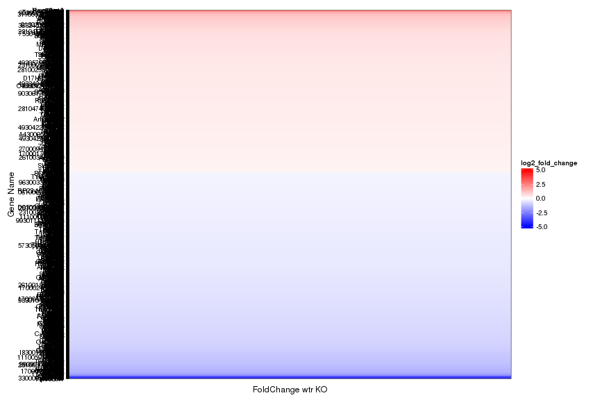 

Expression heatmap of sigGenes

 

Foldchange heatmap of sigGenes 

 


Now, look at genes that are detectably expressed (FPKM>0.5, yes I know it should be 1), and log2foldchange>2 in any direction: 42 genes

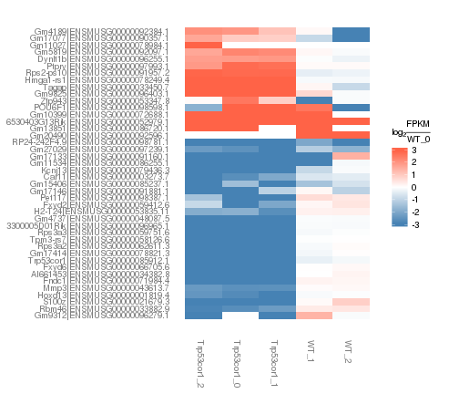 


Now, those that are expressed, changing and called sig: 18 genes 

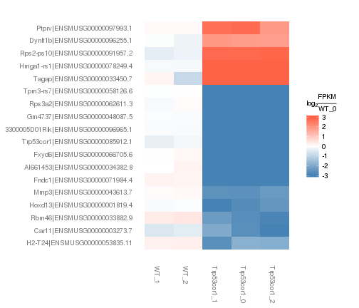 

### Expression-level/significance relationship

Scatter plot of significant genes only:

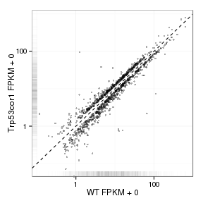 

Volcano Plot

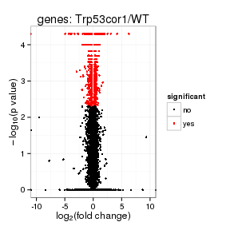 

Volcano plot with significant genes only:

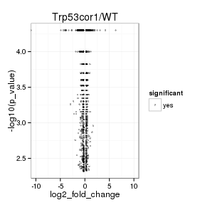 

### Differential Isoforms between conditions

Per isoform difference between conditions:

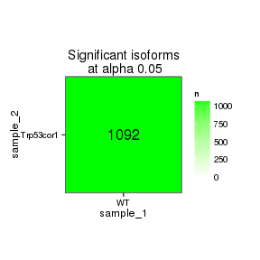 

```
## Error in getGenes(cuff, isoformSigIDs, level = "isoforms"): unused argument (level = "isoforms")
```

These isoforms are:


```
## Error in as.data.frame(isoAnnot$gene_short_name): error in evaluating the argument 'x' in selecting a method for function 'as.data.frame': Error: object 'isoAnnot' not found
```

DE isoform heatmap


```
## Error in csHeatmap(isoformSigGenes, cluster = "both", replicates = T, : error in evaluating the argument 'object' in selecting a method for function 'csHeatmap': Error: object 'isoformSigGenes' not found
```

Isoform foldchange heatmap by isoform:


```
## Error in csFoldChangeHeatmap(isoforms(isoformSigGenes), "WT", replicates = TRUE, : error in evaluating the argument 'object' in selecting a method for function 'csFoldChangeHeatmap': Error in isoforms(isoformSigGenes) : 
##   error in evaluating the argument 'object' in selecting a method for function 'isoforms': Error: object 'isoformSigGenes' not found
```

# Gene/Pathway Analysis

## GSEA

Enrichment and zscores are calculated based on expression in KO vs WT (fpkmKO/fpkmWT), so genes that are down regulated in KO are shown in blue, while upregulation is shown in red. 

KO/WT
Blue = down in KO
Red = Up in KO


Biocarta enrichment: 

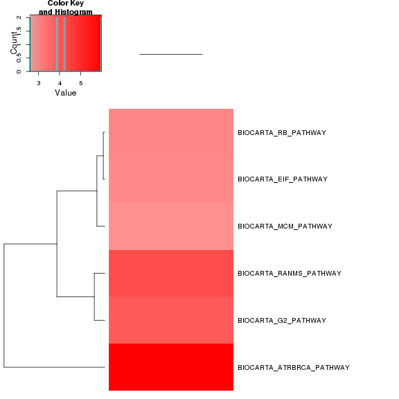 

Biocarta zscore: 

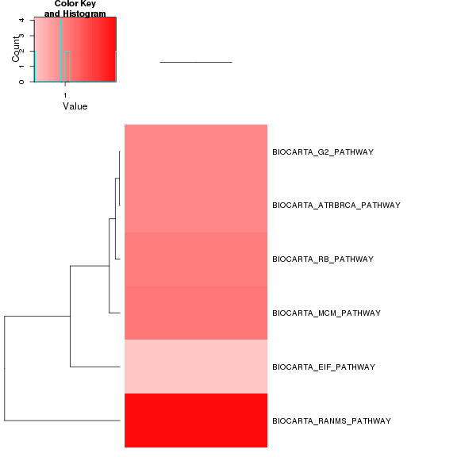 

Reactome enrichment:

 

Reactome zscore: 

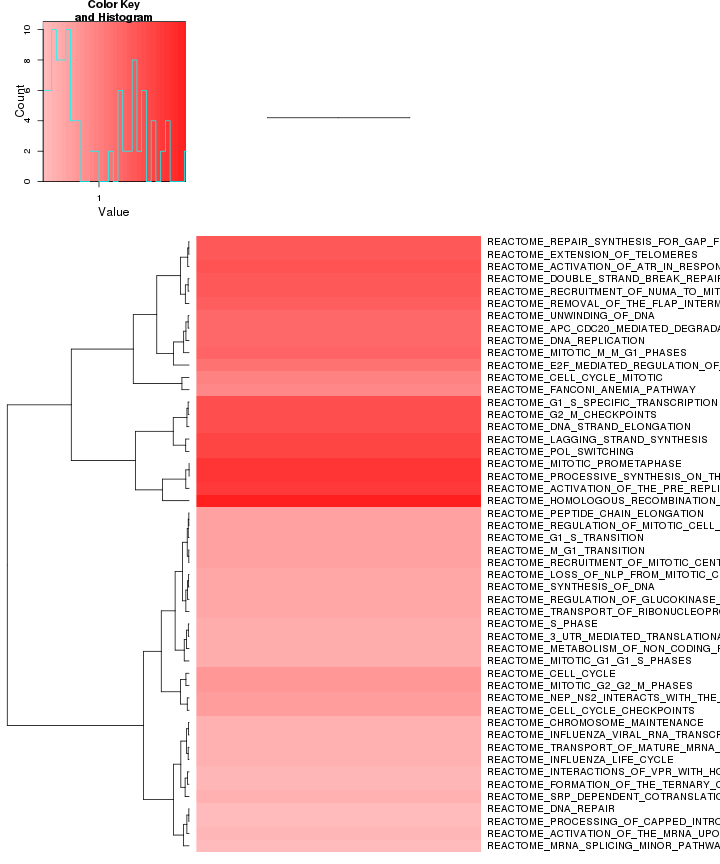 

Kegg enrichment: 

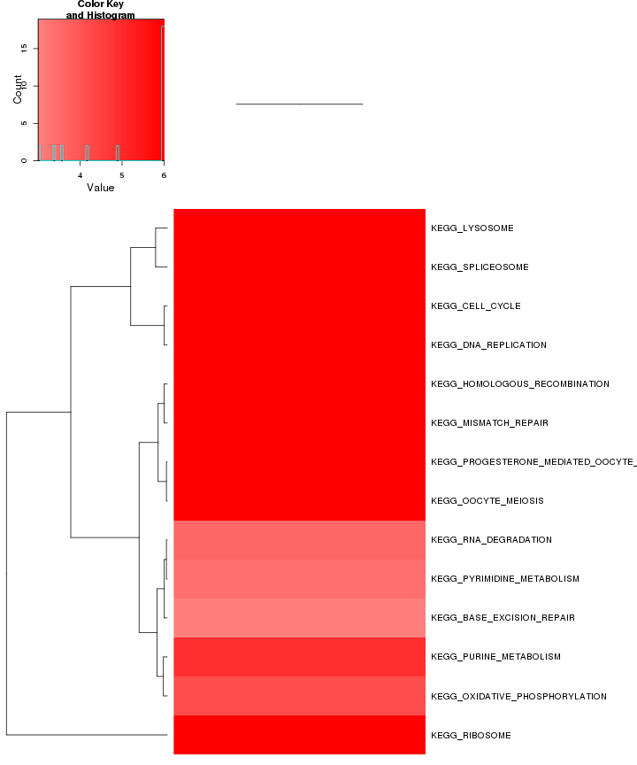 

Kegg zscore: 

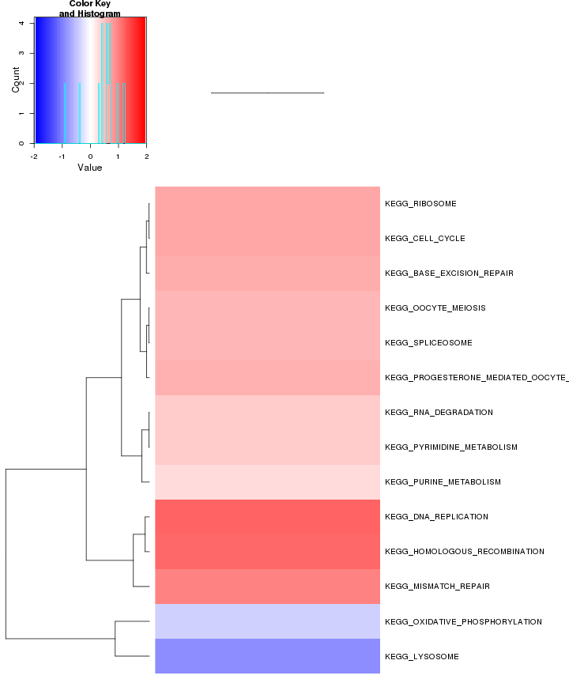 


p53 enrichment: 

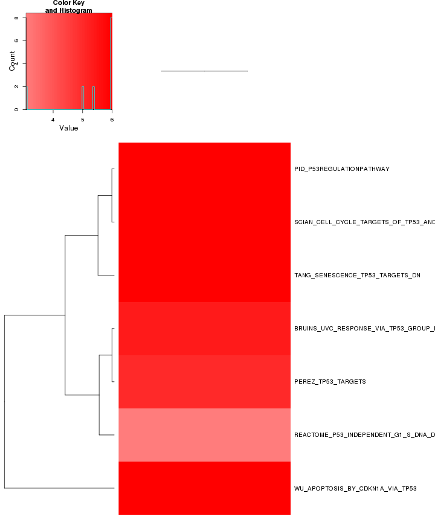 

p53 zscore: 

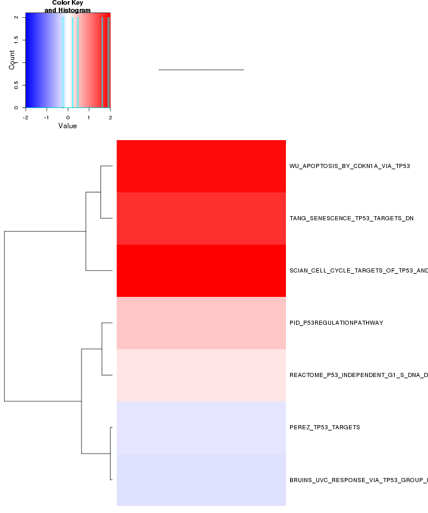 

Oncogene enrichment: 

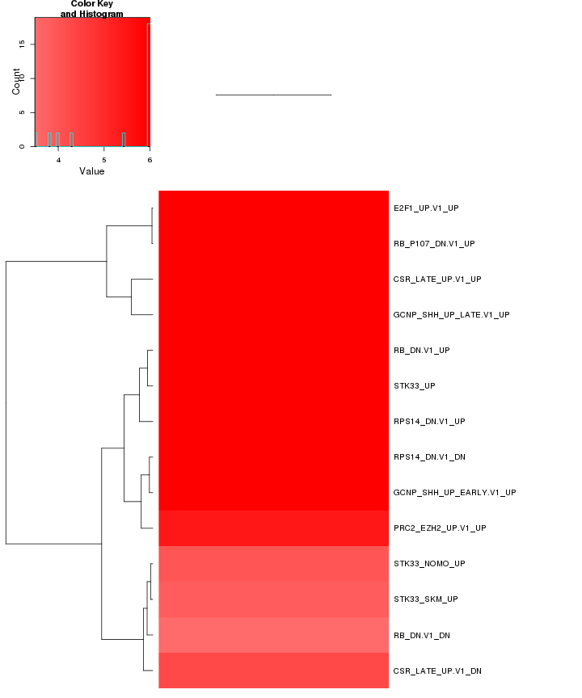 

Oncogene zscore:

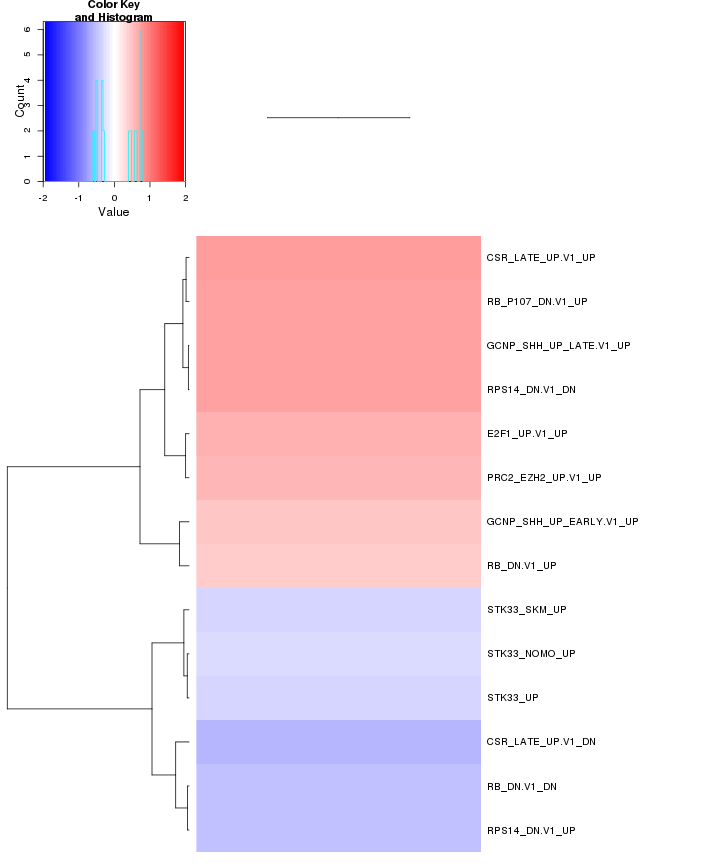 


Jacks enrichment
 


Jacks zscore

 


All enrichment 


There are 1354 categories enriched (p<0.0001). They are:


```
## Error in (function (side, at = NULL, labels = TRUE, tick = TRUE, line = NA, : no locations are finite
```

 

ALL zscore:

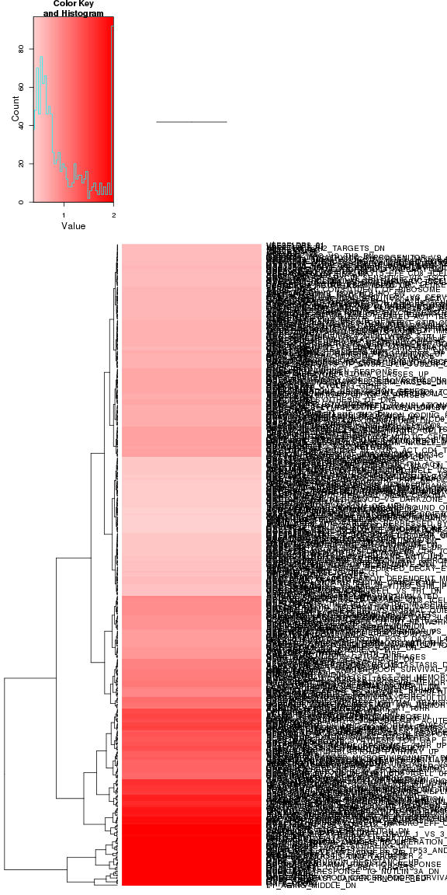 

## GO enrichment 
Cluster profiler used to call enichments of significantly differentially regulated genes that map to Entrez IDs. 


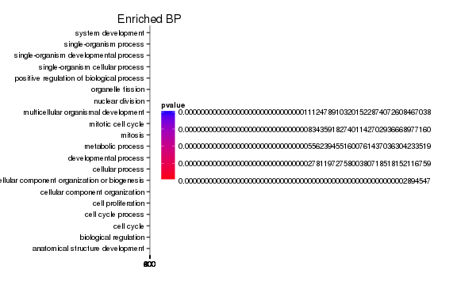 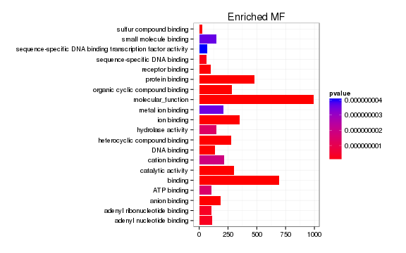 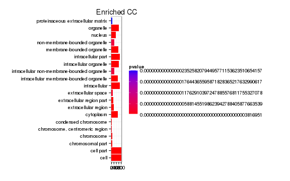 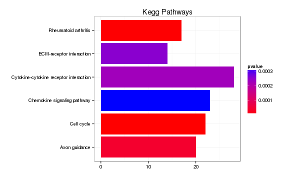 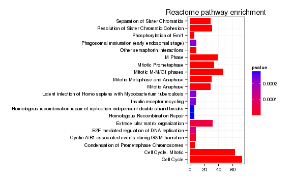 

# Cis vs Trans (locally)

log2 Foldchange and test statistic are calculated with the ratio of fpkm(KO)/fpkm(WT), thus the test_stat is positive if a gene is higher in the KO and negative if a gene has lower expression in the KO


The pvalue for genes significantly regulated in a region this size  is: 0.2036 

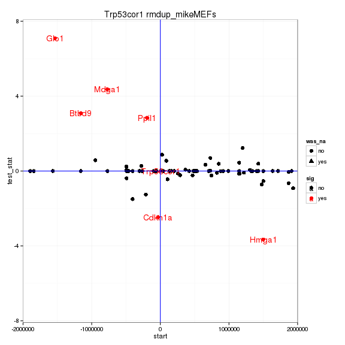 

# Notes

## Samples used are:
<!-- html table generated in R 3.0.2 by xtable 1.7-3 package -->
<!-- Mon Apr  6 13:20:23 2015 -->
<TABLE border=1>
<TR> <TH>  </TH> <TH> 11 </TH>  </TR>
  <TR> <TD align="right"> 1 </TD> <TD> rmdup_mikeMEFs_wt1 </TD> </TR>
  <TR> <TD align="right"> 2 </TD> <TD> rmdup_mikeMEFs_wt2 </TD> </TR>
  <TR> <TD align="right"> 3 </TD> <TD> rmdup_mikeMEFs_wt3 </TD> </TR>
  <TR> <TD align="right"> 4 </TD> <TD> rmdup_mikeMEFs_ko1 </TD> </TR>
  <TR> <TD align="right"> 5 </TD> <TD> rmdup_mikeMEFs_ko2 </TD> </TR>
  <TR> <TD align="right"> 6 </TD> <TD> rmdup_mikeMEFs_ko3 </TD> </TR>
   </TABLE>

## Replicates
<!-- html table generated in R 3.0.2 by xtable 1.7-3 package -->
<!-- Mon Apr  6 13:20:23 2015 -->
<TABLE border=1>
<TR> <TH>  </TH> <TH> file </TH> <TH> sample_name </TH> <TH> replicate </TH> <TH> rep_name </TH> <TH> total_mass </TH> <TH> norm_mass </TH> <TH> internal_scale </TH> <TH> external_scale </TH>  </TR>
  <TR> <TD align="right"> 1 </TD> <TD> /n/rinn_data1/users/agroff/seq/OtherMice/Diana/lincP21/quants/rmdup_mikeMEFs_wt1/abundances.cxb </TD> <TD> WT </TD> <TD align="right">   0 </TD> <TD> WT_0 </TD> <TD align="right"> 18850800.00 </TD> <TD align="right"> 20645600.00 </TD> <TD align="right"> 0.90 </TD> <TD align="right"> 1.00 </TD> </TR>
  <TR> <TD align="right"> 2 </TD> <TD> /n/rinn_data1/users/agroff/seq/OtherMice/Diana/lincP21/quants/rmdup_mikeMEFs_wt2/abundances.cxb </TD> <TD> WT </TD> <TD align="right">   1 </TD> <TD> WT_1 </TD> <TD align="right"> 32168600.00 </TD> <TD align="right"> 20645600.00 </TD> <TD align="right"> 1.60 </TD> <TD align="right"> 1.00 </TD> </TR>
  <TR> <TD align="right"> 3 </TD> <TD> /n/rinn_data1/users/agroff/seq/OtherMice/Diana/lincP21/quants/rmdup_mikeMEFs_wt3/abundances.cxb </TD> <TD> WT </TD> <TD align="right">   2 </TD> <TD> WT_2 </TD> <TD align="right"> 19863600.00 </TD> <TD align="right"> 20645600.00 </TD> <TD align="right"> 0.96 </TD> <TD align="right"> 1.00 </TD> </TR>
  <TR> <TD align="right"> 4 </TD> <TD> /n/rinn_data1/users/agroff/seq/OtherMice/Diana/lincP21/quants/rmdup_mikeMEFs_ko1/abundances.cxb </TD> <TD> Trp53cor1 </TD> <TD align="right">   0 </TD> <TD> Trp53cor1_0 </TD> <TD align="right"> 18236800.00 </TD> <TD align="right"> 20645600.00 </TD> <TD align="right"> 0.88 </TD> <TD align="right"> 1.00 </TD> </TR>
  <TR> <TD align="right"> 5 </TD> <TD> /n/rinn_data1/users/agroff/seq/OtherMice/Diana/lincP21/quants/rmdup_mikeMEFs_ko2/abundances.cxb </TD> <TD> Trp53cor1 </TD> <TD align="right">   1 </TD> <TD> Trp53cor1_1 </TD> <TD align="right"> 20190300.00 </TD> <TD align="right"> 20645600.00 </TD> <TD align="right"> 0.97 </TD> <TD align="right"> 1.00 </TD> </TR>
  <TR> <TD align="right"> 6 </TD> <TD> /n/rinn_data1/users/agroff/seq/OtherMice/Diana/lincP21/quants/rmdup_mikeMEFs_ko3/abundances.cxb </TD> <TD> Trp53cor1 </TD> <TD align="right">   2 </TD> <TD> Trp53cor1_2 </TD> <TD align="right"> 17628700.00 </TD> <TD align="right"> 20645600.00 </TD> <TD align="right"> 0.85 </TD> <TD align="right"> 1.00 </TD> </TR>
   </TABLE>

## Session Info

```
## R version 3.0.2 (2013-09-25)
## Platform: x86_64-unknown-linux-gnu (64-bit)
## 
## locale:
##  [1] LC_CTYPE=en_US.UTF-8       LC_NUMERIC=C              
##  [3] LC_TIME=en_US.UTF-8        LC_COLLATE=en_US.UTF-8    
##  [5] LC_MONETARY=en_US.UTF-8    LC_MESSAGES=en_US.UTF-8   
##  [7] LC_PAPER=en_US.UTF-8       LC_NAME=C                 
##  [9] LC_ADDRESS=C               LC_TELEPHONE=C            
## [11] LC_MEASUREMENT=en_US.UTF-8 LC_IDENTIFICATION=C       
## 
## attached base packages:
## [1] grid      parallel  methods   stats     graphics  grDevices utils    
## [8] datasets  base     
## 
## other attached packages:
##  [1] plyr_1.8.1                         
##  [2] stringr_0.6.2                      
##  [3] seqbias_1.10.0                     
##  [4] BSgenome.Mmusculus.UCSC.mm10_1.3.19
##  [5] BSgenome_1.30.0                    
##  [6] Biostrings_2.30.1                  
##  [7] GO.db_2.10.1                       
##  [8] org.Mm.eg.db_2.10.1                
##  [9] clusterProfiler_1.13.1             
## [10] DOSE_2.0.0                         
## [11] ReactomePA_1.6.1                   
## [12] AnnotationDbi_1.24.0               
## [13] Biobase_2.22.0                     
## [14] mgcv_1.8-2                         
## [15] nlme_3.1-117                       
## [16] RMySQL_0.9-3                       
## [17] RColorBrewer_1.0-5                 
## [18] gridExtra_0.9.1                    
## [19] gtable_0.1.2                       
## [20] marray_1.40.0                      
## [21] gplots_2.14.2                      
## [22] GSA_1.03                           
## [23] limma_3.18.13                      
## [24] xtable_1.7-3                       
## [25] cummeRbund_2.7.2                   
## [26] Gviz_1.6.0                         
## [27] rtracklayer_1.22.7                 
## [28] GenomicRanges_1.14.4               
## [29] XVector_0.2.0                      
## [30] IRanges_1.20.7                     
## [31] fastcluster_1.1.13                 
## [32] reshape2_1.4                       
## [33] ggplot2_1.0.0                      
## [34] RSQLite_0.11.4                     
## [35] DBI_0.3.1                          
## [36] BiocGenerics_0.8.0                 
## [37] knitr_1.7                          
## 
## loaded via a namespace (and not attached):
##  [1] biomaRt_2.18.0         biovizBase_1.10.8      bitops_1.0-6          
##  [4] caTools_1.17.1         cluster_1.15.2         colorspace_1.2-4      
##  [7] dichromat_2.0-0        digest_0.6.4           DO.db_2.7             
## [10] evaluate_0.5.5         formatR_1.0            Formula_1.1-2         
## [13] gdata_2.13.3           GenomicFeatures_1.14.5 GOSemSim_1.20.3       
## [16] graph_1.40.1           graphite_1.8.1         gtools_3.4.1          
## [19] Hmisc_3.14-4           igraph_0.7.1           KEGG.db_2.10.1        
## [22] KernSmooth_2.23-12     labeling_0.2           lattice_0.20-29       
## [25] latticeExtra_0.6-26    MASS_7.3-33            Matrix_1.1-4          
## [28] munsell_0.4.2          org.Hs.eg.db_2.10.1    proto_0.3-10          
## [31] qvalue_1.36.0          Rcpp_0.11.3            RCurl_1.95-4.3        
## [34] reactome.db_1.46.1     Rsamtools_1.14.3       scales_0.2.4          
## [37] splines_3.0.2          stats4_3.0.2           survival_2.37-7       
## [40] tcltk_3.0.2            tools_3.0.2            XML_3.98-1.1          
## [43] zlibbioc_1.8.0
```

## Run Info

```
##           param
## 1      cmd_line
## 2       version
## 3  SVN_revision
## 4 boost_version
## 5        genome
##                                                                                                                                                                                                                                                                                                                                                                                                                                                                                                                                                                                                                                                                                                                                                                                                                           value
## 1 cuffdiff -p 10 -L WT,Trp53cor1 -o /n/rinn_data1/users/agroff/seq/OtherMice/Diana/lincP21/diff/Trp53cor1_rmdup_mike_MEFs /n/rinn_data1/seq/lgoff/Projects/BrainMap/data/annotation/mm10_gencode_vM2_with_lncRNAs_and_LacZ.gtf /n/rinn_data1/users/agroff/seq/OtherMice/Diana/lincP21/quants/rmdup_mikeMEFs_wt1/abundances.cxb,/n/rinn_data1/users/agroff/seq/OtherMice/Diana/lincP21/quants/rmdup_mikeMEFs_wt2/abundances.cxb,/n/rinn_data1/users/agroff/seq/OtherMice/Diana/lincP21/quants/rmdup_mikeMEFs_wt3/abundances.cxb /n/rinn_data1/users/agroff/seq/OtherMice/Diana/lincP21/quants/rmdup_mikeMEFs_ko1/abundances.cxb,/n/rinn_data1/users/agroff/seq/OtherMice/Diana/lincP21/quants/rmdup_mikeMEFs_ko2/abundances.cxb,/n/rinn_data1/users/agroff/seq/OtherMice/Diana/lincP21/quants/rmdup_mikeMEFs_ko3/abundances.cxb 
## 2                                                                                                                                                                                                                                                                                                                                                                                                                                                                                                                                                                                                                                                                                                                                                                                                                         2.2.1
## 3                                                                                                                                                                                                                                                                                                                                                                                                                                                                                                                                                                                                                                                                                                                                                                                                                          4237
## 4                                                                                                                                                                                                                                                                                                                                                                                                                                                                                                                                                                                                                                                                                                                                                                                                                        104700
## 5                                                                                                                                                                                                                                                                                                                                                                                                                                                                                                                                                                                                                                                                                                                                                                                                                          mm10
```

